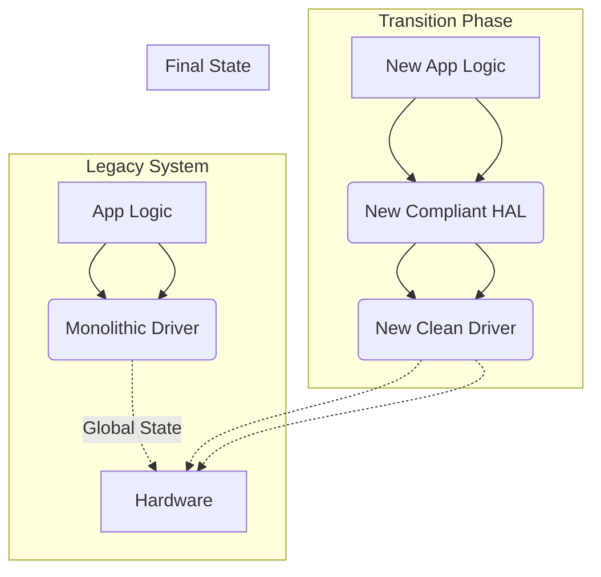

# Recommended Starting Point

Adopting a comprehensive Embedded C Architecture Standard can be a daunting task. The transition path depends entirely on whether you are starting a new project (Greenfield) or working within an existing legacy codebase (Brownfield).

This document provides a pragmatic roadmap for applying the company standards without stalling development or introducing massive regression risks.

## Scenario A: The Greenfield Project (New Codebase)

Starting from scratch is the ideal scenario, but it requires strict discipline from Day 1 to prevent "architecture rot."

### 1. Establish the Toolchain and CI/CD First
Before writing a single line of application code, enforce the standards automatically:
- **Linting:** Configure `clang-format` based on the company style guide. Integrate it into your pre-commit hooks.
- **Static Analysis:** Integrate `clang-tidy`, `cppcheck`, or a commercial static analyzer (like PC-lint or Coverity) into the Continuous Integration (CI) pipeline. Configure it to fail the build on warnings.
- **Compiler Flags:** Enable strict compiler warnings (`-Wall -Wextra -Werror -Wstrict-prototypes -Wconversion` in GCC/Clang).

### 2. Define the Architectural Skeletons
Do not start by writing driver implementations. Start by defining the module boundaries:
- Define the Hardware Abstraction Layer (HAL) interfaces.
- Create the bare header files for the core modules.
- Ensure the include dependency graph is acyclic and strictly layered (e.g., Application -> Services -> HAL -> Drivers).

### 3. Implement by Contract
Begin implementing the `.c` files only after the header APIs (the contracts) have been peer-reviewed and verified to align with the encapsulation and modularity standards.

---

## Scenario B: The Brownfield Project (Legacy Codebase)

Attempting a "stop-the-world" rewrite of a legacy codebase to enforce a new standard is almost always a costly mistake. Instead, use an incremental, strangler-fig approach.

### 1. Draw a Line in the Sand
Establish a rule immediately: **All new modules must be 100% compliant with the new standard.** 
Do not attempt to rewrite everything. Accept that legacy code exists, but prevent the legacy patterns from spreading into new features.

### 2. The Boy Scout Rule
Adopt the Boy Scout Rule: *"Always leave the codebase cleaner than you found it."*
When an engineer is tasked with fixing a bug or adding a feature to a legacy file, they should opportunistically apply safe, low-risk refactoring:
- Convert `int` to `int32_t` or `int16_t`.
- Add braces to naked `if` statements.
- Apply `static` to functions and variables that shouldn't be exposed globally.
- *Do not* attempt massive architectural changes (like stripping out a global state machine) during a routine bug fix.

### 3. The Strangler Fig Pattern in C
When a legacy module becomes too brittle or requires significant new functionality, do not modify it in place. Instead, "strangle" it:
1. Create a brand-new module alongside the old one, completely compliant with the new architecture.
2. Route new functionality to the new module.
3. Slowly refactor callers of the old module to use the new module's API.
4. Once all dependencies are moved, delete the legacy module.

### Architectural Migration Diagram

### 4. Isolate the "Toxic" Code
If a legacy module is a massive violation of the standard (e.g., heavily reliant on dynamic memory and global variables) but works perfectly and rarely needs changes, **leave it alone**. 
Instead, build a clean "wrapper" API around it. Hide the ugly legacy code behind a compliant, modern interface. This prevents the legacy anti-patterns from bleeding into the new architecture.

## Conclusion

Whether Greenfield or Brownfield, adoption requires patience and tooling. Rely heavily on automated checks to enforce syntax and basic rules, allowing code reviews to focus entirely on architectural integrity and modular design.
