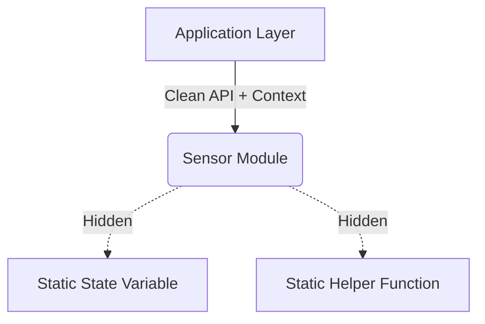

# Suggested Teaching Order

When onboarding new hires or realigning an existing engineering team to a newly established Embedded C standard, presenting the entire architecture document at once can be overwhelming. To maximize retention and practical application, the material should be taught incrementally, starting with foundational rules and progressing toward complex architectural patterns.

This document outlines a phased teaching approach, designed to build a solid mental model of the company's embedded software philosophy.

## Phase 1: The Foundations (Weeks 1-2)

**Goal:** Establish a baseline for code safety, readability, and basic mechanics before introducing architectural complexity.

### Topics to Cover
1. **Types and Variables:**
   - Strict use of `<stdint.h>` (`uint32_t`, `int16_t` instead of `int`, `long`).
   - Initialization rules (no uninitialized variables).
   - Scope minimization (declare variables as close to their use as possible).
2. **Control Flow and Defensive Programming:**
   - Braces `{}` are mandatory for all `if`, `for`, `while` statements, even single-liners.
   - Guard clauses (early returns) to avoid deep nesting.
   - `switch` statements must always have a `default` case.
3. **Pointers and Memory:**
   - Ban on dynamic memory allocation (`malloc`/`free`) after initialization.
   - `const` correctness (e.g., `const uint8_t * const ptr`).
   - Null pointer checks at module boundaries.

### Anti-Pattern Focus
```c
// Anti-pattern: Vague types, missing braces, deep nesting
void process(int mode, int* data) {
    if (mode == 1)
        if (data != NULL) {
            // Do something
        }
}
```

### Practical Exercise
Provide a poorly written, single-file driver and ask the trainee to refactor it using only Phase 1 rules. Focus purely on syntactical and foundational improvements.

## Phase 2: Modularity and Encapsulation (Weeks 3-4)

**Goal:** Shift the focus from *writing code* to *designing modules*. Teach the principles of loose coupling and high cohesion.

### Topics to Cover
1. **Header File Anatomy:**
   - Include guards (`#ifndef`, `#define`, `#endif` or `#pragma once`).
   - Opaque pointers to hide implementation details (Pimpl idiom in C).
   - Exporting only what is necessary (minimal API surface).
2. **Encapsulation:**
   - Extensive use of the `static` keyword for module-private functions and variables.
   - State encapsulation (no global variables; pass state contexts/handles).
3. **Error Handling Strategy:**
   - Returning status codes (e.g., `typedef enum { OK, ERROR } status_t;`) instead of relying on global error flags.
   - Out-parameters for returning data.

### Architectural Diagram



### Practical Exercise
Assign the task of splitting a monolithic "super-loop" file into three distinct, encapsulated modules (e.g., `uart_handler.c`, `sensor_logic.c`, `system_state.c`) with clean header APIs.

## Phase 3: Hardware Abstraction and Drivers (Weeks 5-6)

**Goal:** Teach how to separate business logic from hardware-specific implementations to ensure portability and testability.

### Topics to Cover
1. **Hardware Abstraction Layers (HAL):**
   - Defining abstract interfaces (structs of function pointers) for peripherals (e.g., I2C, SPI).
   - Dependency Injection: Passing HAL interfaces into business logic modules.
2. **Interrupt Service Routines (ISRs):**
   - Keep ISRs extremely short (set a flag, read a register, defer processing).
   - Proper use of the `volatile` keyword.
   - Avoiding function calls inside ISRs to prevent stack bloat.

### Anti-Pattern Focus
```c
// Anti-pattern: Business logic mixed with hardware access
void calculate_temperature(void) {
    // Reading directly from hardware registers in business logic
    uint16_t raw = ADC1->DR; 
    float temp = (raw * 3.3) / 4096.0;
    // ...
}
```

### Practical Exercise
Create a mock hardware interface. Ask the engineer to write a driver that depends on the mock interface, allowing the driver to be unit-tested on a PC without the actual microcontroller.

## Phase 4: Concurrency and Advanced Architecture (Weeks 7+)

**Goal:** Master the complexities of asynchronous execution, RTOS integration, and overall system design.

### Topics to Cover
1. **RTOS Fundamentals (if applicable):**
   - Task prioritization and stack sizing.
   - Inter-Process Communication (IPC): Queues, Semaphores, Mutexes.
   - Priority inversion and how to avoid it.
2. **State Machines:**
   - Designing hierarchical or flat finite state machines (FSMs).
   - Table-driven state machines vs. `switch/case` implementations.
3. **Memory Architecture:**
   - DMA (Direct Memory Access) management.
   - Handling cache coherency (if applicable to the target MCU).
   - Custom memory pools.

### Conclusion of Training
By following this tiered approach, engineers avoid cognitive overload. They first learn *how* to write safe C, then *how* to organize it, then *how* to interact with the hardware cleanly, and finally *how* to manage complex systemic behaviors.
