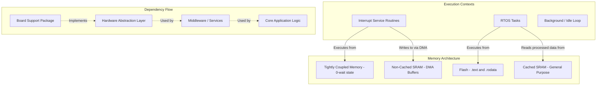

# 1.1 What Architecture Means in Embedded C: The 20-Year Horizon

## Defining Architecture in the Context of Silicon and Compilers

In software engineering, "architecture" is a notoriously overloaded term, often diluted to mean simply "how the folders are organized." In the uncompromising domain of safety-critical embedded C, **architecture is the set of fundamental, irreversible decisions regarding the structure of the system that dictate how software interacts with silicon, how the compiler optimizes your code, and how the linker places your data in physical memory.** 

When we design an embedded system for a 20-year lifecycle, we are not just writing logic; we are building an environment that must survive multiple microcontroller (MCU) obsolescence cycles, compiler major version upgrades, and entire team turnovers. True architecture is the deliberate organization of your codebase into rigorously bounded modules, the explicit definition of Application Binary Interfaces (ABIs) between those modules, and the strict management of dependencies to prevent hardware idiosyncrasies from infecting business logic.

At its core, embedded architecture addresses three foundational realities:
1. **Separation of Concerns at the Silicon Level:** Does the algorithm computing the PID loop know about the pipeline stalls of the Cortex-M7? Does it know about the read-modify-write hazards of the target GPIO peripheral? It absolutely must not.
2. **Compiler-Aware Dependency Management:** When a hardware vendor changes their SDK, does it force a recompilation of your core flight-control logic? If dependencies flow outward toward the hardware, a change in a vendor header file can alter the Abstract Syntax Tree (AST) generated by the compiler for your business logic, potentially altering optimization paths and introducing subtle bugs. Dependencies must flow *inward* toward core business logic.
3. **Data Flow, Aliasing, and Memory Hierarchy:** How does data move from a DMA buffer into an application queue? Is the architecture designed to prevent pointer aliasing so the compiler can safely optimize loops? Are memory barriers explicitly placed to handle out-of-order execution in superscalar processors?

## The Compiler and Linker Reality

A 20-year architecture recognizes that C is not a portable assembly language; it is a high-level language that an optimizing compiler transforms into machine code based on a strict set of rules (the C Standard). If your architecture does not account for how the compiler and linker work, your system will fail in production.

Consider Link-Time Optimization (LTO). Modern compilers can cross module boundaries to inline functions and remove unused code. If your architecture relies on implicit behaviors or weakly defined interfaces, LTO will aggressively strip away code that it deems "unreachable" or optimize out variable reads that it assumes cannot change, simply because the architectural boundaries (like `volatile` or memory barriers) were not explicitly defined.

Furthermore, architecture extends to the linker script. Where data lives is an architectural decision. Is your Ethernet frame buffer placed in a standard `.bss` section that is cached, leading to cache coherency issues when the DMA controller writes to it? Or is it architecturally segregated into a `.sram_nocache` section defined in your linker script?

### Architectural Diagram: Memory and Dependency Segregation



## ❌ Anti-Pattern: The God Object and the Read-Modify-Write Race

In embedded C, the most catastrophic architectural failure is the "God Object" or "God File"—usually a massive `main.c` that mixes vendor hardware headers, interrupt handlers, and complex business logic. This pattern ignores the realities of the CPU pipeline and compiler optimizations.

Consider this concrete example of a real-world failure caused by poor architecture. A God Object manages a global configuration struct directly modified by an ISR and read by the main loop.

```c
// ANTI-PATTERN: The God Object and Silicon-level Race Conditions
#include "stm32h7xx.h" // Vendor header bleeding into business logic
#include <stdint.h>
#include <stdbool.h>

// Global shared state with no architectural encapsulation
typedef struct {
    uint32_t raw_adc;
    bool is_overheated;
    uint32_t active_faults;
} SystemState_t;

SystemState_t g_state; // Shared between ISR and Main

// Interrupt Service Routine modifying the struct directly
void ADC_IRQHandler(void) {
    // Read hardware register directly in business logic file
    g_state.raw_adc = ADC1->DR; 
    
    if (g_state.raw_adc > 4000) {
        // Read-Modify-Write on a non-atomic struct member!
        g_state.active_faults |= 0x01; 
        g_state.is_overheated = true;
    }
    
    // Clear interrupt flag
    ADC1->SR &= ~ADC_SR_EOC;
}

int main(void) {
    // Hardware Init mixed with logic
    RCC->AHB1ENR |= RCC_AHB1ENR_ADC1EN;
    
    while(1) {
        // The compiler might cache g_state.active_faults in a CPU register (e.g., r0).
        // It has no idea the ISR can change it because the architecture didn't enforce a boundary.
        if (g_state.active_faults != 0) {
            // Business logic directly manipulating GPIO pins
            GPIOA->ODR |= GPIO_ODR_ODR_5; // Trigger alarm LED
            
            // Attempting to clear the fault
            // THIS WILL CAUSE A FATAL RACE CONDITION
            g_state.active_faults &= ~0x01; 
        }
    }
}
```

**Deep Technical Rationale for Failure:**
1. **Compiler Optimization Hazard:** Because `g_state` is not `volatile` and there are no memory barriers, an optimizing compiler (`-O2` or `-O3`) will likely hoist the read of `g_state.active_faults` outside the `while(1)` loop, caching it in a core register. The `if` statement may never evaluate to true even if the ISR fires, because the main loop never re-reads from RAM.
2. **Read-Modify-Write Race:** In the main loop, `g_state.active_faults &= ~0x01;` translates to three assembly instructions: LDR (load), BIC (bit clear), STR (store). If the `ADC_IRQHandler` fires exactly after the LDR but before the STR, any *new* faults logged by the ISR during that nanosecond window will be irrevocably overwritten and lost when the main loop executes the STR.
3. **Pipeline and Write Buffer Reordering:** On high-performance Cortex-M7 or Cortex-A processors, the write buffer might delay the clearing of the interrupt flag (`ADC1->SR &= ~ADC_SR_EOC;`). Without a Data Synchronization Barrier (`__DSB()`), the processor might exit the ISR while the flag is still physically asserted in the peripheral, causing the interrupt to instantly fire again, leading to a stack overflow or complete system lockup.

## ✅ Good Pattern: Component Boundaries and Silicon-Aware Encapsulation

A true 20-year architecture prevents these issues mechanically. We split the code into strictly bounded modules: a decoupled ADC HAL, an encapsulated State Manager, and an architecture that forces safe memory access using synchronization primitives and explicit memory barriers.

```c
// GOOD: system_state.h (The Architectural Interface)
#ifndef SYSTEM_STATE_H
#define SYSTEM_STATE_H

#include <stdint.h>
#include <stdbool.h>

// Business logic interface. No hardware includes allowed here.
void SystemState_Init(void);
void SystemState_LogFault(uint32_t fault_mask);
uint32_t SystemState_GetAndClearFaults(void);

#endif // SYSTEM_STATE_H
```

```c
// GOOD: system_state.c (The Implementation)
#include "system_state.h"
#include "cpu_atomic.h" // Provides __disable_irq(), __enable_irq(), __DSB(), etc.

// Internal state is hidden from the rest of the application.
// Volatile prevents compiler caching across context switches.
static volatile uint32_t m_active_faults;

void SystemState_LogFault(uint32_t fault_mask) {
    // Safe, atomic Read-Modify-Write using LDREX/STREX or IRQ disabling
    CpuAtomic_EnterCritical();
    m_active_faults |= fault_mask;
    CpuAtomic_ExitCritical();
}

uint32_t SystemState_GetAndClearFaults(void) {
    uint32_t faults;
    
    // Atomically read and clear to prevent losing faults logged by ISRs
    CpuAtomic_EnterCritical();
    faults = m_active_faults;
    m_active_faults = 0;
    CpuAtomic_ExitCritical();
    
    return faults;
}
```

```c
// GOOD: adc_hal.c (Hardware abstraction, aware of silicon pipelines)
#include "adc_hal.h"
#include "system_state.h"
#include "stm32h7xx.h" // Confined entirely to this file

// Linker script integration: placing DMA buffer in non-cached RAM
__attribute__((section(".sram_nocache")))
static uint16_t m_dma_buffer[16];

void ADC_IRQHandler(void) {
    // Fast path: read hardware, log safely, clear flags
    uint32_t raw = ADC1->DR;
    
    if (raw > 4000) {
        SystemState_LogFault(0x01); // Abstracted, safe call
    }
    
    ADC1->SR = ~(ADC_SR_EOC); // Clear flag
    
    // Critical Silicon Architecture: Force the write buffer to drain
    // ensuring the interrupt flag is truly cleared in the peripheral
    // before the CPU exits the ISR, preventing tail-chaining loops.
    __DSB();
}
```

**Deep Technical Rationale for Success:**
1. **Encapsulation of Volatility:** The `volatile` keyword and atomic block logic are completely hidden inside `system_state.c`. The application layer doesn't need to know *how* to safely read a variable; the architecture handles it.
2. **Silicon-Aware Execution:** The inclusion of `__DSB()` (Data Synchronization Barrier) in the HAL layer acknowledges the reality of the superscalar processor's write buffer, a detail that the application layer is blissfully unaware of.
3. **Linker Script Segregation:** By explicitly placing `m_dma_buffer` in a `.sram_nocache` section using GCC attributes, we eliminate cache coherency bugs (where the CPU reads stale cache lines instead of the fresh data written by the DMA controller) without having to perform expensive cache invalidation instructions manually in the application code.

## Company Standard Rules: Architecture Foundations

1. **Rule of Ultimate Encapsulation:** Business logic (Layer 3) MUST NEVER `#include` vendor-specific hardware headers or utilize compiler-specific intrinsics directly. All interaction with the physical silicon MUST be mediated through an explicitly defined Hardware Abstraction Layer (HAL).
2. **Rule of Atomic Mutation:** Any variable or structure that is modified in an asynchronous context (ISR or separate RTOS task) and read in another MUST be protected by a strict synchronization primitive (Interrupt masking, Mutex, or LDREX/STREX atomic instructions). Relying solely on `volatile` for Read-Modify-Write operations is strictly prohibited.
3. **Rule of Explicit Memory Placement:** All memory buffers utilized by autonomous bus masters (e.g., DMA controllers, Ethernet MACs) MUST be explicitly placed in non-cached memory regions via linker script section attributes (`__attribute__((section("...")))`), or explicit Data Cache Invalidate/Clean operations MUST be encapsulated within the HAL driver.
4. **Rule of Architectural Synchronization:** All Interrupt Service Routines that clear peripheral interrupt flags MUST execute a Data Synchronization Barrier (`__DSB()` or equivalent) immediately after the register write to prevent spurious re-entry caused by processor write-buffer delays.
5. **Rule of Dependency Inversion:** Hardware drivers MUST depend on the interfaces (headers) defined by the application layer or mid-level services. The application logic MUST NOT depend on the implementation details of the hardware drivers.