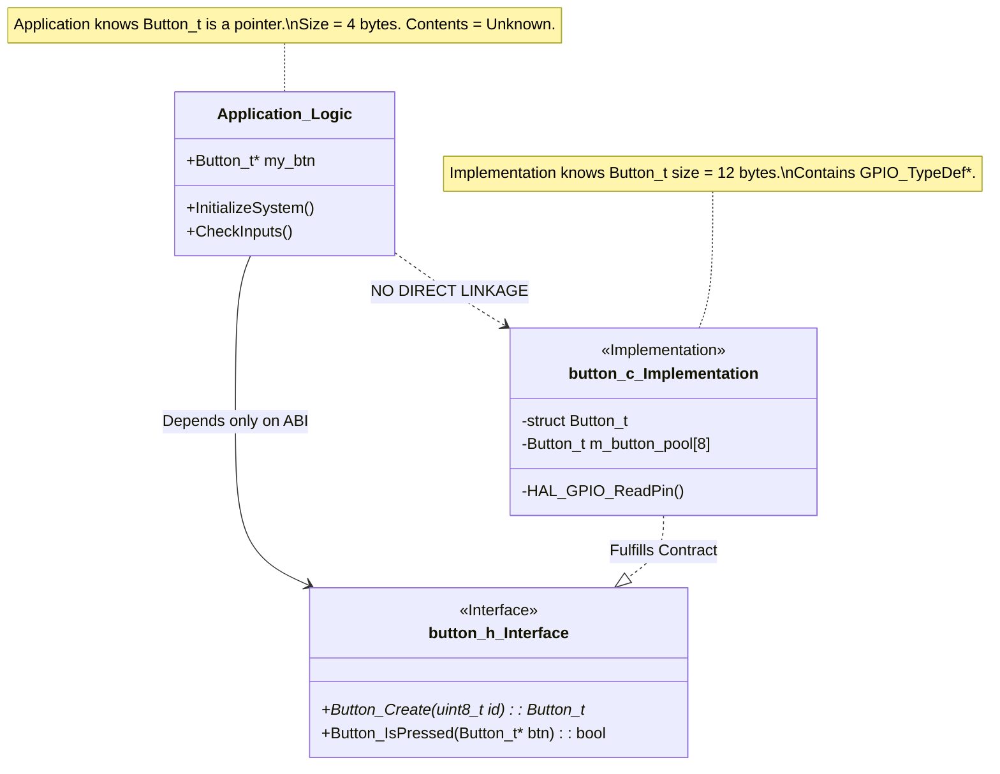

# 1.2 Architecture vs. Implementation: ABI, Memory, and The Physical Divide

## The "What" vs. The "How" in the C ABI

To engineer embedded systems that survive decades of maintenance, we must establish an impenetrable firewall between **Architecture** and **Implementation**. 
- **Architecture** is the definition of the interfaces, the contracts between modules, the exact memory layout of data structures, and the calling conventions. It is the "What."
- **Implementation** is the internal algorithmic logic, the local variable usage, and the silicon-specific register manipulations that fulfill the architectural contract. It is the "How."

In the C programming language, this logical separation is physically manifested: the `.h` header file represents the Architecture (the interface), and the `.c` source file represents the Implementation. However, the true depth of this separation lies in the Application Binary Interface (ABI). 

When you define a function in a header file, you are dictating how the compiler maps parameters to CPU registers (e.g., `r0` through `r3` in the ARM AAPCS) or the stack. If your architecture forces massive structures to be passed by value, you are architecturally dictating that the CPU must execute dozens of `LDR`/`STR` instructions to push that struct onto the stack for every function call. A poor architectural choice in an interface destroys system performance before a single line of implementation is written.

### The Power of Link-Time Decoupling

A mathematically sound architectural interface hides all implementation complexity. When an interface is designed correctly, you can completely excise the underlying `.c` file, replace it with a structurally different algorithm or an entirely new hardware vendor's driver, and the linker will resolve the symbols without requiring a single modification to the application code.

### ❌ Anti-Pattern: Leaking Implementation Details and ABI Breakage

The most pervasive architectural sin in C is putting implementation details—like internal state structures, vendor-specific `#include` directives, or implicitly padded bitfields—into the header file. This forces every module that includes the header to inherit those dependencies, creating a massive, fragile compilation graph.

```c
// ANTI-PATTERN: button.h leaking details and destroying the ABI
#ifndef BUTTON_H
#define BUTTON_H

// FATAL FLAW 1: Leaking hardware dependency into the interface!
// Every file that includes button.h now depends on STMicroelectronics.
#include "stm32f4xx_hal.h" 

// FATAL FLAW 2: Compiler-dependent struct packing and alignment
typedef struct {
    uint32_t pin;
    GPIO_TypeDef* port; // Silicon-specific type exposed to application!
    uint32_t debounce_timer;
    
    // FATAL FLAW 3: Bitfields have implementation-defined endianness and padding
    uint8_t is_pressed : 1;
    uint8_t is_bouncing : 1;
    uint8_t hardware_fault : 1;
    // 5 bits of undefined padding added by compiler
} Button_State_t;

// FATAL FLAW 4: Exposing internal state to the caller. 
// The caller must allocate this struct, tying their stack/BSS usage to this exact layout.
void Button_Init(Button_State_t* btn);
uint8_t Button_Read(Button_State_t* btn);

#endif
```

**Deep Technical Rationale for Failure:**
1. **ABI Fragility:** If you add a single boolean flag to `Button_State_t`, the size of the struct changes. Because the caller allocates this struct (on the stack or globally), every file that includes `button.h` must be recompiled. If this is a static library, the entire ABI is broken, resulting in memory corruption if linked against older object files.
2. **Bitfield Ambiguity:** The C standard does not dictate how bitfields are packed (MSB first vs. LSB first). If this struct is transmitted over a network or shared via shared memory between a Cortex-M (Little Endian) and a DSP core (Big Endian), the data will be silently corrupted.
3. **Silicon Contamination:** By exposing `GPIO_TypeDef* port` in the header, the business logic now intrinsically knows about the memory-mapped register layout of an STM32F4. Porting this code to a Texas Instruments or NXP processor requires modifying the supposedly hardware-agnostic application layer.

### ✅ Good Pattern: Opaque Pointers and Static Memory Pools

To enforce a true architectural boundary, we employ the "Opaque Pointer" pattern (also known as the Pimpl idiom—Pointer to Implementation). This technique completely hides the struct definition from the caller, reducing the ABI surface area to a single 32-bit or 64-bit pointer.

```c
// GOOD: button.h (Pure Architecture - The Interface)
#ifndef BUTTON_H
#define BUTTON_H

#include <stdbool.h>
#include <stdint.h>

// Opaque type declaration. The caller only knows this name, not its size or contents.
// The ABI only sees a pointer, which is guaranteed to be a fixed size (e.g., 4 bytes on ARM Cortex-M).
typedef struct Button_t Button_t; 

// Factory function returns a handle. 
Button_t* Button_Create(uint8_t logical_button_id); 

// The caller uses the handle to interact. Pass by pointer avoids stack copying.
bool Button_IsPressed(Button_t* button);

#endif
```

```c
// GOOD: button.c (The Implementation)
#include "button.h"
#include "stm32f4xx_hal.h" // Vendor dependency strictly contained to the implementation!

// The actual memory layout is known only to the compiler when compiling THIS file.
struct Button_t {
    uint16_t hw_pin;
    GPIO_TypeDef* hw_port;
    uint32_t debounce_time_ms;
    bool is_pressed;
    // We can add 100 more fields here, and the application layer will never need recompilation.
};

// Architecture explicitly forbids malloc() in safety-critical firmware.
// We use a statically allocated memory pool entirely hidden within the implementation.
#define MAX_BUTTONS 8
static struct Button_t m_button_pool[MAX_BUTTONS];
static uint8_t m_allocated_buttons = 0;

Button_t* Button_Create(uint8_t logical_button_id) {
    if (m_allocated_buttons >= MAX_BUTTONS) {
        return NULL; // Pool exhausted
    }
    
    Button_t* btn = &m_button_pool[m_allocated_buttons++];
    
    // Map logical ID to physical pins internally...
    if (logical_button_id == 1) {
        btn->hw_port = GPIOA;
        btn->hw_pin = GPIO_PIN_0;
    }
    
    return btn;
}

bool Button_IsPressed(Button_t* button) {
    if (!button) return false;
    
    // Direct hardware access is safely hidden inside the implementation
    GPIO_PinState state = HAL_GPIO_ReadPin(button->hw_port, button->hw_pin);
    // ... apply debounce logic ...
    return button->is_pressed;
}
```

### Architectural Diagram: ABI Boundaries and The Opaque Pointer



### Deep Technical Rationale for Success

1. **Absolute ABI Stability:** Because `Button_t` is opaque, the compiler merely passes a memory address (via the `r0` register in ARM architecture) when calling `Button_IsPressed`. If the implementation of `struct Button_t` expands from 12 bytes to 1024 bytes, the Application Layer requires zero recompilation. The ABI is perfectly stable.
2. **Link-Time Polymorphism:** You can create a `button_mock.c` for your desktop unit tests that implements the exact same `button.h` interface but reads keypresses from the PC keyboard. The linker simply wires the application to the mock implementation without the application ever knowing the difference.
3. **Deterministic Memory Management:** By utilizing a static memory pool (`m_button_pool`) hidden inside the `.c` file, we achieve the dynamic-like allocation of `Button_Create()` without the catastrophic fragmentation risks and non-deterministic execution time associated with `malloc()` and `free()`.

### Company Standard Rules: Interface and Implementation

1. **Rule of Opaque Pointers:** Internal module state (`structs` used for managing state) MUST be defined exclusively in the `.c` file. Headers (`.h`) MUST only expose `typedef struct Type_t Type_t;` opaque pointers to the caller.
2. **Rule of Header Purity:** Header files (`.h`) MUST NOT `#include` hardware-specific vendor headers (`stm32_hal.h`, `nrf.h`, etc.) under any circumstances. Vendor headers are strictly confined to `.c` implementation files.
3. **Rule of Static Allocation:** Dynamic memory allocation (`malloc`, `calloc`, `free`) is STRICTLY PROHIBITED. All "dynamic" module instantiation (like `Module_Create()`) MUST be backed by statically allocated memory pools (`.bss` or `.data` sections) hidden within the implementation.
4. **Rule of Explicit Sizing:** Abstract data interfaces MUST NOT use ambiguous C types (`int`, `long`, `char`). All data interfaces MUST utilize exact-width integer types from `<stdint.h>` (e.g., `int32_t`, `uint8_t`) to guarantee consistent ABI behavior across 16-bit, 32-bit, and 64-bit architectures.
5. **Rule of Bitfield Ban:** C-language bitfields (`uint8_t flag : 1;`) are STRICTLY PROHIBITED in structures that are passed across module boundaries, saved to Non-Volatile Memory (NVM), or transmitted over communication buses, due to compiler-defined padding and endianness ambiguities. Explicit bitwise operations (`&`, `|`, `~`) MUST be used instead.