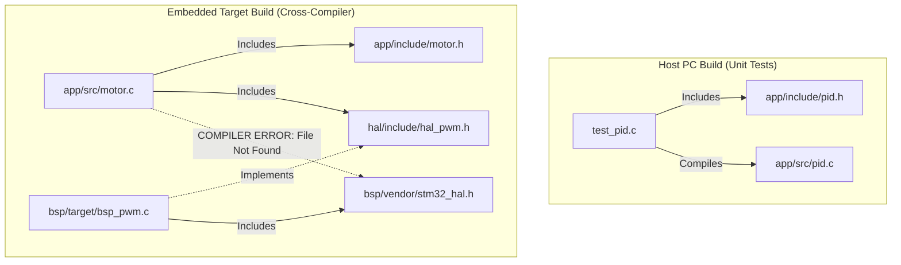

# 1.3 Why Codebase Structure Matters: The Physical Architecture

## Physical Architecture is Architecture

While modules, opaque pointers, and ABIs represent the *logical* architecture of a system, the directory and file organization on disk represent the *physical* architecture. If the physical architecture is a tangled, flat mess, the logical architecture will inevitably degrade. It is impossible to maintain clean architectural boundaries in your code if everything is dumped into a single `src/` directory where any file can technically `#include` any other file.

The physical structure of your codebase is the very first thing a new engineer—or an automated CI/CD pipeline—sees. It should instantly communicate the intent and design of the system. We often refer to this concept as "Screaming Architecture"—the folder structure should scream "This is a High-Reliability Motor Controller," rather than "This is a generic Eclipse/CubeIDE project that happens to run a motor."

When designing for a 20-year lifecycle, the physical layout is not a matter of aesthetics; it is the fundamental mechanism by which we configure the build system (Make, CMake, Bazel) to physically prevent architectural violations via compiler include path (`-I`) restrictions.

### The Vendor SDK Threat

The greatest threat to a clean physical architecture is the semiconductor vendor. Modern embedded development relies heavily on automated code generators (like STM32CubeMX, NXP MCUXpresso Config Tools, or Microchip Harmony). These tools are incredibly useful for rapidly generating clock tree initialization and pin muxing code. 

However, they are architecturally disastrous. Vendor tools typically generate a "Vendor Dump"—a flat or poorly structured tree that haphazardly mixes application logic stubs, third-party middleware (like FreeRTOS or LwIP), and low-level hardware registers. 

### ❌ Anti-Pattern: The Vendor Dump

If you adopt the vendor's generated directory structure without modification, you are implicitly adopting the vendor's architecture. 

```text
// ANTI-PATTERN: The Vendor Dump (Physical Architecture Failure)
Project_Root/
├── Core/
│   ├── Inc/
│   │   ├── main.h               <-- Contains vendor headers
│   │   ├── stm32f4xx_hal_conf.h
│   │   ├── motor_control.h      <-- App logic dumped in vendor folder!
│   │   └── pid_algorithm.h
│   └── Src/
│       ├── main.c               <-- The God Object
│       ├── system_stm32f4xx.c
│       ├── motor_control.c      <-- Hard-coupled to stm32f4xx_hal.h
│       └── pid_algorithm.c
├── Drivers/
│   ├── STM32F4xx_HAL_Driver/    <-- The actual vendor code
│   └── CMSIS/
└── Middlewares/
    └── Third_Party/
        └── FreeRTOS/
```

**Deep Technical Rationale for Failure:**
1. **The Include Path Free-For-All:** Because `motor_control.c` lives in `Core/Src` and its header is in `Core/Inc`, the build system must provide an include path to `Core/Inc`. Because `main.h` (which includes vendor HAL files) is *also* in `Core/Inc`, it becomes trivially easy for an engineer to lazily `#include "main.h"` inside `pid_algorithm.c`. Instantly, your pure math algorithm is intimately coupled to a specific STM32 microcontroller.
2. **The Upgrade Nightmare:** Three years later, when a silicon errata forces you to upgrade the STM32 HAL library, you must regenerate the project. Because your business logic (`motor_control.c`) is physically co-located with generated files, you must manually perform a tortuous `diff` to figure out which files are *yours* and which files belong to the vendor.
3. **Unit Testing Impossibility:** You cannot easily compile `pid_algorithm.c` on a desktop PC for unit testing (using GCC or Clang on x86) because the build system cannot easily decouple `Core/Src` from the `Drivers/` directory.

### ✅ Good Pattern: The Layered Directory Structure and The Firewall

A robust, 20-year company standard enforces a directory structure that physically segregates layers. We treat the Vendor SDK as an untrusted third-party library that is quarantined in a specific folder. 

```text
// GOOD: Screaming Embedded Architecture (Physical Decoupling)
Firmware_Root/
├── app/                      # Layer 3: Pure Business Logic (Hardware Agnostic)
│   ├── include/              # Public interfaces for app modules
│   └── src/                  # Implementation (motor_control.c, pid_algorithm.c)
├── services/                 # Layer 2: Middleware / OS / Comms
│   ├── osal/                 # Operating System Abstraction Layer
│   └── comms/                # MQTT, Protocol Buffers
├── hal/                      # Layer 1: The Architectural Firewall
│   ├── include/              # Pure C Interfaces (hal_gpio.h, hal_pwm.h)
│   └── src/                  # Generic, MCU-agnostic logic
├── bsp/                      # Layer 0: Board Support Package (The Quarantined Zone)
│   ├── target_stm32g4/       # Concrete implementation of hal/include/ for STM32
│   │   ├── bsp_gpio.c        # Includes stm32g4xx_hal.h and implements hal_gpio.h
│   │   └── board_init.c      # System clock config, generated by CubeMX
│   └── vendor_sdk/           # The untouched, raw vendor generated code
├── tests/                    # Host-PC Unit Tests (x86/ARM64)
│   ├── test_pid/             # Compiles ONLY app/src/pid_algorithm.c
│   └── mocks/                # Fake HAL implementations for testing
└── CMakeLists.txt            # Enforces the Include Path Firewall
```

### Deep Dive: Compiler-Enforced Include Path Firewalls

The true power of this physical architecture is realized in the build system (e.g., CMake). We don't just rely on engineers to follow the rules; we use the compiler's include path mechanisms (`-I` or `target_include_directories`) to physically prevent violations.

```cmake
# CMake Snippet: Enforcing the Architectural Firewall

# 1. Define the Application Target
add_library(app_logic STATIC 
    app/src/motor_control.c 
    app/src/pid_algorithm.c
)

# 2. Grant Access ONLY to approved directories.
# The app logic can ONLY see its own headers, and the HAL interfaces.
target_include_directories(app_logic PUBLIC 
    app/include
    hal/include      # Layer 1 interface
    services/include # Layer 2 interface
)

# CRITICAL SECURITY: We explicitly DO NOT add bsp/vendor_sdk to app_logic's includes.
# If motor_control.c attempts to `#include "stm32g4xx_hal.h"`, the compiler 
# throws a fatal "file not found" error. The architecture defends itself mechanically.

# 3. Define the BSP Target (The only place vendor code is allowed)
add_library(bsp_stm32 STATIC 
    bsp/target_stm32g4/bsp_gpio.c
    bsp/vendor_sdk/Src/stm32g4xx_hal.c
)

# The BSP must include the HAL interfaces to implement them, 
# AND it needs the vendor headers.
target_include_directories(bsp_stm32 PRIVATE 
    hal/include
    bsp/vendor_sdk/Inc
)
```

### Architectural Diagram: Physical Include Paths



### Company Standard Rules: Physical Architecture

1. **Rule of Physical Segregation:** Application logic (Layer 3), Hardware Abstraction Interfaces (Layer 1), and Vendor/BSP code (Layer 0) MUST reside in physically distinct, top-level directories within the repository root.
2. **Rule of the Include Firewall:** The build system (CMake, Make, Bazel) MUST be configured such that the target building the Application Layer does not have include paths (`-I`) to the Vendor SDK or BSP directories. Any attempt by application code to include a silicon-specific header MUST result in a compiler error.
3. **Rule of the Untouched Vendor:** Code generated by vendor tools or provided via vendor SDKs MUST remain in a quarantined directory (`bsp/vendor_sdk/`). This code MUST NOT be manually modified unless absolutely necessary (e.g., applying a silicon errata patch). If modified, the changes must be explicitly documented and tracked via version control patches, to allow for seamless future SDK upgrades.
4. **Rule of Testability:** The directory structure MUST support compiling the `app/` and `services/` layers on a host PC (x86/ARM64) using a standard desktop compiler (GCC/Clang) without requiring the cross-compiler or any vendor headers. All hardware dependencies must be mockable via the `hal/include/` firewall.