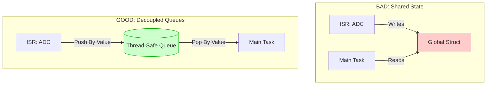

# 2.3 Control Flow in Embedded Systems: State and Concurrency

## Managing State and Concurrency

If Control Flow is the skeleton of the application, **Data Flow** is the circulatory system. How data is stored, modified, shared, and passed between different execution contexts (e.g., main loop and ISRs, or multiple RTOS tasks) is the source of the most insidious, hard-to-reproduce bugs in embedded systems: **Race Conditions** and **Memory Corruption**.

Architecting a safe data flow means establishing uncompromising rules about *who owns* a piece of data at any given millisecond, and *how* that data is safely handed off to another context. 

### The Root of All Evil: Shared State

Whenever two different execution contexts (e.g., the `main()` loop and an ISR) access the same global variable, and at least one of them writes to it, you have a **Critical Section**. If that access is not protected mechanically by the architecture, the data will eventually be corrupted.

#### ❌ Anti-Pattern: Unprotected Shared Structs and Read-Modify-Write Hazards

Consider a drone controller where an ISR reads the IMU sensor and the main loop calculates the motor outputs.

```c
// ANTI-PATTERN: Race condition on shared struct

// Global Shared State
typedef struct {
    int16_t accel_x;
    int16_t accel_y;
    int16_t accel_z;
} ImuData_t;

volatile ImuData_t g_sensor_data; // Volatile is NOT enough!

// Context 1: Runs in an ISR (Preempts Context 2 at any time)
void SPI_IMU_IRQHandler(void) {
    g_sensor_data.accel_x = ReadHardwareX();
    g_sensor_data.accel_y = ReadHardwareY();
    g_sensor_data.accel_z = ReadHardwareZ();
}

// Context 2: Runs in Main Loop (Background)
void App_Task_FlightController(void) {
    // RACE CONDITION!
    // What if the ISR fires exactly here, after reading X but before Y?
    int16_t x = g_sensor_data.accel_x; 
    int16_t y = g_sensor_data.accel_y;
    int16_t z = g_sensor_data.accel_z;
    
    CalculatePID(x, y, z); 
}
```

**Deep Technical Rationale for Failure:**
1. **The Tearing Effect:** In `App_Task_FlightController`, loading `x`, `y`, and `z` takes multiple assembly instructions (`LDRH`). If the CPU has just loaded `x` from the old sensor reading, and the `SPI_IMU_IRQHandler` fires, it updates all three values. When the ISR returns, the main loop resumes and loads the *new* `y` and `z`. The `CalculatePID` function is now fed an impossible physics state: an X from timestamp T, and a Y/Z from timestamp T+1. The drone flips over and crashes.
2. **The Volatile Misconception:** Many developers believe declaring the struct `volatile` fixes this. **It does not.** `volatile` only tells the compiler not to cache the variable in a CPU register; it guarantees that every read hits physical RAM. It provides exactly zero protection against the ISR preempting the multi-instruction read sequence. `volatile` does not make a struct atomic.

### Safe Data Flow Mechanisms

To architect a robust 20-year system, we must use appropriate data passing mechanisms based on the contexts involved, mechanically preventing race conditions.

#### 1. Atomic Operations & Critical Sections (Bare Metal)

If you absolutely must share global state in a bare-metal system, you must briefly disable hardware interrupts to read or write the shared data safely, creating a guaranteed **Critical Section**.

```c
// GOOD: Using a critical section to protect shared state
#include "cpu_atomic.h" // Abstraction for __disable_irq()

void App_Task_FlightController(void) {
    ImuData_t local_copy;
    
    // CRITICAL SECTION START: Prevent ISRs from firing
    CpuAtomic_EnterCritical(); 
    
    // The copy is fast and guaranteed not to be interrupted.
    // The data cannot "tear".
    local_copy.accel_x = g_sensor_data.accel_x;
    local_copy.accel_y = g_sensor_data.accel_y;
    local_copy.accel_z = g_sensor_data.accel_z;
    
    // CRITICAL SECTION END: Re-enable ISRs
    CpuAtomic_ExitCritical();

    // Safe to use local_copy for the next 500 lines of complex math
    CalculatePID(local_copy.accel_x, local_copy.accel_y, local_copy.accel_z);
}
```

*(Note: In modern ARM Cortex architectures, you can also use `LDREX`/`STREX` instructions for lock-free atomic operations, but disabling IRQs for a few clock cycles to copy a small struct is standard, predictable practice).*

#### 2. Queues and Ring Buffers (The Ultimate Decoupling)

The most architecturally sound way to move data between contexts is **Pass-by-Value through a Queue**. This eliminates shared mutable state entirely. The producer writes a complete copy of the data into the back of the queue, and the consumer reads it from the front. The only shared state is the read/write index pointers of the queue itself, which are carefully managed using atomic operations or IRQ masking inside the Queue library.

```c
// GOOD: Data flow via Ring Buffer / Queue
#include "ring_buffer.h"

// The Queue entirely encapsulates the critical section logic
RingBuffer_Handle_t g_sensor_queue;

// Producer (Context 1: ISR)
void SPI_IMU_IRQHandler(void) {
    ImuData_t new_data;
    new_data.accel_x = ReadHardwareX();
    new_data.accel_y = ReadHardwareY();
    new_data.accel_z = ReadHardwareZ();
    
    // Safely push to queue. The Queue's internal pointers are updated atomically.
    RingBuffer_PushFromISR(g_sensor_queue, &new_data); 
}

// Consumer (Context 2: App Task)
void App_Task_FlightController(void) {
    ImuData_t incoming_data;
    
    // Safely pop from queue. If empty, it returns false.
    // If using an RTOS, this would be an OS Queue that blocks until data arrives!
    if (RingBuffer_Pop(g_sensor_queue, &incoming_data)) {
        // We now OWN this copy of the data. No ISR can touch it.
        CalculatePID(incoming_data.accel_x, incoming_data.accel_y, incoming_data.accel_z);
    }
}
```

### Architectural Diagram: Shared State vs. Producer-Consumer



### Company Standards & Rules: Data Flow

1. **Ban Unprotected Global Variables:** Global variables MUST NOT be used for ad-hoc data passing between modules or execution contexts. If a global variable must be used, it MUST be declared `static` within a single `.c` module and protected by accessor functions (getters/setters).
2. **Encapsulate Critical Sections:** If shared state is unavoidable, the protection mechanism (disabling interrupts via `__disable_irq()`, or RTOS Mutexes) MUST be strictly encapsulated within the module that owns the data. The caller application MUST NEVER be responsible for managing locks or disabling interrupts manually.
3. **Producer-Consumer Over Shared State:** Whenever data streams from hardware/ISRs to the application layer, it MUST flow through a First-In-First-Out (FIFO) queue, ring buffer, or RTOS message queue. This fundamentally decouples the execution timing of the hardware from the execution timing of the application logic.
4. **The `volatile` Rule:** The `volatile` keyword MUST ONLY be used for: 
   - Memory-mapped hardware registers.
   - Simple primitive flags (`bool`, `uint32_t`) shared between an ISR and a polling loop.
   It MUST NEVER be relied upon to provide atomic access to structures or arrays. Any multi-byte structure shared between contexts MUST use a formal Critical Section or a Queue.
