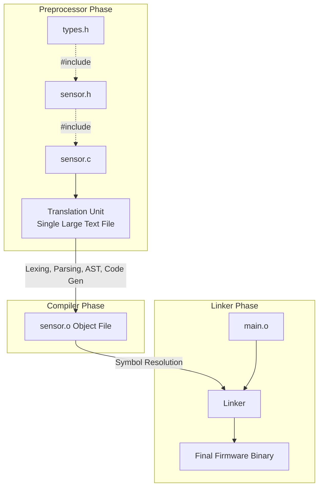

# Chapter 3.1: The True Nature of a Module in C

In the realm of modern systems programming—specifically within the rigorous constraints of safety-critical embedded software—a "module" is not a construct provided by the language. Unlike C++ (with its `class` and `namespace` mechanisms) or Rust (with its `mod` system), standard C (C99/C11) possesses zero syntactic awareness of modularity. To the C language, there are only functions, variables, and translation units.

Because the language will not enforce architectural boundaries for you, you must enforce them yourself. In our architecture, a module is a strict design discipline—a physical and logical boundary enforced through a profound understanding of the C preprocessor, the compiler, and the linker. 

This document defines the 20-year company standard for what constitutes a module, why it matters at the silicon level, and how we implement it to guarantee scalable, robust firmware.

---

## 1. The Anatomy of a Translation Unit

To understand a module, we must first understand how the toolchain views your code. When you invoke `gcc` or `arm-none-eabi-gcc`, the compiler does not compile your "project." It compiles **Translation Units**.

A translation unit is the ultimate result of the C preprocessor. When the compiler is handed `sensor.c`, the preprocessor executes first. It strips all comments, expands all macros, and—crucially—literally copy-pastes the entire contents of every `#include` directive into a single, massive temporary text file. This monolithic text file is the Translation Unit.

The compiler takes this Translation Unit and generates an Object File (`.o` or `.obj`). Finally, the Linker stitches these object files together, resolving symbol references (function calls and global variables) to create the final binary executable (the `.elf` or `.bin`).



### The Definition of a Module
At this company, **a Module is a highly cohesive, loosely coupled unit of software encapsulated within exactly one primary source file (`.c`) and exactly one public interface file (`.h`).**

The `.h` file is the **Contract**. It is the only part of the module exposed to the rest of the system.
The `.c` file is the **Implementation**. It contains the private, hidden details that the rest of the system is forbidden from knowing.

---

## 2. The Public Interface (`.h`) and Include Guards

The header file defines the Application Programming Interface (API) of the module. It must contain *only* what the caller absolutely needs to interact with the module.

### 2.1 The Include Hell Anti-Pattern
One of the most destructive forces in a legacy embedded codebase is "Include Hell." This occurs when header files indiscriminately include other header files.

```c
// ANTI-PATTERN: Include Hell
// uart_driver.h
#include "stm32f4xx_hal.h"  // Leaks 10,000 lines of vendor code!
#include "gpio_driver.h"
#include "dma_driver.h"
#include "rtos_tasks.h"     // Why does UART know about RTOS tasks?!

typedef struct {
    UART_HandleTypeDef huart; // Vendor struct exposed to the world
    uint8_t rx_buffer[256];
} UART_ModuleState_t;

void UART_Init(UART_ModuleState_t* state);
```

When `main.c` includes this `uart_driver.h`, the preprocessor pulls in the STM32 HAL, the GPIO driver, the DMA driver, and the RTOS. A simple 10-line `main.c` suddenly becomes a 35,000-line Translation Unit. 
1. **Compilation Time:** Build times skyrocket because the compiler parses tens of thousands of lines repeatedly for every `.c` file.
2. **Coupling:** If you change a macro in `rtos_tasks.h`, the compiler is forced to recompile `uart_driver.c`, `main.c`, and every other file in the system.
3. **Namespace Pollution:** Thousands of vendor macros (`ENABLE`, `DISABLE`, `MAX_DELAY`) are dumped into the global namespace, causing impossible-to-debug collisions.

### 2.2 The Solution: Precise Forward Declarations
To prevent Include Hell, our header files must be fiercely minimalist. We rely on **Forward Declarations** instead of `#include`.

At the silicon/compiler level, a pointer to any struct is always the same size (e.g., 4 bytes on a 32-bit ARM Cortex-M). Therefore, the compiler does not need to know the *contents* of a struct to pass a pointer to it. It only needs to know the struct *exists*.

```c
// PRODUCTION STANDARD: The Minimalist Header
// sensor_manager.h
#ifndef SENSOR_MANAGER_H_  // Strict include guards
#define SENSOR_MANAGER_H_

#include <stdint.h>        // ONLY include what is strictly necessary for this file
#include <stdbool.h>       // e.g., standard types

// 1. Forward Declaration (Opaque Pointer)
// The compiler knows this is a pointer, but the caller cannot see inside the struct.
typedef struct SensorManager_Context_t SensorManager_t;

// 2. Public Enumerations
typedef enum {
    SENSOR_OK = 0,
    SENSOR_ERR_TIMEOUT,
    SENSOR_ERR_HARDWARE
} Sensor_Status_e;

// 3. Public API Prototypes
// Notice we pass the opaque pointer. The caller has no idea how large it is or what it holds.
SensorManager_t* SensorManager_Create(void);
Sensor_Status_e SensorManager_ReadTemperature(SensorManager_t* const self, float* out_temp);
void SensorManager_Destroy(SensorManager_t* self);

#endif /* SENSOR_MANAGER_H_ */
```

### 2.3 Include Guard Strategy
To prevent cyclic dependencies and redundant parsing, every header file MUST use standard `#ifndef` include guards. While `#pragma once` is supported by GCC and Clang, it is not part of the ISO C standard and has caused esoteric failures in certified, deeply embedded proprietary compilers (e.g., older versions of IAR or Tasking). We strictly use standard `#ifndef`.

---

## 3. The Private Implementation (`.c`)

The `.c` file is where the module's actual logic lives. This is where we define the `SensorManager_Context_t` struct. Because the struct definition is placed in the `.c` file, it is invisible to the rest of the system. This is the C equivalent of the PIMPL (Pointer to Implementation) idiom.

### 3.1 Linker-Level Information Hiding with `static`
In standard C, any function or global variable declared without the `static` keyword has **External Linkage**. This means the compiler puts the symbol's name into the Object File's global symbol table. The linker can see it, and any other file can call it simply by guessing the function signature.

To achieve true encapsulation, every function and variable that is not explicitly part of the public API (defined in the `.h` file) **MUST** be marked `static`. This changes the linkage to **Internal Linkage**. The compiler strips the symbol from the global symbol table. It is mathematically impossible for another module to call a `static` function by name, because the linker will reject it with an "Undefined Reference" error.

Furthermore, marking private functions `static` allows the compiler to perform extreme optimizations. Because the compiler knows no other file can call the function, it can aggressively inline the function, eliminating the call-stack overhead and reducing execution cycles at the silicon level.

```c
// PRODUCTION STANDARD: The Implementation
// sensor_manager.c
#include "sensor_manager.h"
#include "stm32f4xx_hal.h"   // Vendor includes go HERE, safely hidden in the .c file!

// 1. Concrete Struct Definition (Hidden from callers)
struct SensorManager_Context_t {
    I2C_HandleTypeDef* i2c_bus; // Vendor type hidden!
    uint8_t slave_address;
    bool is_initialized;
    uint32_t error_count;
};

// Singleton instance (if dynamic allocation is forbidden)
static struct SensorManager_Context_t instance; 

// 2. Private Helper Functions (Internal Linkage)
// The 'static' keyword ensures the Linker hides these symbols.
static void reset_i2c_bus(struct SensorManager_Context_t* ctx) {
    // Hardware specific recovery logic...
    ctx->error_count++;
}

// 3. Public API Implementation
SensorManager_t* SensorManager_Create(void) {
    instance.is_initialized = true;
    instance.error_count = 0;
    // Note: In safety-critical systems, static allocation is preferred over malloc.
    return &instance; 
}

Sensor_Status_e SensorManager_ReadTemperature(SensorManager_t* const self, float* out_temp) {
    if (self == NULL || !self->is_initialized) {
        return SENSOR_ERR_HARDWARE;
    }
    
    // Implementation details...
    if (/* hardware failure */ false) {
        reset_i2c_bus(self);
        return SENSOR_ERR_TIMEOUT;
    }
    
    *out_temp = 25.5f;
    return SENSOR_OK;
}
```

---

## 4. Architectural Outcomes

By strictly adhering to this definition of a module, we achieve massive architectural benefits:

1. **ABI Stability:** Because the caller only knows about the opaque pointer, we can add, remove, or change the members of `SensorManager_Context_t` in the `.c` file *without* recompiling any other module in the system. The Application Binary Interface (ABI) remains perfectly stable.
2. **Vendor Isolation:** If we migrate from an STM32 to a Nordic NRF microcontroller, the `sensor_manager.h` file remains completely unchanged. Only `sensor_manager.c` needs to be rewritten. The application layer above it has no idea the silicon changed.
3. **Compile-Time Firewalling:** We physically sever the dependency graph. The preprocessor no longer cascades millions of lines of header files throughout the project.

---

## 5. Company Standard Rules for Modules

1. **One Header, One Source:** A module shall consist of exactly one `.h` file and one `.c` file unless abstracting a polymorphic interface (covered in Chapter 4).
2. **Strict Include Guards:** Every `.h` file MUST use `#ifndef`, `#define`, `#endif` guards. `#pragma once` is strictly forbidden to maintain 100% ISO C compliance across all proprietary compilers.
3. **Minimalist Headers:** A header file shall `#include` only the absolute minimum required for its own declarations. If a pointer to a struct is used, a Forward Declaration `typedef struct Name_t Name_t;` MUST be used instead of including the struct's definition.
4. **Opaque Pointers (PIMPL):** All module state must be encapsulated within a `struct` defined exclusively in the `.c` file. The `.h` file shall only expose an opaque pointer to this struct.
5. **No Vendor Leaks:** No vendor-specific hardware headers (e.g., `stm32f4xx.h`, `nrf.h`) or RTOS headers (e.g., `FreeRTOS.h`) shall ever be included in a module's public `.h` file. They must be isolated within the `.c` file.
6. **Default to Static:** Every variable and function defined in a `.c` file MUST be marked `static` (Internal Linkage) unless it is explicitly prototyped in the corresponding `.h` file.
