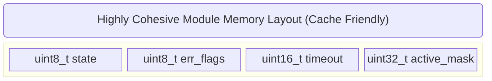

# Chapter 3.2: Cohesion and Coupling at the Silicon Level

To evaluate the architectural survivability of an embedded system, you do not look at the framework, the RTOS, or the coding style. You measure exactly two metrics: **Cohesion** and **Coupling**.

The golden rule of software architecture, immutable across all languages and execution environments, is: **Maximize Cohesion, Minimize Coupling.**

In deeply embedded systems, these are not just abstract software engineering concepts. They have tangible, measurable impacts on Linker resolution time, flash memory footprint, and L1/L2 cache locality at the silicon level. This document details our company standard for analyzing and enforcing these metrics.

---

## 1. Cohesion: The Internal Glue

Cohesion measures the strength of the relationship between the functions, variables, and data structures *within* a single module. A highly cohesive module does exactly one thing, does it completely, and encapsulates all the necessary state to do it.

### 1.1 The Silicon Reality of Cohesion (Cache Locality)
Why do we care about cohesion in firmware? Beyond readability, high cohesion directly correlates with hardware execution efficiency. 

Modern high-performance microcontrollers (like the ARM Cortex-M7 or Cortex-A/R series) utilize highly structured L1 Instruction and Data caches. When the CPU fetches a variable from RAM, it pulls an entire "cache line" (typically 32 or 64 bytes) into the fast, on-chip SRAM cache. 

If your module is highly cohesive, its internal state variables (`struct` members) are grouped tightly together in memory. When a function in a cohesive module executes, it typically operates on variables that are adjacent to each other. Because they are adjacent, pulling the first variable pulls the rest of the module's state into the cache simultaneously. The CPU experiences a "cache hit" on subsequent reads, executing at zero wait-states.



Conversely, a module with **Low Cohesion** (the "God Object" anti-pattern) grabs data from global variables scattered randomly across the `.bss` and `.data` sections. This causes constant "cache misses," forcing the CPU to stall for dozens of clock cycles while it fetches data over the slow AHB/AXI bus.

### 1.2 The "God Object" Anti-Pattern (Low Cohesion)

```c
// ANTI-PATTERN: Low Cohesion (The God Object)
// system_manager.c

uint32_t system_tick;
float last_known_temperature;
uint8_t uart_rx_buffer[128];
bool motor_is_running;

// This module handles timing, thermal, comms, AND actuation. 
// It has ZERO cohesion.
void System_DoEverything(void) {
    system_tick++;
    if (uart_rx_buffer[0] == 0xAA) {
        motor_is_running = true;
    }
    if (last_known_temperature > 45.0f) {
        motor_is_running = false;
    }
}
```
*Why this fails:* The `System_DoEverything` function is a nightmare to unit test. To test the motor thermal shutdown logic, the test harness must also mock the UART buffer and the system tick. The responsibilities are hopelessly tangled.

---

## 2. Coupling: The Web of Dependencies

Coupling measures the degree to which one module relies on another. If Module A cannot compile, link, or function without Module B, then Module A is tightly coupled to Module B.

In embedded C, coupling manifests in two distinct phases of the build pipeline: **Compile-Time Coupling** (via `#include`) and **Link-Time Coupling** (via symbol resolution).

### 2.1 Compile-Time Coupling
As discussed in Chapter 3.1, compile-time coupling is driven by the preprocessor. If `A.h` includes `B.h`, changing a single character in `B.h` forces the compiler to recompile `A.c`. This destroys build times. We mitigate this using Opaque Pointers and Forward Declarations.

### 2.2 Link-Time Coupling
Link-Time coupling is more insidious. It occurs when `Module A` directly calls a function defined in `Module B`. 

When the compiler generates `A.o`, it leaves a "hole" where the call to `B_Function()` should be, marking it as an unresolved external symbol. Later, the Linker searches all object files for `B_Function()`. If the Linker finds it in `B.o`, it patches the hole in `A.o` with the actual memory address of `B_Function()`.

```mermaid
graph LR
    subgraph Tight Link-Time Coupling
        A[App_Thermostat.o] -->|Direct Call: 'TempSensor_Read()'| B[Driver_TempSensor.o]
        B -->|Direct Call: 'I2C_Transfer()'| C[HAL_I2C.o]
    end
```

### 2.3 The Testing Nightmare of Tight Coupling
If `App_Thermostat` is tightly coupled to `Driver_TempSensor`, you **cannot** run `App_Thermostat` on your development PC to run unit tests. Why? Because the Linker will try to find `TempSensor_Read()`. If you compile `Driver_TempSensor` for your PC, it will in turn look for `I2C_Transfer()`. Your PC does not have an I2C peripheral, so the link fails. 

Tight coupling chains your high-level business logic to the physical silicon, making off-target testing impossible.

### 2.4 The Solution: Interface Injection (Inversion of Control)
To break link-time coupling, we must stop modules from explicitly naming the functions they call. Instead of `Module A` calling `B_Function()`, we pass a **Function Pointer** (or a struct of function pointers, known as a V-Table) to `Module A`.

```c
// PRODUCTION STANDARD: Loose Coupling via Function Pointers
// thermostat.h
typedef struct {
    // Function pointer injected at runtime!
    // The thermostat knows HOW to read a sensor, but doesn't care WHICH sensor.
    float (*ReadTemperature_Fn)(void); 
    float setpoint;
} Thermostat_t;

void Thermostat_Init(Thermostat_t* self, float (*sensor_func)(void));
void Thermostat_Update(Thermostat_t* self);
```

```c
// thermostat.c
void Thermostat_Update(Thermostat_t* self) {
    // Loose Coupling: We call the function pointer, NOT a specific hardware driver.
    float current_temp = self->ReadTemperature_Fn(); 
    
    if (current_temp < self->setpoint) {
        // Turn on heater...
    }
}
```

By doing this, the Linker resolves the call to `ReadTemperature_Fn()` entirely within the `Thermostat.o` object file (it's just dereferencing a pointer). The Linker no longer demands that the hardware sensor driver be present. During unit testing, we simply inject a mock function that returns a dummy temperature.

---

## 3. The Coupling/Cohesion Matrix

Every module in our codebase must strive for the top-left quadrant of this matrix:

| | High Cohesion | Low Cohesion |
|---|---|---|
| **Loose Coupling** | **The Ideal (Target Architecture).** Modules are isolated, testable, and focused. | **The Utility Drawer.** A collection of unrelated math/string functions. Tolerable, but poorly structured. |
| **Tight Coupling** | **The Brittle Monolith.** Modules do one thing, but are chained together. Hard to reuse. | **The Spaghetti Disaster (Anti-Pattern).** God objects calling each other directly. Impossible to maintain. |

---

## 4. Company Standard Rules for Cohesion and Coupling

1. **Single Responsibility Principle:** A module shall have one, and only one, reason to change. Its cohesion must be absolute. If a module manages an ADC, it shall not format strings for a display.
2. **No Global State Cross-Talk:** Modules shall never read or write global variables defined in other modules. All data transfer must occur through strictly defined API function parameters and return values.
3. **Hardware Independence:** High-level application modules (business logic) shall NEVER contain direct link-time dependencies to low-level hardware drivers. They must depend exclusively on abstract interfaces (Function Pointers/V-Tables).
4. **Link-Time Substitutability:** Every business-logic module must be capable of compiling and linking into an executable on an x86/x64 development PC using a standard host compiler (GCC/Clang) without requiring the cross-compiler or hardware abstraction layers.
5. **Cache-Conscious Design:** When defining a module's private context struct (`PIMPL`), variables accessed sequentially within the module's update loop MUST be grouped adjacent to each other in the struct definition to maximize L1 cache hit rates on applicable silicon.
