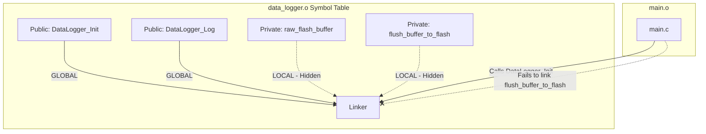

# Chapter 3.3: Public API vs Private Implementation

The essence of modularity is **Information Hiding**. A module must expose exactly what is necessary for others to use it, and ruthlessly hide everything else. 

When a module's internal details are exposed, other modules will inevitably begin to rely on them. When you later need to change those internal details to fix a bug or optimize performance, the dependent modules break. This is the root cause of rigid, fragile codebases. In safety-critical systems, exposing internal state is not just poor design; it is a critical vulnerability that allows rogue modules to silently corrupt another module's state.

---

## 1. The `static` Keyword: C's Access Modifier

In C++, developers rely on `public`, `private`, and `protected` to enforce access control. In C, we have the `static` keyword. However, `static` in C is heavily overloaded and behaves completely differently depending on its context.

To understand information hiding, we must understand how `static` affects **Linkage** at the compiler and linker level.

### 1.1 External Linkage (The Public API)
By default, any function or global variable declared in a `.c` file has **External Linkage**. 

When the compiler generates the object file (`.o`), it places the names of all external symbols into the object file's **Symbol Table**. The linker uses this table to resolve function calls across the entire program. 

```c
// data_logger.c
// NO static keyword. This has External Linkage.
uint8_t raw_flash_buffer[2048]; 

void flush_buffer_to_flash(void) {
    // Implementation...
}
```

If another developer creates `main.c`, they can simply write `extern uint8_t raw_flash_buffer[];` and directly modify your buffer. They have bypassed your API entirely. They don't even need to include your header file! They just guessed the symbol name, and the Linker happily resolved it.

### 1.2 Internal Linkage (The Private Implementation)
When you apply the `static` keyword to a global variable or a function at the file scope, you change its linkage to **Internal Linkage**.

```c
// data_logger.c
// PRIVATE: The static keyword enforces Internal Linkage.
static uint8_t raw_flash_buffer[2048]; 

static void flush_buffer_to_flash(void) {
    // Implementation...
}
```

When the compiler generates the object file for this code, it tags these symbols as `LOCAL` rather than `GLOBAL` in the Symbol Table. When the Linker runs, it actively prevents any other object file from resolving a reference to a `LOCAL` symbol. 

If `main.c` tries to call `flush_buffer_to_flash()`, the Linker will throw an `undefined reference` error, **even if `main.c` correctly guesses the function signature.**



### 1.3 The Optimization Benefits of `static`
Beyond encapsulation, `static` is a massive hint to the compiler's optimizer. Because the compiler knows a `static` function cannot be called from outside the current translation unit, it can perform **Link-Time Optimization (LTO)** even if LTO is disabled globally.

If `flush_buffer_to_flash()` is only called once or twice within `data_logger.c`, the compiler will simply inline the function's assembly code directly into the caller. This eliminates the overhead of setting up the stack frame, pushing registers, branching, and returning—saving crucial clock cycles on deeply embedded microcontrollers.

---

## 2. Opaque Types: Hiding the Struct

The ultimate form of information hiding in C is the **Opaque Pointer** (also known as the PIMPL idiom - Pointer to Implementation).

If your module requires state (variables), you must define a `struct`. The critical question is: *Where* does that struct definition live?

### 2.1 The Anti-Pattern: The Exposed Struct
```c
// ANTI-PATTERN: Exposed Implementation
// pid_controller.h
typedef struct {
    float kp, ki, kd;
    float integral_sum; // DANGER: Internal state exposed!
    float last_error;   // DANGER: Internal state exposed!
} PID_Controller_t;

void PID_Init(PID_Controller_t* pid, float p, float i, float d);
float PID_Calculate(PID_Controller_t* pid, float error);
```

If `PID_Controller_t` is defined in the header file, any module that includes `pid_controller.h` can read or write `integral_sum` directly. A rogue module could reset the integral sum to zero, completely destabilizing the control loop. You have provided an API, but you have no way to enforce its use.

Furthermore, if you realize you need to add a low-pass filter to the D-term and add a `float d_filter_state;` to the struct, you have changed the size of the struct. Every single `.c` file that included `pid_controller.h` must be recompiled.

### 2.2 The Standard: The Opaque Pointer
As established in Chapter 3.1, we move the struct definition into the `.c` file.

```c
// PRODUCTION STANDARD: The Opaque Pointer
// pid_controller.h
typedef struct PID_Controller_Context_t PID_Controller_t; // Forward Declaration

PID_Controller_t* PID_Create(float p, float i, float d);
float PID_Calculate(PID_Controller_t* pid, float error);
```

```c
// pid_controller.c
#include "pid_controller.h"
#include <stdlib.h> // For malloc, or use a static memory pool

// The definition is hidden here!
struct PID_Controller_Context_t {
    float kp, ki, kd;
    float integral_sum; 
    float last_error;   
};

PID_Controller_t* PID_Create(float p, float i, float d) {
    // Allocation logic (static pool or dynamic)...
    // Return pointer to opaque context
}
```

Now, if `main.c` tries to do `my_pid->integral_sum = 0;`, the compiler will throw a fatal error: `dereferencing pointer to incomplete type`. The compiler literally does not know what `integral_sum` is, or what offset it lives at, because the struct definition is not in the translation unit for `main.c`. 

You have achieved true, compiler-enforced information hiding.

---

## 3. Company Standard Rules for API vs Implementation

1. **Default to Static:** Every function and global variable defined in a `.c` file MUST be explicitly marked `static` unless it is a public API function prototyped in the module's `.h` file. 
2. **Zero Global Variables:** Global variables with external linkage (i.e., lacking the `static` keyword) are strictly forbidden. If a variable must be accessed across modules, it must be hidden behind an opaque pointer or accessed via a strictly controlled getter/setter API.
3. **Struct Encapsulation:** Any `struct` that contains internal state, calculation history, or private configuration MUST be defined exclusively within the `.c` file. The `.h` file shall only expose a forward-declared opaque pointer to that struct.
4. **No Extern Keywords:** The `extern` keyword shall never be used in a `.c` file to manually link to a variable in another file. If you need data from another module, you must include its header and use its public API.
5. **Clear API Boundaries:** The `.h` file must be treated as an immutable contract. Changes to the internal `static` implementation or the hidden `struct` in the `.c` file must never require changes to the `.h` file or recompilation of dependent modules.
