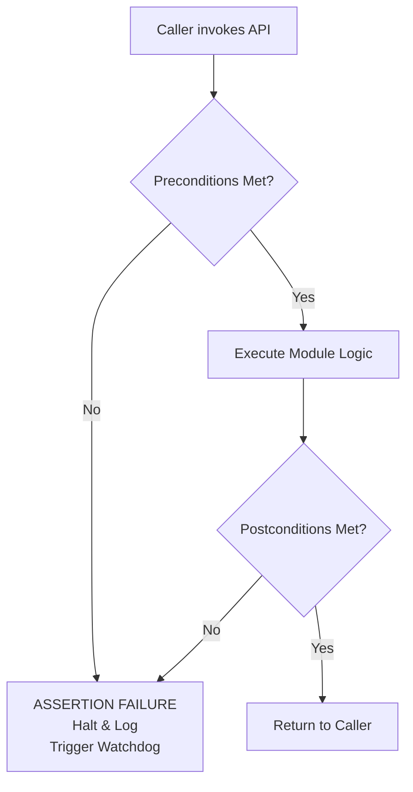

# Chapter 3.4: Defining Module Contracts

When a module exposes a public function in its header file, it is making a solemn promise to the rest of the system. This promise is called a **Contract**. 

In standard C, the compiler only enforces the *signature* of the contract: it ensures the caller passes the correct data types (e.g., a `uint32_t` and a `float*`) and receives the correct return type. It does not—and cannot—enforce the *behavior* or the *validity* of the data. 

To build safety-critical firmware that fails predictably and safely, we employ a methodology called **Design by Contract (DbC)**.

---

## 1. The Three Pillars of a Contract

A module contract consists of three explicit guarantees: Preconditions, Postconditions, and Invariants.

### 1.1 Preconditions (The Caller's Responsibility)
Preconditions are the absolute requirements that must be true *before* a function is called. If the caller violates a precondition, the function is under no obligation to execute correctly, safely, or at all. The fault lies entirely with the caller.

Examples of preconditions:
*   Pointers passed as arguments must not be `NULL`.
*   An initialization function (`Module_Init()`) must have been called previously.
*   A parameter must fall within a specific range (e.g., `pwm_duty_cycle <= 100`).

### 1.2 Postconditions (The Callee's Responsibility)
Postconditions are the guarantees that the function makes *after* it has finished executing, assuming the preconditions were met.

Examples of postconditions:
*   The returned pointer is guaranteed to be valid (not `NULL`).
*   The hardware register has been updated with the new configuration.
*   The output buffer contains exactly `N` bytes of processed data.

### 1.3 Invariants (The Module's Integrity)
Invariants are conditions that remain internally consistent across the entire lifespan of the module. They are true before a public function is called, and they are true after it returns.

Examples of invariants:
*   A circular buffer's `head` and `tail` pointers never exceed the buffer's maximum size.
*   The internal state machine is always in one of the defined, valid states.

---

## 2. Enforcing Contracts in C

How do we enforce these contracts in a language as permissive as C? We use **Assertions**.

An assertion is a runtime check that explicitly tests a contract condition. If the condition is false, the assertion halts the system immediately. 

```c
// PRODUCTION STANDARD: Enforcing Preconditions
#include <assert.h>
#include "flash_driver.h"

// Invariant: The flash subsystem must be initialized before use.
static bool is_flash_initialized = false;

void FlashDriver_Init(void) {
    // Hardware init...
    is_flash_initialized = true;
}

Flash_Status_e FlashDriver_WritePage(uint32_t address, const uint8_t* data, size_t length) {
    // Precondition 1: Module must be initialized
    assert(is_flash_initialized == true);
    
    // Precondition 2: Pointers must be valid
    assert(data != NULL);
    
    // Precondition 3: Address must be page-aligned
    assert((address % FLASH_PAGE_SIZE) == 0);
    
    // Precondition 4: Length must not exceed a page
    assert(length <= FLASH_PAGE_SIZE);

    // --- Core Logic Executes Here ---

    // Postcondition: Ensure the write actually succeeded at the silicon level
    // (In a real system, this might be a blocking check or interrupt flag)
    // assert(HW_REG_FLASH_STATUS == FLASH_READY);

    return FLASH_OK;
}
```

### 2.1 The Defensive Programming Anti-Pattern
Many developers confuse Design by Contract with "Defensive Programming." Defensive programming dictates that a function should try to gracefully recover from invalid inputs. 

```c
// ANTI-PATTERN: Defensive Programming
Flash_Status_e FlashDriver_WritePage_Bad(uint32_t address, const uint8_t* data, size_t length) {
    if (!is_flash_initialized) return FLASH_ERR_NOT_READY;
    if (data == NULL) return FLASH_ERR_INVALID_ARG;
    if ((address % FLASH_PAGE_SIZE) != 0) return FLASH_ERR_ALIGNMENT;
    // ...
}
```

**Why Defensive Programming Fails in Embedded Systems:**
1.  **Slower Execution:** Every `if` statement adds branching overhead and pipeline stalls at the silicon level. Checking for `NULL` pointers deep inside a high-frequency control loop wastes critical clock cycles.
2.  **Hidden Bugs:** If a high-level application logic bug passes a `NULL` pointer to the Flash Driver, returning `FLASH_ERR_INVALID_ARG` just kicks the can down the road. The application might ignore the error code, leading to silent failures. 
3.  **Code Bloat:** The error handling logic often doubles the size of the function, eating up precious flash memory.

**The DbC Philosophy:** If a contract is violated, the system is fundamentally broken. A `NULL` pointer where one is strictly forbidden means the software is in an undefined state. The safest and most predictable action is to immediately halt the system, log the failure (file and line number), and trigger a watchdog reset to recover.



### 2.2 Assertions in Production vs Debug
Standard C `<assert.h>` provides a macro `assert()`. If you compile with the `NDEBUG` flag (typically for production builds), the preprocessor entirely removes all `assert()` statements from the code. They consume zero flash space and zero execution cycles in the final product.

In safety-critical systems (DO-178C, ISO 26262), relying on standard `assert()` is often insufficient, because silently removing checks in production is dangerous. Instead, we implement a **Custom Assertion Handler**.

```c
// company_assert.h
#ifdef DEBUG
    #define SYSTEM_ASSERT(condition) \
        do { \
            if (!(condition)) { \
                System_Halt_And_Log(__FILE__, __LINE__); \
            } \
        } while(0)
#else
    // In production, we might still assert, but perhaps with less string data 
    // to save flash, or we map it directly to a software reset.
    #define SYSTEM_ASSERT(condition) \
        do { \
            if (!(condition)) { \
                Trigger_Safe_State_Reset(); \
            } \
        } while(0)
#endif
```

---

## 3. Company Standard Rules for Module Contracts

1. **Preconditions over Error Codes:** Use assertions (`SYSTEM_ASSERT`) to enforce API preconditions (e.g., non-NULL pointers, valid ranges, initialized state). Do not use `if` statements to return error codes for conditions that indicate a fundamental software logic bug. 
2. **Error Codes for Expected Failures:** Reserve return error codes (e.g., `STATUS_TIMEOUT`, `STATUS_I2C_NACK`) for environmental or hardware conditions that are expected to fail occasionally and from which the caller is expected to recover.
3. **No Asserts on External Data:** Never use assertions to validate data received from an external, untrusted source (e.g., parsing a UART packet). Assertions are for proving internal software correctness. External data MUST be validated using `if` statements and graceful error handling.
4. **Asserts in Private Functions:** Private (`static`) functions do not need to rigorously check their inputs if the public API functions that call them have already validated the preconditions.
5. **No Side Effects in Asserts:** An assertion condition must never contain code that modifies system state. Because assertions can be compiled out via `NDEBUG`, any side effects will disappear in production builds. (e.g., `SYSTEM_ASSERT(x++ == 5)` is strictly forbidden).
