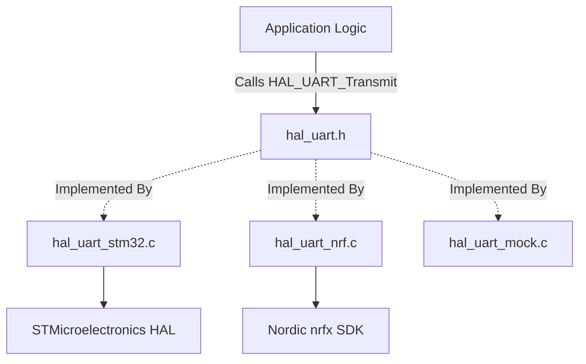

# Chapter 4.2: True Hardware Abstraction Layers (HAL)

The most misunderstood concept in embedded architecture is the "Hardware Abstraction Layer." 

When you buy a microcontroller from STMicroelectronics, they provide the "STM32 HAL." When you buy from NXP, they provide the "MCUXpresso SDK." When you buy from Nordic, you get "nrfx." 

**Architectural Reality Check:** From the perspective of a robust, 20-year software architecture, these vendor libraries are *not* your HAL. They are highly proprietary, fiercely coupled vendor APIs that merely wrap hardware registers in C functions. If your application logic calls `HAL_UART_Transmit()` from ST, your entire application is now permanently welded to ST silicon. 

In our company standard, an **Architectural HAL** is a layer of software *you* write. Its sole purpose is to wrap the vendor's API into a truly generic, silicon-agnostic interface.

---

## 1. The Role of the Architectural HAL

The Architectural HAL sits directly above the Vendor API. It translates generic, high-level requests (e.g., "Send these 10 bytes over UART") into specific, vendor-coupled requests (e.g., "Call `HAL_UART_Transmit(&huart1, data, 10, 1000)`").

### 1.1 The Vendor Leakage Anti-Pattern
The most common mistake when building an Architectural HAL is accidentally leaking the vendor's types through your interface.

```c
// ANTI-PATTERN: Vendor Leakage
// my_uart_hal.h (This is supposed to be generic!)
#include "stm32f4xx_hal.h" // FATAL MISTAKE: Vendor header exposed!

// We tried to make a generic init function...
void UART_Init(UART_HandleTypeDef* vendor_handle, uint32_t baud_rate);

// But now, any module that includes my_uart_hal.h is forced to know what 
// a UART_HandleTypeDef is, coupling them back to the STM32!
```

If you do this, you have accomplished nothing. You added an extra function call, but you did not break the dependency. The application still cannot be compiled for a PC or a Nordic chip.

---

## 2. Implementing a True Architectural HAL

To build a true HAL, we must use the Opaque Pointer pattern (Chapter 3.3) to completely hide the vendor's data types inside the `.c` file.

### 2.1 The Generic Interface (`.h`)
The header file must be pure C. It cannot contain a single reference to any specific microcontroller.

```c
// PRODUCTION STANDARD: Pure Architectural HAL Interface
// hal_uart.h
#ifndef HAL_UART_H_
#define HAL_UART_H_

#include <stdint.h>
#include <stdbool.h>
#include <stddef.h>

// 1. Opaque Pointer: Represents a generic UART instance
typedef struct HAL_UART_Context_t HAL_UART_t;

// 2. Generic Error Codes
typedef enum {
    HAL_UART_OK = 0,
    HAL_UART_ERR_TIMEOUT,
    HAL_UART_ERR_BUSY,
    HAL_UART_ERR_HW
} HAL_UART_Status_e;

// 3. The Pure C API
// Notice there are ZERO vendor types here.
HAL_UART_t* HAL_UART_Create(uint8_t hardware_instance, uint32_t baud_rate);
HAL_UART_Status_e HAL_UART_Transmit(HAL_UART_t* self, const uint8_t* data, size_t length);

#endif /* HAL_UART_H_ */
```

### 2.2 The Concrete Implementation (`.c`)
The `.c` file is where the vendor lock-in occurs. We *want* this lock-in, but we want it isolated, quarantined entirely within this single file.

```c
// PRODUCTION STANDARD: Vendor-Coupled Implementation
// hal_uart_stm32.c 
#include "hal_uart.h"
#include "stm32f4xx_hal.h" // Safe! Hidden from the rest of the system.

// Define the hidden context. This holds the ST-specific struct.
struct HAL_UART_Context_t {
    UART_HandleTypeDef huart; // Vendor struct encapsulated!
    bool is_initialized;
};

// Static memory pool for instances (avoiding malloc)
static struct HAL_UART_Context_t uart_instances[3];

HAL_UART_t* HAL_UART_Create(uint8_t hardware_instance, uint32_t baud_rate) {
    HAL_UART_t* ctx = &uart_instances[hardware_instance];
    
    if (hardware_instance == 1) {
        ctx->huart.Instance = USART1;
    } // ... etc
    
    ctx->huart.Init.BaudRate = baud_rate;
    // ... setup ST specific parameters ...
    
    if (HAL_UART_Init(&ctx->huart) == HAL_OK) {
        ctx->is_initialized = true;
        return ctx;
    }
    return NULL;
}

HAL_UART_Status_e HAL_UART_Transmit(HAL_UART_t* self, const uint8_t* data, size_t length) {
    if (self == NULL || !self->is_initialized) return HAL_UART_ERR_HW;
    
    // Translate the generic call into the ST specific call
    HAL_StatusTypeDef st_status = HAL_UART_Transmit(&(self->huart), (uint8_t*)data, length, 1000);
    
    // Translate the ST specific error code back to our generic error code
    if (st_status == HAL_OK) return HAL_UART_OK;
    if (st_status == HAL_TIMEOUT) return HAL_UART_ERR_TIMEOUT;
    return HAL_UART_ERR_HW;
}
```



---

## 3. The Power of the Mock implementation

Because our `hal_uart.h` is pure C, we can easily create a third `.c` file: `hal_uart_mock.c`. 

When compiling for the target hardware, our build system (CMake/Make) links `hal_uart_stm32.c`. When compiling on our development PC for unit tests, the build system links `hal_uart_mock.c`.

The mock implementation simply records what was transmitted into a standard C array, allowing the unit test framework to assert that the application sent the correct bytes.

---

## 4. Company Standard Rules for the HAL

1. **Total Encapsulation:** A HAL interface (`.h`) MUST NEVER include a silicon vendor header file, RTOS header, or expose a vendor-specific type (e.g., `uint32_t` is fine, `IRQn_Type` is forbidden).
2. **Translation Layer:** The HAL `.c` implementation MUST translate all vendor-specific error codes into the generic, company-standard error enumerations defined in the HAL `.h`.
3. **No Business Logic:** The HAL is an incredibly dumb layer. It must contain zero application logic, state machines, or data processing. It solely ferries bytes between the generic interface and the silicon registers.
4. **Mock Parity:** Every HAL interface MUST have a corresponding `_mock.c` implementation available in the test tree, ensuring 100% of HAL dependencies can be fulfilled when compiling on a host PC.
