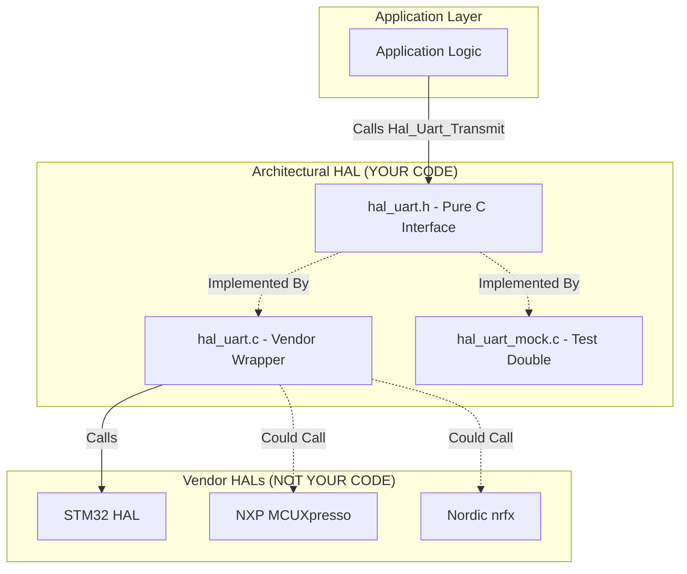

# Hardware Abstraction Layers (HAL)

The Hardware Abstraction Layer (HAL) is the lowest level of software in a well-architected embedded system. Its sole purpose is to provide a generic, standardized API for the microcontroller's internal peripherals (UART, SPI/I2C, ADC, Timers, GPIO).

## The Vendor HAL Problem

When you buy a microcontroller from STMicroelectronics, you are provided with "STM32 HAL." When you buy from NXP, you are provided with "MCUXpresso SDK." When you buy from Nordic, you get "nrfx."

**Architectural Reality:** From the perspective of a robust, 20-year software architecture, these vendor libraries are **not** your HAL. They are highly proprietary, fiercely coupled vendor APIs that merely wrap hardware registers in C functions. If your application logic calls `HAL_UART_Transmit()` from ST directly, your entire application is now permanently welded to ST silicon.

## The Architectural HAL Solution
In our company standard, an **Architectural HAL** is a layer of software *you* write. Its sole purpose is to wrap the vendor APIs into a truly generic, silicon-agnostic interface.

### Complete Example: Architectural UART HAL

See the complete working example in:
- [`code/part2-modular-design/hal_example/hal_uart.h`](https://github.com/raynhardt-van-zyl/Embedded-C-Architecture-Course/blob/main/code/part2-modular-design/hal_example/hal_uart.h) - Full HAL header
- [`code/part2-modular-design/hal_example/hal_uart.c`](https://github.com/raynhardt-van-zyl/Embedded-C-Architecture-Course/blob/main/code/part2-modular-design/hal_example/hal_uart.c) - Vendor-independent implementation

#### The Header File Pattern

The header file (`hal_uart.h`) defines a pure, silicon-agnostic interface:

```c
// PRODUCTION STANDARD: Pure Architectural HAL Interface
// hal_uart.h
#ifndef HAL_UART_H_
#define HAL_UART_H_

#include <stdint.h>
#include <stdbool.h>
#include <stddef.h>

// 1. Opaque Pointer: Represents a generic UART instance
typedef struct HAL_UART_Context_t HAL_UART_t;

// 2. Standardized Baud Rates (Not Vendor Macros!)
typedef enum {
    HAL_UART_BAUD_9600,
    HAL_UART_BAUD_19200,
    HAL_UART_BAUD_38400,
    HAL_UART_BAUD_57600,
    HAL_UART_BAUD_115200,
    HAL_UART_BAUD_230400,
    HAL_UART_BAUD_460800,
    HAL_UART_BAUD_921600
} HalUartBaudRate_t;

// 3. Standardized Error Codes
typedef enum {
    HAL_UART_OK = 0,
    HAL_UART_ERR_INVALID_PARAM = -1,
    HAL_UART_ERR_NOT_INITIALIZED = -2,
    HAL_UART_ERR_TIMEOUT = -3,
    HAL_UART_ERR_BUFFER_FULL = -4,
    HAL_UART_ERR_HARDWARE = -5,
} HalUartError_t;

// 4. Configuration Structure
typedef struct {
    HalUartBaudRate_t baud_rate;
    uint8_t data_bits;       // 7, 8, or 9
    bool parity_enabled;
    bool parity_even;        // Only valid if parity_enabled
    uint8_t stop_bits;       // 1 or 2
    uint32_t rx_buffer_size;
    uint32_t tx_buffer_size;
} HalUartConfig_t;

// 5. Public API (Clean, No Vendor Types!)
HAL_UART_t* Hal_Uart_Init(uint8_t uart_id, const HalUartConfig_t* config);
HalUartError_t Hal_Uart_Deinit(HAL_UART_t* uart);
HalUartError_t Hal_Uart_Transmit(HAL_UART_t* uart, const uint8_t* data, size_t length, uint32_t timeout_ms);
HalUartError_t Hal_Uart_Receive(HAL_UART_t* uart, uint8_t* buffer, size_t max_length, size_t* actual_length, uint32_t timeout_ms);
uint32_t Hal_Uart_GetRxAvailable(HAL_UART_t* uart);

bool Hal_Uart_IsTxBusy(HAL_UART_t* uart);

#endif // HAL_UART_H_
```

**Key Observation:** Notice that this header contains **ZERO** vendor-specific types. There is no `UART_HandleTypeDef`, There is no `USART_TypeDef`. This file can be compiled on a standard x86 PC with GCC. This is the definition of a clean HAL boundary.

#### The Implementation File Pattern
The `.c` file is where we break the "clean" rule. This file **MUST** include vendor headers. This is the only place in the entire codebase where vendor headers are allowed.

```c
// PRODUCTION STANDARD: Vendor-Coupled Implementation
// hal_uart.c - IMPLEMENTATION FILE (Hidden from the rest of the system)

#include "hal_uart.h"
#include "stm32f4xx_hal.h"  // Safe! Hidden here!

// Define the hidden context structure
struct HAL_UART_Context_t {
    UART_HandleTypeDef vendor_handle;  // Vendor struct encapsulated!
    uint8_t* rx_buffer;
    uint8_t* tx_buffer;
    volatile uint16_t rx_head;
    volatile uint16_t rx_tail;
    bool is_initialized;
};

// Static memory pool (avoiding malloc in embedded)
static struct HAL_UART_Context_t s_uart_pool[3];

HAL_UART_t* Hal_Uart_Init(uint8_t uart_id, const HalUartConfig_t* config) {
    if (config == NULL) return NULL;
    
    struct HAL_UART_Context_t* ctx = &s_uart_pool[uart_id];
    
    // Translate generic baud rate to STM32-specific value
    uint32_t st_baud;
    switch (config->baud_rate) {
        case HAL_UART_BAUD_115200: st_baud = 115200; break;
        // ... other cases
    }
    
    // Configure STM32 HAL
    ctx->vendor_handle.Instance = (uart_id == 0) ? USART1 : USART2;
    ctx->vendor_handle.Init.BaudRate = st_baud;
    // ... more vendor-specific setup
    
    if (HAL_UART_Init(&ctx->vendor_handle) != HAL_OK) {
        return NULL;  // Translate error!
    }
    
    ctx->is_initialized = true;
    return ctx;
}
```

**Key Architecture Rule:** The implementation file contains all the "messy" vendor code. The application **never** sees this. It only sees the `hal_uart.h`.

## Layered Architecture Diagram



## The Mock Implementation for Testing
Because our `hal_uart.h` is pure C, we can easily create a third `.c` file: `hal_uart_mock.c`.

See the complete mock implementation:
- [`code/part5-testability/mocking/mock_hal.h`](https://github.com/raynhardt-van-zyl/Embedded-C-Architecture-Course/blob/main/code/part5-testability/mocking/mock_hal.h)
- [`code/part5-testability/mocking/mock_hal.c`](https://github.com/raynhardt-van-zyl/Embedded-C-Architecture-Course/blob/main/code/part5-testability/mocking/mock_hal.c)

When compiling for the target hardware, our build system (CMake/Make) links `hal_uart.c`. When compiling on our development PC for unit tests, the build system links `hal_uart_mock.c`.

The mock implementation simply records what was transmitted into a standard C array, allowing the unit test framework to assert that the application sent the correct bytes.

## Additional HAL Examples

See these complete working HAL implementations:
- [`code/part2-modular-design/hal_example/hal_i2c.h`](https://github.com/raynhardt-van-zyl/Embedded-C-Architecture-Course/blob/main/code/part2-modular-design/hal_example/hal_i2c.h) - I2C HAL header
- [`code/part2-modular-design/hal_example/hal_i2c.c`](https://github.com/raynhardt-van-zyl/Embedded-C-Architecture-Course/blob/main/code/part2-modular-design/hal_example/hal_i2c.c) - I2C HAL implementation

## Company Standard Rules for the HAL

1. **Total Encapsulation:** A HAL interface (`.h`) MUST NEVER include a silicon vendor header file, RTOS header, or expose a vendor-specific type (e.g., `uint32_t` is fine, `IRQn_Type` is forbidden).
2. **Translation Layer:** The HAL `.c` implementation MUST translate all vendor-specific error codes into the generic, company-standard error enumerations defined in the HAL `.h`.
3. **No Business Logic:** The HAL is an incredibly dumb layer. It must contain zero application logic, state machines, or data processing. It solely ferries bytes between the generic interface and the silicon registers.
4. **Mock Parity:** Every HAL interface MUST have a corresponding `_mock.c` implementation available in the test tree, ensuring 100% of HAL dependencies can be fulfilled when compiling on a host PC.
5. **Static Allocation:** HAL implementations MUST use static memory pools (arrays) for instance allocation. Dynamic memory allocation (`malloc`) is FORBIDDEN in HAL layer.
6. **Thread Safety:** All HAL functions MUST document thread safety guarantees. If a function is NOT thread-safe, it it must be clearly documented and protected by critical sections at application layer.
