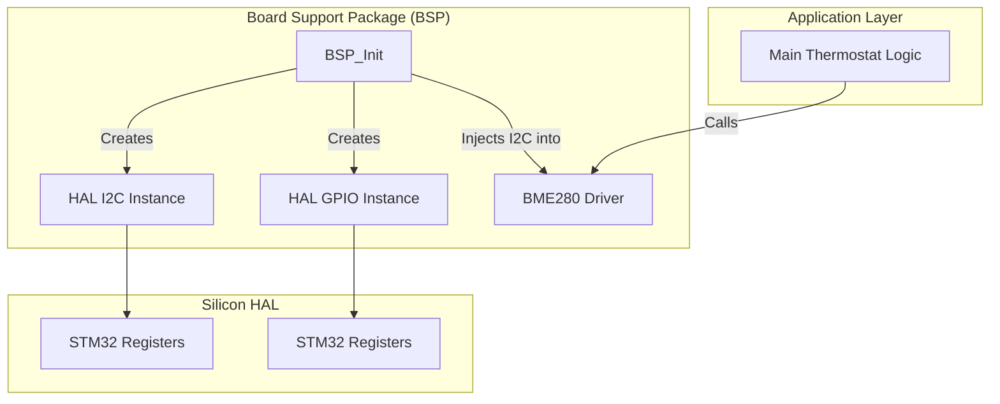

# Chapter 4.3: Board Support Packages (BSP)

One of the most destructive architectural mistakes in legacy embedded systems is the conflation of the Hardware Abstraction Layer (HAL) with the Board Support Package (BSP). 

If the HAL abstracts the silicon inside the black epoxy square (the Microcontroller), the BSP abstracts everything outside of it—the traces on the Printed Circuit Board (PCB) and the external chips soldered to those traces.

Mixing these two domains creates a rigid monolith. If an STM32 I2C driver contains hardcoded logic to turn on a specific GPIO pin to power an external temperature sensor, that I2C driver can never be reused on another project that doesn't have that specific sensor wired to that specific pin.

This document establishes our rigorous separation between the HAL and the BSP.

---

## 1. The Architectural Divide

Consider a product line with two devices: a Smart Thermostat and an Industrial Motor Controller. Both use the exact same STM32G4 microcontroller. 

**The HAL is identical.** They both use the same `hal_i2c_stm32.c` to talk to the internal I2C peripheral.

**The BSP is radically different.** 
*   The Thermostat's PCB routes `I2C1` to a Bosch BME280 environmental sensor.
*   The Motor Controller's PCB routes `I2C1` to a generic EEPROM chip. 
*   Furthermore, the Motor Controller requires the software to assert a specific GPIO (`PB12`) to provide 3.3V power to the EEPROM before it can talk to it.

If the power-on logic (`PB12`) is placed inside `hal_i2c_stm32.c`, the HAL is ruined. The Thermostat will toggle a random pin on its PCB every time it uses I2C.

### 1.1 The Role of the BSP
The BSP is the layer that "knows" how the PCB is physically wired. Its responsibilities are:
1.  **Pin Muxing/Routing:** Configuring the microcontroller's Alternate Function matrices (e.g., mapping `I2C1_SCL` to physical pin `PB8`).
2.  **Power Sequencing:** Toggling specific GPIOs to provide power or hardware reset signals to external chips (e.g., LCD displays, sensors, radios) before attempting to communicate with them.
3.  **Dependency Injection (The Glue):** Instantiating the generic HAL drivers and passing them into the higher-level Application drivers.

---

## 2. BSP Initialization and Dependency Injection

The most critical function of the BSP is acting as the central "wiring loom" for the software architecture at boot time. This is where we implement **Dependency Injection (DI)** in C.

Instead of a Temperature Sensor driver creating its own I2C instance, the BSP creates the I2C instance, powers on the board, and then *injects* the I2C instance into the Temperature Sensor driver.

### 2.1 The BSP Implementation

```c
// PRODUCTION STANDARD: BSP Wiring and Injection
// bsp_thermostat_v1.c

#include "hal_i2c.h"
#include "hal_gpio.h"
#include "driver_bme280.h" // The generic sensor driver (Application Layer)

// Private, static instances of the HAL drivers
static HAL_I2C_t* bsp_i2c1;
static HAL_GPIO_t* bsp_sensor_power_pin;

// The public application-level driver instance
static BME280_t thermostat_sensor;

void BSP_Init(void) {
    // 1. Initialize the Silicon HALs
    // The BSP knows that I2C1 operates at 400kHz on this specific board.
    bsp_i2c1 = HAL_I2C_Create(1, 400000); 
    
    // The BSP knows that the sensor power is wired to Port B, Pin 12.
    bsp_sensor_power_pin = HAL_GPIO_Create(PORT_B, 12, GPIO_MODE_OUTPUT);

    // 2. PCB-Specific Power Sequencing
    // Turn on the power rail to the sensor and wait for it to boot.
    HAL_GPIO_Set(bsp_sensor_power_pin, true);
    BSP_Delay_ms(10); // Wait for sensor capacitor to charge

    // 3. DEPENDENCY INJECTION
    // The BME280 driver does NOT know it is running on an STM32. 
    // It only knows it was handed a generic HAL_I2C_t pointer.
    // The BSP injects the hardware dependency into the application driver.
    BME280_Init(&thermostat_sensor, bsp_i2c1, 0x76); // 0x76 is the I2C address
}

// The BSP provides an accessor to the initialized, wired application driver
BME280_t* BSP_GetTemperatureSensor(void) {
    return &thermostat_sensor;
}
```



### 2.2 Why This is Bulletproof
If hardware engineering releases `Thermostat_V2` which moves the sensor to `I2C2` and changes the power pin to `PA5`, the Application Logic and the HAL remain 100% unchanged. We simply write `bsp_thermostat_v2.c`, update the initialization parameters in `BSP_Init()`, and change the CMake/Make file to compile `v2` instead of `v1`.

If we want to run the `BME280` driver in a unit test on a PC, we bypass the BSP entirely. The unit test creates a `Mock_HAL_I2C`, injects it into `BME280_Init()`, and proves the mathematical pressure/temperature compensation formulas work flawlessly.

---

## 3. Company Standard Rules for the BSP

1. **The Layer Boundary:** The HAL shall only contain logic to configure internal microcontroller registers. Any logic related to external components (power sequencing, chip selects, reset lines, pin routing) MUST reside in the BSP.
2. **Dependency Injection:** High-level application drivers (e.g., a display driver, a sensor driver) shall NEVER call `HAL_Create()` or instantiate their own hardware peripherals. They must accept a pointer to an already-initialized HAL interface via their `Init()` function. The BSP is solely responsible for this instantiation and injection.
3. **BSP Swappability:** A project must be able to support multiple hardware revisions simply by swapping the `bsp_*.c` file at compile time, without requiring a single `#ifdef` in the application or HAL layers.
4. **No Application Logic in BSP:** The BSP is exclusively for initialization, hardware routing, and dependency injection. It shall not contain state machines, data processing, or business logic. 
