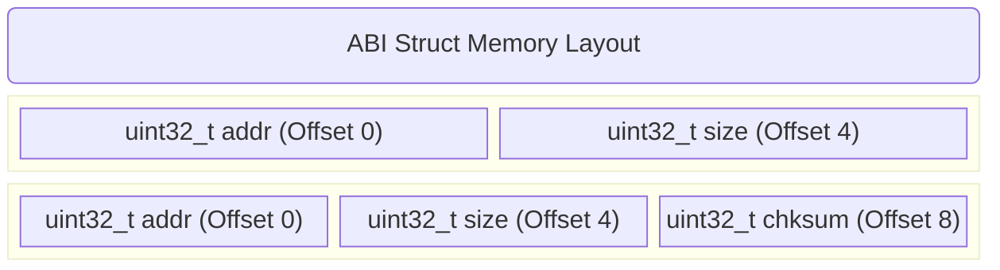

# Chapter 4.5: Stable Interfaces and ABI Compatibility

In software architecture, an interface is a rigid contract. When an interface is published (especially in a multi-team environment or a system with a bootloader), other modules begin to depend on it. If you change that contract, you introduce systemic pain. 

A **Stable Interface** is designed defensively, anticipating future growth so that the contract rarely—ideally never—needs to be broken. 

In embedded systems, interface stability is paramount due to the division between the **Application** and the **Bootloader**. Often, a bootloader exposes an API (e.g., cryptographic verification functions or flash drivers) to the application via a shared memory struct or a V-Table at a fixed flash address. 

If the Application and Bootloader are compiled independently and flashed at different times (e.g., via Over-The-Air (OTA) updates), any mismatch in the interface will result in catastrophic system failure (a hard fault).

---

## 1. Source Compatibility vs. Binary (ABI) Compatibility

To understand stability, you must understand the two levels of compatibility:

1.  **Source Compatibility (API):** If you modify a header file, does the calling code still compile without needing modification? For example, adding a new function to a header file is source-compatible. Changing the name of an existing function is not.
2.  **Binary Compatibility (ABI - Application Binary Interface):** This is the silicon reality. If you modify a header file, can you link a *newly compiled* application against an *old, already compiled* bootloader binary without crashing?

**The Anti-Pattern: Breaking ABI with Structs**

```c
// V1.0 Bootloader API (Shared Header)
typedef struct {
    uint32_t flash_address;
    uint32_t image_size;
    // v1.0 size: 8 bytes
} OTA_Metadata_t;

void Bootloader_ProcessImage(OTA_Metadata_t* meta);
```

Six months later, an engineer realizes they need a checksum. They update the shared header:

```c
// V1.1 Bootloader API (Shared Header)
typedef struct {
    uint32_t flash_address;
    uint32_t checksum;       // <-- DANGER: Inserted in the middle!
    uint32_t image_size;
    // v1.1 size: 12 bytes
} OTA_Metadata_t;
```

**The Catastrophe:** The Application is recompiled with V1.1 and pushed via OTA. The Bootloader is *not* updated (it is still V1.0). 
The Application populates the V1.1 struct and passes a pointer to the Bootloader. The Bootloader (compiled against V1.0) expects `image_size` to be at an offset of 4 bytes from the pointer. But the Application put the `checksum` at the 4-byte offset. 

The Bootloader reads the checksum, assumes it is the image size, attempts to erase 4 gigabytes of flash, and bricks the device permanently. The ABI was shattered.

---

## 2. Strategies for ABI Stability

To design interfaces that survive version upgrades, we employ several silicon-level strategies.

### 2.1 Append-Only Structs
If a struct is part of a shared interface, you may **only** add new fields to the very end of the struct. You may never remove fields, reorder fields, or change the data type of existing fields.


By appending to the end, the offsets of `addr` and `size` remain identical. If a new Application passes a V1.1 struct to a V1.0 Bootloader, the Bootloader safely reads the first 8 bytes and ignores the rest. 

### 2.2 Explicit Padding and Reserved Fields
Compilers automatically insert "padding" bytes into structs to ensure variables align to memory boundaries (e.g., a 32-bit `uint32_t` must sit on an address divisible by 4). If you change compiler flags or switch compilers, this padding can change, instantly breaking the ABI.

Stable interfaces must manually define padding, leaving zero ambiguity for the compiler. Furthermore, "Reserved" fields allow future expansion without changing the struct size.

```c
// PRODUCTION STANDARD: ABI Stable Struct
typedef struct {
    uint8_t  command_id;
    uint8_t  _padding1[3];   // Force 32-bit alignment explicitly
    uint32_t payload_length;
    uint32_t reserved[4];    // 16 bytes explicitly reserved for future use
} System_Command_t;
```
If we need a checksum in V2.0, we consume one of the reserved fields: `uint32_t checksum; uint32_t reserved[3];`. The struct size and offsets remain mathematically identical.

### 2.3 The Enum Ambiguity Hazard
In standard C, the size of an `enum` is compiler-dependent. The C standard only guarantees it will be large enough to hold the defined values, up to the size of an `int`. 

If the Bootloader is compiled with GCC (which defaults `enum` to 4 bytes) and the Application is compiled with an older proprietary compiler (which might aggressively optimize `enum` to 1 byte if the values are small), the ABI is broken.

**Solution:** Force the compiler's hand.

```c
// PRODUCTION STANDARD: ABI Stable Enum
typedef enum {
    STATE_INIT = 0,
    STATE_READY = 1,
    
    // Force the enum to be exactly 32-bits wide across all compilers
    _STATE_FORCE_32BIT = 0x7FFFFFFF 
} System_State_e;
```

---

## 3. Company Standard Rules for Stable Interfaces

1. **Append-Only Modification:** When modifying a struct or a V-Table that crosses an independent compilation boundary (e.g., App/Bootloader, or a dynamically loaded library), fields and function pointers may ONLY be appended to the end of the definition. Existing fields shall never be reordered, removed, or resized.
2. **Explicit Struct Padding:** All shared structs MUST be manually padded using explicit `uint8_t` arrays to ensure uniform 32-bit or 64-bit alignment across all members, removing any reliance on compiler-specific automatic padding rules.
3. **Enum Size Forcing:** Any `enum` used in a stable interface MUST include a final dummy element (e.g., `_FORCE_32BIT = 0x7FFFFFFF`) to mathematically guarantee the compiler allocates exactly 4 bytes for the enumeration, regardless of optimization flags.
4. **Interface Versioning:** Any substantial API shared between a Bootloader and an Application MUST include an explicit `uint32_t version_magic` field at offset 0 of its primary communication struct. The receiver MUST verify this version matches its supported ABI before dereferencing any further pointers.
