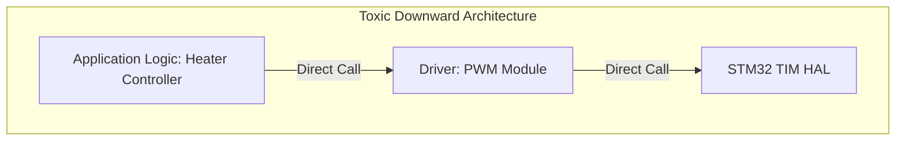

# Chapter 5.1: Dependency Direction and Inversion of Control

In a traditional, naive embedded software architecture, dependencies flow strictly downwards. The high-level application logic (e.g., a PID Controller for a heater) depends on the mid-level device drivers (e.g., a PWM Driver), which in turn depend on the low-level Hardware Abstraction Layer (HAL).

This feels logical, but it is architecturally toxic. It chains your most valuable asset—your proprietary business logic—to the least valuable and most volatile asset: the silicon. 

This document establishes our company standard for **Dependency Inversion**, a principle that forces dependencies to flow upwards toward the application, rather than downwards toward the hardware.

---

## 1. The Problem with Downward Dependencies



In the architecture above, the `Heater Controller` must `#include "pwm_driver.h"` to call `PWM_SetDutyCycle(50)`.
1.  **Compile-Time Chain:** Because of the `#include`, every time the PWM driver is modified, the Heater Controller must be recompiled.
2.  **Link-Time Chain:** The Heater Controller `.o` file contains an unresolved symbol for `PWM_SetDutyCycle`. The Linker refuses to build the Heater Controller without the `pwm_driver.o` file, which refuses to build without the `stm32_tim_hal.o` file.
3.  **The Result:** You cannot test the Heater Controller's mathematical logic on a PC. It is permanently fused to the STM32 timer hardware.

---

## 2. Inverting the Dependency

To fix this, we apply the Dependency Inversion Principle (DIP). DIP states that **High-level modules should not depend on low-level modules. Both should depend on abstractions.**

Crucially, **the high-level module must own the abstraction.**

Instead of the Application including the Driver's header file, the Application defines its *own* interface (a V-Table or a set of function pointers) that describes what it needs the hardware to do. The Driver then implements that interface.

### 2.1 The Application Level (Owning the Interface)

```c
// PRODUCTION STANDARD: Application owns the Interface
// heater_controller.h (Pure Application Logic)

// 1. The Interface Definition (Owned by the Application!)
typedef struct {
    void (*SetOutput)(uint8_t percentage);
} IHeaterOutput_VTable_t;

// 2. The Application Context
typedef struct {
    float target_temp;
    const IHeaterOutput_VTable_t* output_interface;
} HeaterController_t;

// 3. Application API
void HeaterController_Init(HeaterController_t* self, const IHeaterOutput_VTable_t* output);
void HeaterController_Update(HeaterController_t* self, float current_temp);
```

Notice that `heater_controller.h` does not include *any* hardware files. It doesn't know what PWM is. It only knows that it has a function pointer called `SetOutput` that accepts a percentage.

### 2.2 The Driver Level (Implementing the Interface)

The low-level PWM driver now depends on the high-level application's interface. **The dependency direction has been inverted.**

```c
// pwm_driver.c (Low Level Hardware Code)
#include "heater_controller.h" // The DRIVER includes the APP's interface!
#include "stm32f4xx_hal.h"

// 1. Concrete implementation of the App's requirement
static void Hardware_SetPWM(uint8_t percentage) {
    // Convert 0-100% to timer register values...
    uint32_t ccr_val = (percentage * 1000) / 100;
    __HAL_TIM_SET_COMPARE(&htim3, TIM_CHANNEL_1, ccr_val);
}

// 2. The Concrete V-Table instance fulfilling the contract
const IHeaterOutput_VTable_t PWM_Heater_Interface = {
    .SetOutput = Hardware_SetPWM
};
```

```mermaid
graph TD
    subgraph Inverted Architecture (The Standard)
        App[Application Logic: Heater Controller] -->|Defines & Uses| Interface[IHeaterOutput_VTable_t]
        Driver[Driver: PWM Module] -->|Implements| Interface
        Driver -->|Direct Call| HAL[STM32 TIM HAL]
    end
```

### 2.3 The Architectural Payoff

Because the dependency arrow points *up* from the Driver to the Interface, the Application is completely decoupled from the hardware. 
1. We can compile `heater_controller.c` on a Windows PC using GCC. 
2. We can create a `Mock_HeaterOutput` that simply prints the percentage to the console instead of writing to a timer register. 
3. We can write unit tests to verify the PID math perfectly, in milliseconds.

---

## 3. The BSP as the Mediator

Who connects the `HeaterController` to the `PWM_Heater_Interface`? The Board Support Package (BSP), as established in Chapter 4.3.

```c
// bsp.c
#include "heater_controller.h"

// The BSP knows the concrete implementation exists
extern const IHeaterOutput_VTable_t PWM_Heater_Interface; 

HeaterController_t my_heater;

void BSP_Init(void) {
    // The BSP wires the abstract application to the concrete hardware driver
    HeaterController_Init(&my_heater, &PWM_Heater_Interface);
}
```

---

## 4. Company Standard Rules for Dependencies

1. **Upward Dependency Mandate:** Application-level business logic (state machines, math, high-level control) shall NEVER `#include` a low-level hardware driver header file. Dependencies must flow towards the application layer, not away from it.
2. **Interface Ownership:** The module that *uses* an interface must be the module that *defines* the interface. Do not put an abstract V-Table definition in a low-level driver file and force the application to include it.
3. **BSP Mediation:** Concrete hardware drivers shall only be injected into abstract application logic by the central Board Support Package (BSP) during system initialization. Application modules shall never instantiate their own hardware dependencies.
4. **Compile-Time Isolation Check:** Every application-level `.c` file MUST be capable of compiling successfully into an object file using a standard host compiler (e.g., `gcc -c app_logic.c`) without requiring any silicon vendor header files in the include path. If it fails to compile, the dependency direction is backwards.
