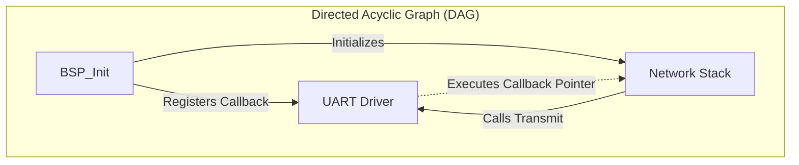

# Chapter 5.2: Avoiding Cyclic Dependencies

In a complex firmware architecture, modules inevitably need to talk to each other. When Module A depends on Module B, the architecture is sound. However, when Module A depends on Module B, and Module B simultaneously depends on Module A, you have created a **Cyclic Dependency**.

Cyclic dependencies are the architectural equivalent of a deadlock. They physically break the C compilation and linking process, resulting in cryptic compiler errors, infinite `#include` loops, or linker resolution failures.

This document details how to identify, break, and prevent cyclic dependencies at both compile-time and link-time.

---

## 1. Compile-Time Cycles (The `#include` Loop)

A compile-time cycle occurs when header files include each other circularly.

```c
// ANTI-PATTERN: Compile-Time Cycle
// module_a.h
#include "module_b.h"
typedef struct {
    ModuleB_t* b_ptr;
} ModuleA_t;

// module_b.h
#include "module_a.h"
typedef struct {
    ModuleA_t* a_ptr;
} ModuleB_t;
```

**The Preprocessor Failure:** When `main.c` includes `module_a.h`, the preprocessor opens `module_a.h`. It sees `#include "module_b.h"` and opens it. Inside `module_b.h`, it sees `#include "module_a.h"`. 
If you lack include guards (`#ifndef`), the compiler gets stuck in an infinite loop and crashes. 
If you *do* have include guards, the preprocessor skips the second inclusion of `module_a.h`. However, the compiler then tries to compile `module_b.h` before it has seen the definition of `ModuleA_t`, resulting in a fatal `unknown type name 'ModuleA_t'` error.

### 1.1 The Solution: Forward Declarations
The compiler does not need to know the *contents* or *size* of a struct to define a pointer to it. By using **Forward Declarations**, we completely remove the need to `#include` the opposing header file.

```c
// PRODUCTION STANDARD: Breaking the Cycle
// module_a.h
// NO #include "module_b.h" here!

typedef struct ModuleB_Context_t ModuleB_t; // Forward Declaration

typedef struct {
    ModuleB_t* b_ptr; // The compiler knows it's a pointer. That's enough.
} ModuleA_t;
```

If `module_a.c` actually needs to call functions on `ModuleB_t` or access its members, it will `#include "module_b.h"` in the `.c` file, completely avoiding the header cycle.

---

## 2. Link-Time Cycles (The Call Graph Loop)

A link-time cycle is far more insidious. It occurs when `Module_A.c` directly calls a function in `Module_B.c`, and `Module_B.c` directly calls a function in `Module_A.c`.

```mermaid
graph LR
    subgraph SG_1["Toxic Link-Time Cycle"]
        A[Network Stack] -->|Calls: UART_Transmit()| B[UART Driver]
        B -->|Calls: Network_RxISR_Handler()| A
    end
```

**Why this is fatal:**
If the Network Stack directly calls the UART driver to send data, and the UART driver directly calls the Network Stack when data arrives, they are permanently fused together. You cannot unit-test the Network Stack without compiling the UART driver. You cannot reuse the UART driver in another project without dragging the entire Network Stack along with it.

### 2.1 The Solution: The Observer Pattern (Callbacks)

To break a link-time cycle, one of the modules must stop explicitly naming the other. The standard mechanism for this in embedded C is the **Callback Function Pointer** (The Observer Pattern).

Typically, the lower-level module (the UART Driver) is modified to accept a callback. The high-level module (the Network Stack) registers itself with the driver.

```c
// PRODUCTION STANDARD: Breaking Link-Time Cycles via Callbacks
// uart_driver.h

// 1. Define the callback signature
typedef void (*UART_RxCallback_t)(uint8_t byte_received);

// 2. Provide a registration API
void UART_RegisterRxCallback(UART_RxCallback_t callback);
```

```c
// uart_driver.c
static UART_RxCallback_t registered_callback = NULL;

void UART_RegisterRxCallback(UART_RxCallback_t callback) {
    registered_callback = callback;
}

// Inside the Hardware Interrupt Service Routine (ISR)
void USART1_IRQHandler(void) {
    uint8_t data = USART1->RDR;
    
    // The UART driver calls the pointer. 
    // It has ZERO knowledge of the Network Stack.
    if (registered_callback != NULL) {
        registered_callback(data); 
    }
}
```

### 2.2 The Wiring (BSP)
The Board Support Package (BSP) or the application initialization routine connects the two disparate modules at boot time.

```c
// network_stack.c
void Network_ProcessByte(uint8_t byte) {
    // Process incoming network data...
}

// bsp.c
void BSP_Init(void) {
    // The BSP injects the Network Stack's function into the UART driver.
    // The Link-Time cycle is broken. The modules are physically isolated.
    UART_RegisterRxCallback(Network_ProcessByte);
}
```



---

## 3. Company Standard Rules for Cyclic Dependencies

1. **The DAG Mandate:** The module dependency graph MUST form a strictly Directed Acyclic Graph (DAG). There shall be zero cyclical paths between any two modules in the system.
2. **Header Isolation:** Header (`.h`) files shall NEVER `#include` another header file purely to resolve a struct pointer dependency. Forward Declarations (`typedef struct X_t X_t;`) MUST be used instead to prevent preprocessor loops.
3. **Upward Callbacks:** A lower-level module (e.g., a hardware driver or ISR) shall NEVER directly call a function defined in a higher-level module (e.g., application logic). All upward communication MUST occur via registered function pointers (callbacks) or RTOS message queues.
4. **Linker Verification:** The build system must be able to compile and link any high-level application module into a standalone test executable without requiring the linker to resolve symbols from low-level hardware drivers. If the linker throws an undefined reference to a hardware driver, a link-time cycle exists and must be broken via an interface or callback.
