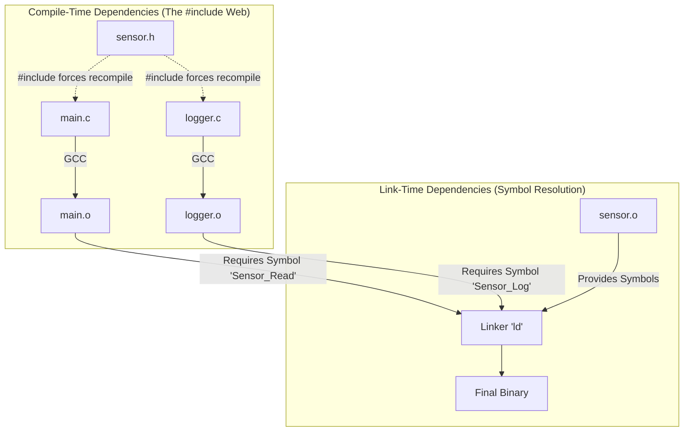

# Chapter 5.3: Compile-Time vs. Link-Time Dependencies

Dependencies in C are resolved at fundamentally different stages of the build pipeline. Failing to understand the distinction between a **Compile-Time** dependency and a **Link-Time** dependency is the primary reason legacy embedded projects take 15 minutes to build and are impossible to unit test.

This document dissects how the toolchain handles dependencies and establishes our standard for minimizing build friction.

---

## 1. The Build Pipeline Reality

When you type `make` or hit "Build" in your IDE, two distinct monolithic programs execute sequentially: The **Compiler** (e.g., `gcc`) and the **Linker** (e.g., `ld`). They care about entirely different things.

### 1.1 The Compiler's Perspective (Compile-Time)
The Compiler translates a single `.c` file into a single `.o` (object) file. It operates in total isolation. While compiling `main.c`, it has absolutely no idea that `sensor.c` exists. 

To translate `main.c`, the compiler must know the *exact physical size and memory layout* of any variable it instantiates. 

If `main.c` contains `SensorState_t my_sensor;`, the compiler *must* see the full `struct` definition of `SensorState_t` to know whether to allocate 4 bytes or 400 bytes on the stack. This forces a **Compile-Time Dependency** via an `#include "sensor.h"`.

**The Cost:** If you modify a single comment inside the `SensorState_t` struct definition in `sensor.h`, the compiler's timestamp checks will force it to recompile `main.c`, and every other file that includes `sensor.h`. This is how a 1-line change triggers a 15-minute complete project rebuild.

### 1.2 The Linker's Perspective (Link-Time)
The Linker takes all the isolated `.o` files and stitches them together into the final `.elf` binary. 

If `main.c` contains a function call `Sensor_Read();`, the compiler doesn't care where that function is implemented. It simply verifies the signature against the header file, generates the assembly instructions to set up the registers for the call, and leaves a "blank hole" (an unresolved symbol) in `main.o`.

Later, the Linker searches `sensor.o` for the symbol `Sensor_Read`. When it finds it, it calculates the physical flash memory address and patches the blank hole in `main.o`. This is a **Link-Time Dependency**.

**The Cost:** Link-time dependencies are what prevent unit testing. If `main.o` has an unresolved symbol for `Sensor_Read`, the Linker refuses to build the executable until it is provided with `sensor.o`.

---

## 2. Eradicating Compile-Time Dependencies

Our goal is to sever as many Compile-Time dependencies as mathematically possible. We do this by aggressively denying the compiler access to struct definitions using **Opaque Pointers** (as detailed in Chapters 3.1 and 3.3).

If `main.c` contains `SensorState_t* my_sensor_ptr;`, the compiler does *not* need to know the size of the struct. It knows a pointer is exactly 4 bytes on a 32-bit ARM Cortex. Therefore, `main.c` does NOT need to include `sensor.h`. It only needs a forward declaration: `typedef struct SensorState_t SensorState_t;`.

If `sensor.h` changes, `main.c` is NOT recompiled. The compile-time dependency has been completely eradicated. 

---

## 3. Managing Link-Time Dependencies

While we want to eradicate compile-time dependencies to speed up builds, we must carefully manage link-time dependencies to enable testing and polymorphism.

### 3.1 Hard Link-Time Dependencies
A direct function call `Sensor_Read()` is a Hard Link-Time dependency. The Linker demands that the exact symbol exists. We accept Hard Link-Time dependencies *only* when a module depends on a pure, hardware-agnostic utility (e.g., calling a CRC32 calculation function). 

### 3.2 Soft Link-Time Dependencies (Function Pointers)
When Application Logic needs to communicate with Hardware Drivers, a Hard Link-Time dependency is disastrous, because it chains the application to the silicon.

We convert this to a Soft dependency using Function Pointers or V-Tables (Chapter 4.4). 
If `main.c` calls `my_sensor_ptr->read_func()`, the Compiler generates a dynamic jump to an address stored in RAM. **There is no unresolved symbol for the Linker to worry about.** 

The Linker happily builds `main.o` into an executable without ever needing `sensor.o`. The Link-Time dependency has been successfully broken, allowing flawless, isolated unit testing.

---

## 4. Company Standard Rules for Dependencies

1. **Compile-Time Minimization:** Modules shall prioritize passing Opaque Pointers (`Type_t*`) rather than Concrete Structs (`Type_t`) in their public APIs to eliminate the need for dependent modules to `#include` the struct definition.
2. **Forward Declaration Priority:** If a module only references a type via a pointer, it MUST use a forward declaration (`typedef struct X_t X_t;`) and MUST NOT `#include` the header file defining that type.
3. **Hard Link Limitations:** High-level application logic (e.g., state machines, controllers) shall NEVER possess Hard Link-Time dependencies (direct function calls) to specific hardware abstraction drivers (e.g., `HAL_UART_Transmit`).
4. **Soft Link Mandate:** All communication from high-level application modules to silicon-specific hardware drivers MUST be resolved at runtime using Soft Link-Time dependencies (Function Pointers or V-Tables injected by the BSP).
