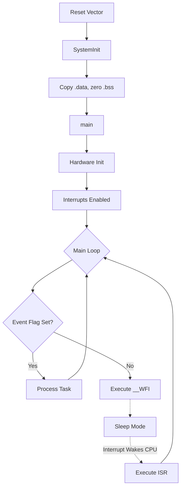

# The Superloop Model: The Bare-Metal Foundation

The "Superloop" or infinite loop architecture is the primordial execution model for embedded software. Despite the proliferation of Real-Time Operating Systems (RTOS), the superloop remains fundamentally relevant. At its core, an embedded system is a state machine driven by hardware events and time. The superloop models this by executing an initialization sequence followed by an infinite `while(1)` loop that continuously polls flags, services inputs, and updates outputs.

To a Principal Engineer, a superloop is not just a `while(1)`. It is a deterministic, highly predictable execution pipeline. When designed correctly, it offers guarantees about stack usage, memory safety, and timing that an RTOS often struggles to provide without heavy analysis.

## 1. Architectural Deep Dive: The Silicon Perspective

When we write `int main(void) { init(); while(1) { task1(); task2(); } }`, what is actually happening at the silicon and compiler level?

### 1.1 The Reset Handler and `main()`

Before `main()` is ever called, the microcontroller executes the Reset Handler. In a standard ARM Cortex-M environment, this is an assembly or C routine mapped to the reset vector. It is responsible for:
1. Copying the `.data` section from Flash to RAM.
2. Zeroing out the `.bss` section in RAM.
3. Setting up the stack pointer (`MSP`).
4. Calling `__libc_init_array` to execute C++ constructors or static initializations.
5. Branching to `main()`.

At the linker level, `main()` is placed in the `.text` section. Because the embedded system has no operating system to return to, `main()` must never exit. If a superloop accidentally breaks or returns, it falls back into the startup code's `exit()` function, which is typically implemented as an infinite `BKPT` (breakpoint) or a `while(1)` trap.

### 1.2 Pipeline Behavior and Branch Prediction

Modern microcontrollers, such as the ARM Cortex-M4 and Cortex-M7, feature instruction pipelines (3-stage and 6-stage, respectively). The `while(1)` loop translates to an unconditional branch instruction (e.g., `B` in Thumb-2) at the bottom of the loop, jumping back to the top.

```assembly
.L2:
    BL      task1
    BL      task2
    B       .L2      ; Unconditional branch back to top
```

Because the loop branch is unconditional, the CPU's branch predictor will always fetch the instructions at the top of the loop. If the loop is small enough, it may reside entirely within the processor's Instruction Cache (I-Cache) or prefetch buffer, resulting in highly deterministic execution time without Flash memory wait-state penalties.

### 1.3 Power Management and the `WFI` Instruction

A naive superloop runs the CPU at 100% utilization, constantly polling flags. This consumes maximum active current. In a professional superloop design, the system should enter a low-power sleep state when there is no work to be done.

This is achieved using the Wait For Interrupt (`WFI`) or Wait For Event (`WFE`) instructions. 

```c
#include "core_cm4.h" // ARM CMSIS Header

void main_superloop(void) {
    system_init();
    
    while(1) {
        if (events_pending()) {
            process_events();
        } else {
            // No work to do. Put CPU to sleep.
            // CPU clock is halted, but peripherals and interrupts remain active.
            __WFI(); 
        }
    }
}
```

When `__WFI()` is executed, the CPU pipeline is flushed, and the processor core halts execution. It waits for a peripheral interrupt (e.g., a timer tick, a UART byte received) to wake it up. Once the interrupt fires, the CPU services the ISR, and upon returning from the ISR, it resumes execution *immediately after* the `__WFI()` instruction, continuing the loop.

## 2. Production-Grade Examples

### 2.1 The Flag-Polling Architecture

The most robust way to build a superloop is to decouple the *detection* of an event (in an ISR) from the *processing* of that event (in the main loop). This is done using volatile flags.

```c
#include <stdint.h>
#include <stdbool.h>

// Shared flags must be declared volatile so the compiler knows 
// they can change outside the main thread of execution.
static volatile bool g_uart_rx_ready = false;
static volatile bool g_1ms_tick      = false;

// UART Interrupt Service Routine
void USART1_IRQHandler(void) {
    if (USART1->SR & USART_SR_RXNE) {
        buffer_push(USART1->DR);
        g_uart_rx_ready = true; // Signal main loop
    }
}

// SysTick Timer ISR (Fires every 1ms)
void SysTick_Handler(void) {
    g_1ms_tick = true; // Signal main loop
}

int main(void) {
    hardware_init();
    
    while(1) {
        // Service Timers
        if (g_1ms_tick) {
            g_1ms_tick = false; // Clear flag
            run_1ms_tasks();
        }
        
        // Service UART
        if (g_uart_rx_ready) {
            g_uart_rx_ready = false; // Clear flag
            process_uart_packet();
        }
        
        // Sleep until next interrupt
        __WFI();
    }
}
```

### 2.2 Memory Barriers in Superloops

While `volatile` prevents the compiler from optimizing away memory accesses, it does *not* prevent the hardware (the CPU or cache controller) from reordering them out-of-order. On architectures like ARM Cortex-M7 (which has a superscalar pipeline and data cache), we must use Memory Barriers when exchanging complex data between an ISR and the superloop.

```c
volatile bool data_ready = false;
uint32_t shared_data[10];

void DMA_IRQHandler(void) {
    // DMA finished transferring data to shared_data
    
    // Data Memory Barrier ensures all memory writes to shared_data 
    // are completed BEFORE the write to data_ready occurs.
    __DMB(); 
    
    data_ready = true;
}

int main(void) {
    while(1) {
        if (data_ready) {
            // Ensure we read data_ready before reading shared_data
            __DMB(); 
            
            process_data(shared_data);
            data_ready = false;
        }
    }
}
```

## 3. Concrete Anti-Patterns

### Anti-Pattern 1: Blocking Delays (The "Spin-Wait" of Death)

The most destructive thing a developer can do in a superloop is block. A blocking delay halts the entire state machine, preventing any other task from executing.

```c
// [ANTI-PATTERN] DO NOT DO THIS
void process_sensor(void) {
    start_adc_conversion();
    
    // BAD: The entire CPU is stuck here for 500us!
    // No other tasks can run. UART buffers will overflow.
    while(adc_is_converting()); 
    
    uint16_t val = read_adc();
}
```

### Anti-Pattern 2: Missing Volatile on ISR Shared Variables

If a variable is updated in an ISR and read in the main loop, it MUST be `volatile`.

```c
// [ANTI-PATTERN] Missing volatile
bool timer_expired = false;

void SysTick_Handler(void) {
    timer_expired = true;
}

int main(void) {
    while(1) {
        // The compiler optimization (e.g., -O2 or -O3) will load timer_expired
        // into a CPU register ONCE. It will never read memory again.
        // This loop becomes an infinite hang.
        while(!timer_expired) { 
            // Wait
        }
        timer_expired = false;
    }
}
```

## 4. Execution Flow Visualization



## 5. Company Standard Rules: Superloop Design

1. **RULE-SL-01**: **No Blocking Functions in Main Loop:** Functions called from the main loop SHALL NOT contain spin-waits or blocking delays exceeding 50 microseconds. State machines must be used for asynchronous operations.
2. **RULE-SL-02**: **Deterministic Loop Bounds:** `for` and `while` loops within task functions MUST have a deterministic upper bound to prevent infinite hanging.
3. **RULE-SL-03**: **WFI Utilization:** The superloop MUST drop into a low-power sleep state (`__WFI()` or equivalent) when no background flags are pending.
4. **RULE-SL-04**: **Volatile Keyword:** Any variable modified within an ISR and read within the main loop (or vice versa) MUST be declared with the `volatile` qualifier.
5. **RULE-SL-05**: **Memory Barriers:** Complex data structures shared between ISRs and the main loop on architectures with data caches MUST be synchronized using appropriate Data Memory Barriers (`__DMB()`).
6. **RULE-SL-06**: **Watchdog Timer:** The independent hardware watchdog timer MUST be serviced exactly once per main loop iteration, never inside an ISR or a sub-task loop.