# Cooperative Scheduling

While a raw superloop with flag polling works for simple devices, complex embedded systems quickly collapse under the weight of disorganized `if` statements. The transition from a chaotic superloop to an organized system involves introducing a Cooperative Scheduler (also known as a Non-Preemptive Scheduler).

In a cooperative scheduler, tasks "cooperate" by voluntarily yielding control back to the scheduler. Unlike an RTOS, there is no timer interrupt ripping the CPU away from a running task (preemption). A task runs to completion, or until it explicitly returns. 

## 1. Deep Technical Rationale: Why Cooperative?

### 1.1 Stack Usage and Memory Safety
The most significant architectural advantage of cooperative scheduling is RAM efficiency. In a preemptive RTOS, *every task must have its own dedicated stack*. If you have 10 tasks, you must allocate 10 stacks, sizing each to handle the deepest possible function call tree and worst-case interrupt nesting. This wastes massive amounts of SRAM.

In a cooperative scheduler, **all tasks share the exact same system stack** (the Main Stack Pointer, `MSP`, on ARM Cortex-M). Because Task A completely finishes and returns before Task B begins, Task A's stack frames are popped off, leaving the stack pristine for Task B. This allows cooperative systems to run complex logic on microcontrollers with as little as 2KB of RAM.

### 1.2 Deterministic Concurrency without Mutexes
Because tasks cannot preempt one another, the developer is free from the horrors of race conditions *between tasks*. 
If Task A modifies a global data structure, it knows with absolute certainty that Task B will not wake up halfway through the modification and corrupt the data. 

**Linker Perspective:** 
Global variables accessed by multiple cooperative tasks do not need to be guarded by mutexes. The linker places them in the `.bss` or `.data` section, and the lack of preemption guarantees atomic-like access relative to other tasks (though ISRs can still preempt, requiring ISR-level protection).

## 2. Production-Grade Cooperative Scheduler

A professional cooperative scheduler uses an array of task control blocks (TCBs). Each TCB contains a function pointer and an interval.

```c
#include <stdint.h>
#include <stdbool.h>

// Standard task signature
typedef void (*task_func_t)(void);

typedef struct {
    task_func_t function;    // Pointer to task function
    uint32_t interval_ms;    // How often to run the task
    uint32_t last_run_time;  // Last execution time (from SysTick)
    bool is_ready;           // Flag for asynchronous events
} tcb_t;

// The Task Table
static tcb_t task_table[] = {
    { update_display,   50, 0, false },  // Run every 50ms
    { read_sensors,     10, 0, false },  // Run every 10ms
    { process_network,   0, 0, false }   // Event-driven (interval 0)
};

#define NUM_TASKS (sizeof(task_table) / sizeof(task_table[0]))

extern volatile uint32_t g_system_ticks; // Incremented in SysTick ISR

void scheduler_run(void) {
    while (1) {
        uint32_t current_time = g_system_ticks;
        bool idle = true;

        for (uint8_t i = 0; i < NUM_TASKS; i++) {
            tcb_t *task = &task_table[i];

            // Check if it is a time-driven task and time has expired
            bool time_to_run = (task->interval_ms > 0) && 
                               ((current_time - task->last_run_time) >= task->interval_ms);
                               
            // Check if it is an event-driven task that was flagged
            bool event_triggered = task->is_ready;

            if (time_to_run || event_triggered) {
                // Execute the task!
                task->function();
                
                // Update tracking
                task->last_run_time = current_time;
                task->is_ready = false;
                idle = false;
            }
        }

        // If no tasks ran, put the CPU to sleep
        if (idle) {
            __WFI();
        }
    }
}

// API for ISRs to trigger an event-driven task
void scheduler_set_task_ready(uint8_t task_id) {
    if (task_id < NUM_TASKS) {
        task_table[task_id].is_ready = true;
    }
}
```

### 2.1 The "Run-to-Completion" Paradigm
In the code above, `task->function()` is called. The scheduler completely stops. The CPU is inside the task. If the task takes 500ms to execute, *the entire scheduler halts for 500ms*. This is the defining characteristic—and primary danger—of cooperative scheduling. 

To build a cooperative task properly, it must be implemented as a state machine that does a tiny slice of work and returns immediately.

## 3. Concrete Anti-Patterns

### Anti-Pattern 1: The Monolithic Task
A common mistake is treating a cooperative task like an RTOS thread containing an infinite loop.

```c
// [ANTI-PATTERN] Infinite loop inside a cooperative task!
void read_sensors_task(void) {
    while(1) { // FATAL ERROR: Scheduler will never regain control
        read_i2c();
        delay_ms(10);
    }
}
```
**Fix:** Remove the loop. Let the scheduler invoke the task periodically.

```c
// [CORRECT] Run-to-completion task
void read_sensors_task(void) {
    read_i2c(); // Read once and return immediately
}
```

### Anti-Pattern 2: Hidden Blocking Calls
Calling third-party libraries that use blocking delays inside a cooperative task.

```c
// [ANTI-PATTERN] Hidden blocking
void update_display_task(void) {
    lcd_clear();
    // Library function delays for 5ms internally
    lcd_print("Hello"); 
    // The scheduler jitter just increased by 5ms!
}
```

## 4. Execution Timing Visualization

```mermaid
gantt
    title Cooperative Scheduler Timing (No Preemption)
    dateFormat  s
    axisFormat  %S
    
    section ISR
    SysTick (1ms)     :crit, isr1, 0, 0.1s
    UART RX ISR       :crit, isr2, 2.5, 0.2s
    
    section Main Stack
    Task 1 (Sensors)  :active, t1, 0.1, 1s
    Task 2 (Network)  :t2, 1.1, 1.5s
    Task 3 (Display)  :t3, 2.7, 1s
    
    section Sleep
    WFI/Idle          :done, wfi, 2.6, 0.1s
```


*Notice how Task 2 is delayed slightly by Task 1, but they never overlap. The UART ISR preempts Task 2, but Task 2 resumes immediately, protecting the shared data environment of the main loop.*

## 5. Company Standard Rules: Cooperative Scheduling

1. **RULE-CS-01**: **Run-To-Completion Semantics:** All cooperative tasks MUST return to the caller (scheduler) in bounded time. Infinite loops within tasks are strictly prohibited.
2. **RULE-CS-02**: **Execution Time Limit:** A single cooperative task invocation SHALL NOT exceed a maximum execution time (e.g., 5 milliseconds) to prevent delaying other critical tasks. Tasks requiring more time must be broken down using state machines.
3. **RULE-CS-03**: **Shared Stack Allocation:** The main system stack (`MSP`) MUST be sized to accommodate the deepest single task call tree plus the deepest possible interrupt nesting.
4. **RULE-CS-04**: **No RTOS Yielding:** Functions like `sleep()`, `delay()`, or `yield()` SHALL NOT be used inside tasks. Time delays must be managed by the scheduler's interval tracking.
5. **RULE-CS-05**: **Static Task Allocation:** The task table MUST be statically allocated at compile time. Dynamic task creation (`malloc`) is prohibited in the cooperative environment to ensure deterministic memory bounds.