# Superloop Failure Modes

Even a perfectly designed superloop and cooperative scheduler can fail in production. Understanding the hardware mechanics of *why* they fail is critical for diagnosing systemic issues. The primary enemies of the bare-metal system are Jitter, Starvation, and Interrupt Storms.

## 1. Deep Technical Rationale: Jitter and CPU Hogging

### 1.1 The Mechanics of Jitter

**Jitter** is the deviation from true periodicity. If a task is scheduled to run every 10ms, but actually runs at 10.1ms, 12ms, 9.8ms, and 15ms, the system has high jitter. 

In a superloop, jitter is caused by **CPU Hogging**. Because tasks cannot preempt each other, Task A must wait for Task B to finish. 
At the compiler and linker level, there is no mechanism to enforce execution time. If a junior developer adds a `printf()` statement over a slow UART connection inside a cooperative task, that `printf` might block for 20ms. 

### 1.2 Cycle Counters for Diagnosis

To mathematically prove and diagnose jitter, Principal Engineers do not rely on standard timers; they use CPU Cycle Counters. On the ARM Cortex-M architecture, the Data Watchpoint and Trace (DWT) unit contains a 32-bit register (`DWT_CYCCNT`) that increments on every single CPU clock cycle. 

If the CPU is 100MHz, `DWT_CYCCNT` ticks every 10 nanoseconds. It is the ultimate profiling tool.

```c
#include "core_cm4.h"

void profile_task_execution(void) {
    // Enable DWT Cycle Counter
    CoreDebug->DEMCR |= CoreDebug_DEMCR_TRCENA_Msk;
    DWT->CTRL |= DWT_CTRL_CYCCNTENA_Msk;
    
    uint32_t start_cycles = DWT->CYCCNT;
    
    run_suspicious_task();
    
    uint32_t end_cycles = DWT->CYCCNT;
    uint32_t cycles_taken = end_cycles - start_cycles;
    
    // If > 100,000 cycles (1ms at 100MHz), flag an error!
    if (cycles_taken > 100000) {
        log_error("Task CPU Hog detected: %u cycles", cycles_taken);
    }
}
```

## 2. Interrupt Storms

An interrupt storm occurs when a hardware peripheral generates interrupts faster than the CPU can process them. Because interrupts preempt the main superloop, a high-frequency interrupt can starve the main loop entirely.

### 2.1 The Silicon Mechanism of Starvation

When an interrupt fires, the Cortex-M processor pushes 8 registers to the stack (Stacking) and fetches the exception vector (Vector Fetch). This takes ~12 clock cycles. Returning from the ISR (Unstacking) takes another ~12 cycles. 

If a noisy sensor line triggers a GPIO interrupt 100,000 times a second, the CPU spends 2,400,000 clock cycles just entering and exiting the ISR, plus the execution time of the ISR itself. 

The main superloop is effectively paused. Software timers expire, UART buffers overflow, and the system appears "dead" even though the CPU is running at 100%.

### 2.2 Diagnosing and Mitigating Interrupt Storms

Mitigation must happen at the hardware configuration level:
1. **Debounce in Hardware:** Use RC filters on external interrupt lines.
2. **Interrupt Masking:** If an ISR detects it is being called too rapidly, it should disable its own interrupt at the NVIC level and set a flag for the main loop to re-enable it later.

```c
volatile uint32_t isr_count = 0;

void EXTI0_IRQHandler(void) {
    EXTI->PR = EXTI_PR_PR0; // Clear hardware pending flag
    
    isr_count++;
    
    if (isr_count > STORM_THRESHOLD) {
        // We are under attack by an interrupt storm!
        // Disable this specific interrupt line in the NVIC
        NVIC_DisableIRQ(EXTI0_IRQn);
        
        // Signal main loop that sensor is malfunctioning
        g_sensor_fault = true;
    } else {
        process_sensor_data();
    }
}
```

## 3. Concrete Anti-Patterns

### Anti-Pattern 1: The Cascading Timeout Failure

When severe jitter occurs, delta-time management can experience a catastrophic cascade if not designed carefully.

```c
// [ANTI-PATTERN] Cascading Timeout
if ((g_ticks - task->last_run) >= 10) {
    task->function();
    // BUG: If jitter caused this task to run 15ms late, 
    // adding 10 simply schedules the next run IN THE PAST!
    // The task will fire continuously to "catch up", 
    // starving the rest of the system.
    task->last_run += 10; 
}
```

```c
// [CORRECT] Jitter-Resilient Timeout
if ((g_ticks - task->last_run) >= 10) {
    task->function();
    // Anchor the next run to NOW. Discard the jitter delay.
    task->last_run = g_ticks; 
}
```

### Anti-Pattern 2: Deep Call Stacks in ISRs

Placing a `printf` or a deep mathematical calculation inside an ISR extends its execution time, creating jitter for the entire system and potentially causing an interrupt storm if a new interrupt arrives before the ISR finishes.

## 4. Execution Visualization: Starvation

```mermaid
gantt
    title Superloop Starvation via Interrupt Storm
    dateFormat  s
    axisFormat  %S
    
    section ISR
    Normal Timer ISR    :isr1, 0, 0.2s
    Noisy GPIO ISR      :crit, isr2, 0.4, 0.5s
    Noisy GPIO ISR      :crit, isr3, 0.9, 0.5s
    Noisy GPIO ISR      :crit, isr4, 1.4, 0.5s
    
    section Main Loop
    Task 1              :active, t1, 0.2, 0.2s
    Task 2              :t2, 1.9, 0.3s
    
    section Impact
    Main Loop Starved   :done, starved, 0.4, 1.5s
```


*Notice how Task 2 is delayed massively by the Noisy GPIO ISR storm. The main loop is completely halted between 0.4s and 1.9s.*

## 5. Company Standard Rules: Failure Modes

1. **RULE-FM-01**: **Jitter Profiling:** All critical cooperative tasks MUST be profiled using hardware cycle counters (`DWT_CYCCNT`) to prove worst-case execution time (WCET) bounds.
2. **RULE-FM-02**: **Interrupt Storm Mitigation:** External edge-triggered interrupts (e.g., GPIO EXTI) MUST employ hardware debouncing or software rate-limiting to prevent CPU starvation.
3. **RULE-FM-03**: **Jitter-Resilient Timing:** Time-driven tasks MUST reset their temporal anchor to the *current system time* upon execution, preventing cascading "catch-up" executions that monopolize the CPU.
4. **RULE-FM-04**: **ISR WCET Limit:** Interrupt Service Routines SHALL NOT execute for more than 50 microseconds under any circumstances. Longer operations must be deferred to the main loop.