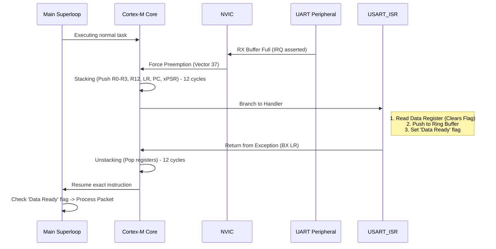

# What Belongs in an ISR

Interrupt Service Routines (ISRs) are the most critical, delicate, and frequently abused constructs in embedded software engineering. An ISR is not merely a C function; it is a hardware-triggered preemption of the processor's current execution context. Understanding exactly what belongs inside an ISR requires understanding the silicon mechanics of exception handling.

## 1. Deep Technical Rationale: The Silicon Reality

When a hardware peripheral (e.g., a UART receiver, a timer, a GPIO edge detector) requires attention, it asserts a signal to the Nested Vectored Interrupt Controller (NVIC). If the interrupt is enabled and its priority is higher than the currently executing code, the NVIC forces the CPU core to halt its current pipeline.

### 1.1 Context Saving and Overhead

On an ARM Cortex-M architecture, the transition from "Thread Mode" (main loop) to "Handler Mode" (ISR) is not free. The hardware automatically pushes 8 registers onto the current stack (`R0`, `R1`, `R2`, `R3`, `R12`, `LR`, `PC`, `xPSR`). This process, called "stacking," takes approximately 12 clock cycles.

When the ISR finishes, "unstacking" takes another 12 cycles. If the ISR modifies other registers (`R4`-`R11`), the compiler must emit assembly instructions at the start and end of the ISR to push and pop these registers, adding further overhead. 

Because of this overhead, invoking an ISR just to do nothing, or doing massive amounts of work inside it, destroys the deterministic timing of the main application.

### 1.2 The Principle of Minimal Work

The golden rule of ISR design is: **Clear the hardware flag, capture volatile data, notify the application, and exit.** 

An ISR should almost never contain application logic, complex math, or blocking delays. Its sole purpose is to bridge the instantaneous hardware event to the asynchronous software domain.

## 2. Production-Grade Examples

### 2.1 The Ideal ISR

Consider a UART receiving a byte. The hardware only holds one byte in its data register (`USART_DR`). If a second byte arrives before the first is read, an Overrun Error occurs, and data is lost. The ISR must read the byte immediately.

```c
#include "core_cm4.h"

// A lock-free ring buffer (implementation detailed in the next chapter)
extern ring_buffer_t rx_buffer;
extern volatile bool rx_packet_ready;

// The Ideal ISR
void USART1_IRQHandler(void) {
    // 1. Check which flag triggered the interrupt (RX Not Empty)
    if (USART1->SR & USART_SR_RXNE) {
        
        // 2. Clear the hardware flag by reading the Data Register
        uint8_t data = USART1->DR;
        
        // 3. Move data into a software buffer
        ring_buffer_push(&rx_buffer, data);
        
        // 4. Signal the main loop if a specific condition is met (e.g., newline)
        if (data == '\n') {
            rx_packet_ready = true;
        }
    }
    
    // 5. Exit immediately
}
```
This ISR executes in less than 20 instructions. It is perfectly deterministic.

## 3. Concrete Anti-Patterns

### Anti-Pattern 1: The "Math in the ISR" Disaster

Junior developers often attempt to process sensor data the moment it arrives. This is a catastrophic architectural mistake. Floating-point math or complex integer division inside an ISR dramatically increases its execution time (WCET), starving the rest of the system.

```c
// [ANTI-PATTERN] DO NOT DO THIS
void ADC1_2_IRQHandler(void) {
    if (ADC1->SR & ADC_SR_EOC) {
        uint16_t raw_adc = ADC1->DR;
        
        // FATAL: Floating point math inside an ISR!
        // This might take hundreds of clock cycles, especially if the 
        // CPU lacks a hardware FPU (Floating Point Unit).
        float voltage = (float)raw_adc * (3.3f / 4096.0f);
        float temperature = (voltage - 0.76f) / 0.0025f;
        
        g_current_temp = temperature; // Update global
    }
}
```
**The Fix:** Read `ADC1->DR` into a circular buffer or a volatile global `uint16_t`, set a `data_ready` flag, and do the floating-point math in the main superloop or an RTOS task.

### Anti-Pattern 2: Blocking Inside the ISR

This is the fastest way to build an embedded system that mysteriously locks up in production.

```c
// [ANTI-PATTERN] DO NOT DO THIS
void EXTI0_IRQHandler(void) {
    EXTI->PR = EXTI_PR_PR0; // Clear flag
    
    // The user pressed a button. Let's send a message over UART.
    // FATAL: The UART transmit function blocks until the byte is sent!
    // The entire system is halted inside this ISR.
    uart_send_string("Button Pressed!\r\n"); 
}
```

## 4. Execution Visualization: The Preemption Timeline



## 5. Company Standard Rules: ISR Design

1. **RULE-ISR-01**: **No Blocking Calls:** An ISR SHALL NOT contain spin-waits, software delays, or calls to blocking driver functions.
2. **RULE-ISR-02**: **No Complex Math:** Floating-point operations and complex integer arithmetic (multiplication/division) SHALL NOT be performed inside an ISR.
3. **RULE-ISR-03**: **Time Bounds:** The Worst-Case Execution Time (WCET) of any ISR MUST be profiled and proven to be strictly less than 20 microseconds at the nominal system clock speed.
4. **RULE-ISR-04**: **Flag Clearing First:** Hardware interrupt flags MUST be cleared as early as possible within the ISR to prevent re-triggering the interrupt immediately upon exit.
5. **RULE-ISR-05**: **Minimize Function Calls:** An ISR SHOULD NOT call external functions, except for inline functions or highly optimized buffer push/pop routines, to prevent excessive stack frame generation and branch penalties.