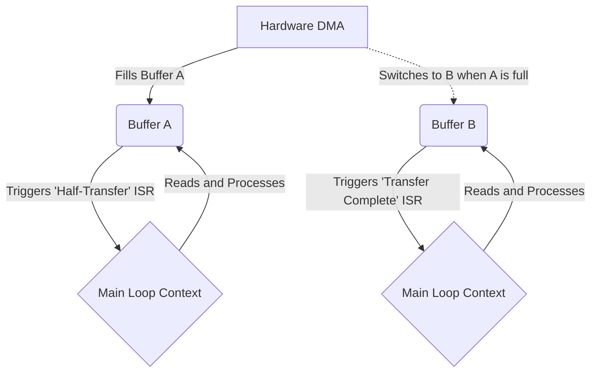

# ISR Handoff Patterns

If an ISR is only allowed to capture data and exit, how do we safely move that data to the main application? This is the core problem of asynchronous embedded design. The solution lies in structured "handoff patterns."

## 1. Deep Technical Rationale: Lock-Free Queues

The standard approach for moving streams of data (like UART bytes or ADC samples) from an ISR to the main loop is the **Circular Buffer** (or Ring Buffer). However, a standard buffer is not thread-safe. If the main loop is reading from the buffer and an interrupt fires, the ISR might push new data and corrupt the indices the main loop was using.

To solve this without disabling interrupts in the main loop (which increases jitter), we must implement a **Lock-Free Single-Producer, Single-Consumer (SPSC) Ring Buffer**.

### 1.1 The Silicon Mechanics of Lock-Free 

A lock-free ring buffer relies on two independent indices: `head` (where data is written) and `tail` (where data is read).
- **The Producer (ISR)** ONLY modifies the `head` index. It reads the `tail` index to check for fullness.
- **The Consumer (Main Loop)** ONLY modifies the `tail` index. It reads the `head` index to check for emptiness.

Because no single variable is modified by both execution contexts, there is no Read-Modify-Write (RMW) conflict. We only need to ensure that memory accesses are ordered correctly using Memory Barriers (`__DMB()`).

## 2. Production-Grade C Example: Safe Ring Buffer

This is the textbook implementation of a fast, lock-free ring buffer suitable for 20 years of production use.

### 2.1 Power-of-Two Masking

**Crucial detail:** Never use the modulo operator (`%`) in an ISR to wrap the buffer index. Modulo translates to a software division loop on many microcontrollers, consuming hundreds of clock cycles. 
Instead, force the buffer size to be a power of two (e.g., 64, 128, 256) and use a bitwise AND mask (`& (SIZE - 1)`).

```c
#include <stdint.h>
#include <stdbool.h>

// Must be a power of 2!
#define BUFFER_SIZE 256 
#define BUFFER_MASK (BUFFER_SIZE - 1)

typedef struct {
    uint8_t data[BUFFER_SIZE];
    volatile uint32_t head; // Modified ONLY by producer (ISR)
    volatile uint32_t tail; // Modified ONLY by consumer (Main Loop)
} ring_buffer_t;

// Initialize the buffer
void rb_init(ring_buffer_t *rb) {
    rb->head = 0;
    rb->tail = 0;
}

// ---------------------------------------------------------
// PRODUCER (Called from ISR)
// ---------------------------------------------------------
bool rb_push(ring_buffer_t *rb, uint8_t byte) {
    uint32_t next_head = (rb->head + 1) & BUFFER_MASK;
    
    // If next_head hits tail, the buffer is full. Drop the byte.
    if (next_head == rb->tail) {
        return false; 
    }
    
    rb->data[rb->head] = byte; // Write the data
    
    // Data Memory Barrier: Ensure the data is physically written to RAM 
    // BEFORE we update the head index. Otherwise, the consumer might see
    // the new head index and read garbage data from RAM.
    __DMB(); 
    
    rb->head = next_head; // Publish the new head
    return true;
}

// ---------------------------------------------------------
// CONSUMER (Called from Main Loop)
// ---------------------------------------------------------
bool rb_pop(ring_buffer_t *rb, uint8_t *byte) {
    // If head == tail, buffer is empty
    if (rb->head == rb->tail) {
        return false; 
    }
    
    // Data Memory Barrier: Ensure we don't speculatively read data 
    // before we've confirmed the head index has moved.
    __DMB();
    
    *byte = rb->data[rb->tail]; // Read the data
    
    // Move tail forward to consume the byte
    rb->tail = (rb->tail + 1) & BUFFER_MASK; 
    return true;
}
```

## 3. Concrete Anti-Patterns

### Anti-Pattern 1: The Modulo Trap in the ISR

```c
// [ANTI-PATTERN] Slow wrap-around
void BAD_USART_ISR(void) {
    uint8_t data = USART->DR;
    buffer[head] = data;
    
    // FATAL: If the CPU has no hardware divide, this invokes 
    // the __aeabi_uidiv compiler intrinsic, which takes ~40-80 cycles!
    head = (head + 1) % 100; 
}
```

### Anti-Pattern 2: Non-Atomic Multi-Byte Transfers

If an ISR needs to transfer a multi-byte struct (e.g., a 12-byte sensor reading) to the main loop, you cannot simply use a flag. The main loop might read half the struct, get preempted by the ISR, and the ISR overwrites the second half. The main loop resumes and reads a corrupted, torn data structure.

```c
// [ANTI-PATTERN] Data Tearing Risk
volatile struct {
    uint32_t x;
    uint32_t y;
    uint32_t z;
} accel_data;

volatile bool data_ready = false;

void Sensor_ISR(void) {
    accel_data.x = read_x();
    accel_data.y = read_y();
    accel_data.z = read_z();
    data_ready = true;
}

void main_loop(void) {
    if (data_ready) {
        data_ready = false;
        // BUG: What if Sensor_ISR fires right HERE?
        // accel_data.x will be the old value.
        // accel_data.y and z will be the NEW values!
        process(accel_data.x, accel_data.y, accel_data.z); 
    }
}
```

**The Fix:** Use a double-buffer (ping-pong buffer) or explicitly disable interrupts while copying the struct in the main loop.

## 4. Execution Visualization: The Ping-Pong Buffer

When dealing with large blocks of data (like DMA transfers from an ADC), a Ring Buffer is inefficient. A Ping-Pong buffer (Double Buffer) is the standard.


*While the DMA hardware autonomously fills Buffer A, the software processes Buffer B. When Buffer A is full, the DMA hardware automatically switches to filling Buffer B, and the software switches to processing Buffer A. Zero data loss, zero CPU intervention during transfer.*

## 5. Company Standard Rules: ISR Handoffs

1. **RULE-HO-01**: **Lock-Free Queues:** Byte-stream data transferred between an ISR and the main application MUST use a single-producer, single-consumer (SPSC) lock-free ring buffer.
2. **RULE-HO-02**: **Power-of-Two Buffers:** Ring buffers MUST be sized to a power of two, and index wrapping MUST use bitwise AND masking. The modulo operator (`%`) is strictly prohibited in ISR contexts.
3. **RULE-HO-03**: **Memory Barriers for Handoff:** Ring buffer implementations MUST utilize Data Memory Barriers (`__DMB()`) between data payload writes and index updates to ensure cache coherency and pipeline ordering on advanced architectures.
4. **RULE-HO-04**: **Block Data Transfer:** Structures or arrays larger than the native CPU word size MUST be transferred using double-buffering (ping-pong) or be protected by explicit interrupt masking (critical sections) during the read operation in the main loop to prevent data tearing.