# Standardizing Interrupt Design

In a complex bare-metal system, you may have 20 different hardware peripherals generating interrupts. If all interrupts are treated equally, the system will eventually fail under load. A Principal Architect must design an **Interrupt Priority Schema**. This establishes a rigid hierarchy of who gets to interrupt whom.

## 1. Deep Technical Rationale: The NVIC and Priority Grouping

The ARM Cortex-M Nested Vectored Interrupt Controller (NVIC) is a phenomenally powerful piece of silicon. It supports up to 240 distinct interrupts, each with programmable priorities.

### 1.1 Preemption vs. Sub-Priority

The NVIC assigns a priority number to each interrupt. **Crucially, lower numbers mean HIGHER priority.** (Priority 0 is the highest, Priority 15 is lower).

The NVIC allows the priority byte to be split into two fields:
1. **Preempt Priority:** If Interrupt A (Preempt 1) is running, and Interrupt B (Preempt 0) fires, B will preempt A. A's ISR stops, its context is pushed to the stack, and B runs. When B finishes, A resumes. This is called interrupt nesting.
2. **Sub-Priority:** If Interrupt C (Preempt 2, Sub 0) is running, and Interrupt D (Preempt 2, Sub 1) fires, D will **NOT** preempt C. They share the same preempt priority. D will remain in a "Pending" state until C finishes. However, if C and D fire at the exact same time, the one with the higher sub-priority (lower number) executes first.

### 1.2 The Dangers of Nesting

Interrupt nesting is incredibly dangerous. Every time an interrupt preempts another interrupt, 8 more registers are pushed to the stack. If you have 5 levels of preemption, your stack usage skyrockets. 

Furthermore, diagnosing a bug where ISR 1 was preempted by ISR 2, which corrupted data read by ISR 3, is nearly impossible. 

**Architectural Decision:** In 95% of bare-metal embedded systems, **Interrupt Nesting should be disabled** by assigning all interrupts to the same Preemption Priority level (using Sub-Priorities to determine execution order for simultaneous hits). Nesting should only be enabled for strict, microsecond-critical motor control or safety-trip routines.

## 2. Production-Grade Priority Schema

A professional codebase does not have magic numbers like `NVIC_SetPriority(USART1_IRQn, 5);` scattered throughout driver files. The priorities are centralized in a system configuration header.

```c
// system_priorities.h

// We configure the NVIC to use 0 bits for Preemption, and 4 bits for Sub-Priority.
// This means NO INTERRUPT CAN PREEMPT ANOTHER INTERRUPT.
// They will execute sequentially based on their Sub-Priority.
#define NVIC_PRIORITYGROUP_0  0x00000007U 

// Define our Company Standard Priorities (0 = Highest, 15 = Lowest)
typedef enum {
    // Critical Hardware Faults (Highest)
    PRIO_HARDWARE_FAULT = 0,
    
    // Motor Control / High-Speed ADC (Microsecond latency required)
    PRIO_MOTOR_PWM      = 1,
    
    // High-Speed Communications (DMA, CAN Bus)
    PRIO_COMM_HIGH      = 5,
    
    // Low-Speed Communications (UART, I2C, SPI)
    PRIO_COMM_LOW       = 8,
    
    // Human Interface (Buttons, Encoders)
    PRIO_HMI            = 12,
    
    // System Timebase (SysTick) - Lowest priority!
    PRIO_SYSTICK        = 15 
} SystemPriority_t;

// Usage in application:
// NVIC_SetPriority(USART1_IRQn, PRIO_COMM_LOW);
```

### 2.1 Why is SysTick the Lowest Priority?
A common junior mistake is setting the SysTick (the 1ms timer) to the highest priority. This is backwards. 
The SysTick only increments a variable. It takes 10 clock cycles. If it gets delayed by a 50us UART ISR, who cares? The 1ms interval just happens at 1.05ms, and the next one happens at 0.95ms. The long-term drift is zero because the hardware timer auto-reloads.
If SysTick is highest priority, it will preempt communication ISRs, increasing their latency and potentially causing FIFO overruns and dropped packets.

## 3. Concrete Anti-Patterns

### Anti-Pattern 1: Priority Inversion at the ISR Level

Priority inversion is a famous RTOS bug, but it can happen in bare-metal if you use nesting.

Imagine:
- **ISR High:** Motor Control (Preempt 0). Needs to read an I2C sensor.
- **ISR Low:** Button Press (Preempt 2).

1. The Button ISR fires. It starts executing.
2. The Button ISR needs to read an I2C configuration bit. It locks a software flag `i2c_in_use = true`.
3. The Motor ISR fires. It preempts the Button ISR.
4. The Motor ISR tries to read the I2C sensor. It checks `i2c_in_use`. It is true.
5. The Motor ISR is now stuck waiting for the flag to clear. But the Button ISR can never run to clear it, because the Motor ISR has preempted it! 

**Result: DEADLOCK.** The system hangs forever inside the Motor ISR.

**The Fix:** Never share resources (like I2C peripherals) between interrupts of different preemption levels. This is why disabling nesting entirely solves the problem at the architectural level.

### Anti-Pattern 2: The Default Priority Trap

If you do not explicitly set an interrupt's priority, the ARM Cortex-M defaults it to `0` (the highest possible priority). 
If a junior developer enables a new UART and forgets to set its priority, that UART will silently preempt your critical motor control loops.

## 4. Execution Visualization: The Power of Sub-Priorities

```mermaid
gantt
    title Sub-Priority Execution (No Preemption)
    dateFormat  s
    axisFormat  %S
    
    section Hardware
    UART RX (Prio 5)   :crit, u1, 0.1, 0.1s
    SysTick (Prio 15)  :crit, s1, 0.1, 0.1s
    
    section CPU Execution
    Executing UART ISR :active, cpu1, 0.1, 0.5s
    Executing SysTick  :cpu2, 0.6, 0.2s
    
    section Explanation
    Note               :done, n1, 0.1, 0.8s
```


*At exactly 0.1s, BOTH the UART and SysTick hardware generate an interrupt. Because they share the same preemption level (nesting disabled), the CPU looks at the Sub-Priority. UART is 5, SysTick is 15. The CPU executes the UART ISR first. SysTick is held in a "Pending" state. Once UART finishes, SysTick executes immediately. No data is lost, and no nesting occurred.*

## 5. Company Standard Rules: Interrupt Architecture

1. **RULE-INT-01**: **No Interrupt Nesting:** By default, all system interrupts MUST be configured to use the same Preemption Priority level (e.g., NVIC Priority Group 0 or 4 depending on silicon). Preemption is strictly forbidden unless formally architected for a microsecond-critical control loop.
2. **RULE-INT-02**: **Centralized Priority Map:** Interrupt priorities MUST NOT be hardcoded as integers in driver files. They MUST be drawn from a single, centralized `enum` mapping the entire system's priority hierarchy.
3. **RULE-INT-03**: **Explicit Priority Assignment:** Every enabled interrupt MUST have its priority explicitly set via `NVIC_SetPriority()`. Relying on the silicon default priority (0) is prohibited.
4. **RULE-INT-04**: **SysTick Priority:** The system tick timer (SysTick) SHOULD be assigned the lowest possible priority in the system. Time-keeping must yield to asynchronous data acquisition to prevent hardware FIFO overruns.
5. **RULE-INT-05**: **No Shared Hardware in ISRs:** Different ISRs SHALL NOT attempt to use the same physical peripheral (e.g., both trying to transmit on the same I2C bus) unless strict, non-preemptive queuing is mathematically proven.