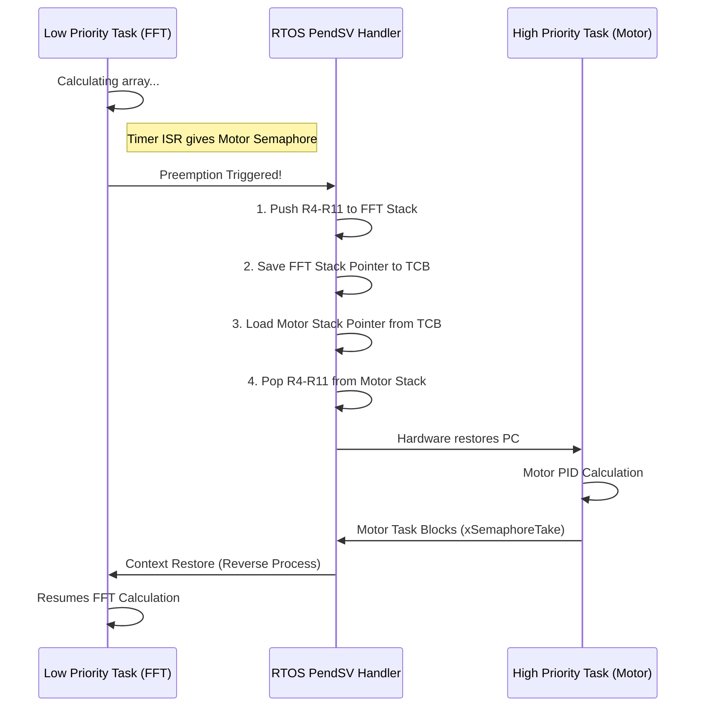

# When an RTOS is Appropriate

For decades, a debate has raged in embedded engineering: Superloop vs. RTOS (Real-Time Operating System). A Principal Architect does not engage in religious wars; they make decisions based on mathematical necessity and silicon constraints. An RTOS is not a silver bullet; it is a massive piece of infrastructure that fundamentally alters how the CPU executes code.

## 1. Deep Technical Rationale: The Cost of Preemption

In a cooperative superloop, tasks run to completion. The CPU's context (its registers) naturally flushes back to the caller. 

An RTOS introduces **Preemption**. A hardware timer (usually the SysTick) fires every millisecond. The RTOS takes control inside this ISR. If it decides that Task B (high priority) needs to run instead of Task A (low priority, currently running), it performs a **Context Switch**.

### 1.1 The Silicon Mechanics of a Context Switch

On an ARM Cortex-M, context switching is handled by a dedicated exception called `PendSV` (Pendable Service Call), which runs at the lowest interrupt priority.

1. **Stacking (Hardware):** When SysTick fires, the hardware pushes 8 registers (`R0-R3, R12, LR, PC, xPSR`) onto Task A's stack.
2. **PendSV Trigger:** SysTick sets the `PendSV` pending bit and exits.
3. **Software Context Save:** The CPU enters the `PendSV` handler. The RTOS assembly code manually pushes the remaining 8 registers (`R4-R11`) onto Task A's stack. It saves Task A's Stack Pointer into Task A's Task Control Block (TCB).
4. **Context Restore:** The RTOS loads Task B's Stack Pointer from Task B's TCB. It manually pops `R4-R11` from Task B's stack.
5. **Unstacking (Hardware):** `PendSV` returns using a special EXC_RETURN value. The hardware pops the original 8 registers (`R0-R3, R12, LR, PC, xPSR`) from Task B's stack.

The CPU is now executing Task B exactly where it was preempted days ago. This entire process takes roughly **300 to 500 clock cycles**. If your RTOS ticks at 1000 Hz, you are burning up to 500,000 clock cycles per second just on overhead. 

### 1.2 When is an RTOS Mandatory?

An RTOS becomes mathematically necessary under the following conditions:
1. **Third-Party Stacks:** You must integrate a TCP/IP stack (LwIP), a USB Host stack, or a FAT32 File System. These libraries are inherently written as blocking, multi-threaded processes. Attempting to rewrite them as cooperative state machines is a colossal waste of engineering hours.
2. **Mixed Criticality with Long Computations:** You have a strict 500-microsecond deadline for motor control, BUT you also need to calculate an FFT (Fast Fourier Transform) that takes 50 milliseconds. In a superloop, the FFT will starve the motor. In an RTOS, the motor task simply preempts the FFT task.
3. **Power Management Complexity:** Modern RTOS implementations (like FreeRTOS Tickless Idle) manage complex deep-sleep transitions automatically when all tasks are blocked.

## 2. Concrete Anti-Patterns

### Anti-Pattern 1: The RAM-Starved RTOS

The most fatal architectural error is deploying an RTOS on a microcontroller with insufficient SRAM. 

In an RTOS, *every task requires its own independent stack*. If you have a microcontroller with 8KB of RAM, and you create 6 tasks, each task might be allocated a 1KB stack (minimum safe size for complex C code). 
You have just consumed 6KB (75%) of your system RAM purely on empty stack space, leaving almost nothing for the application's `.data`, `.bss`, or heap. 

**The Fix:** If the system has less than 16KB of RAM, a cooperative superloop is almost always the correct architectural choice.

### Anti-Pattern 2: The Polling RTOS Task

Junior developers often use an RTOS purely for `vTaskDelay()`, treating it as a fancy superloop.

```c
// [ANTI-PATTERN] Polling in an RTOS destroys its value
void ButtonTask(void *pvParameters) {
    while(1) {
        if (GPIO_Read(BUTTON_PIN) == HIGH) {
            process_button();
        }
        // Burning context switches just to poll!
        vTaskDelay(10); 
    }
}
```

An RTOS is designed to be **Event-Driven**. A task should block indefinitely until an event occurs, consuming zero CPU cycles.

```c
// [CORRECT] Event-Driven RTOS Task
void ButtonTask(void *pvParameters) {
    while(1) {
        // Task sleeps (consumes 0% CPU) until the ISR gives the semaphore
        xSemaphoreTake(button_semaphore, portMAX_DELAY);
        process_button();
    }
}
```

## 3. Execution Visualization: The Preemptive Switch



## 4. Company Standard Rules: RTOS Adoption

1. **RULE-RTOS-01**: **RAM Minimums:** An RTOS SHALL NOT be utilized on microcontrollers with less than 16KB of SRAM unless explicitly approved by the Principal Architect, due to the severe memory fragmentation caused by independent task stacks.
2. **RULE-RTOS-02**: **Event-Driven Over Polling:** RTOS tasks MUST be designed to block indefinitely on OS primitives (Queues, Semaphores, Event Groups). Polling using `vTaskDelay()` or `sleep()` is strictly prohibited outside of initialization sequences.
3. **RULE-RTOS-03**: **Static Allocation Requirement:** In safety-critical or high-reliability products, the RTOS MUST be configured to use Static Allocation (`configSUPPORT_STATIC_ALLOCATION = 1` in FreeRTOS). Dynamic allocation (`malloc()`) for TCBs and Stacks is prohibited to prevent heap fragmentation and runtime memory exhaustion.
4. **RULE-RTOS-04**: **Justification for Preemption:** The introduction of an RTOS MUST be justified by a documented need for preemption (e.g., mixing hard real-time deadlines with long-running computations) or the integration of complex blocking third-party middleware (e.g., TCP/IP).