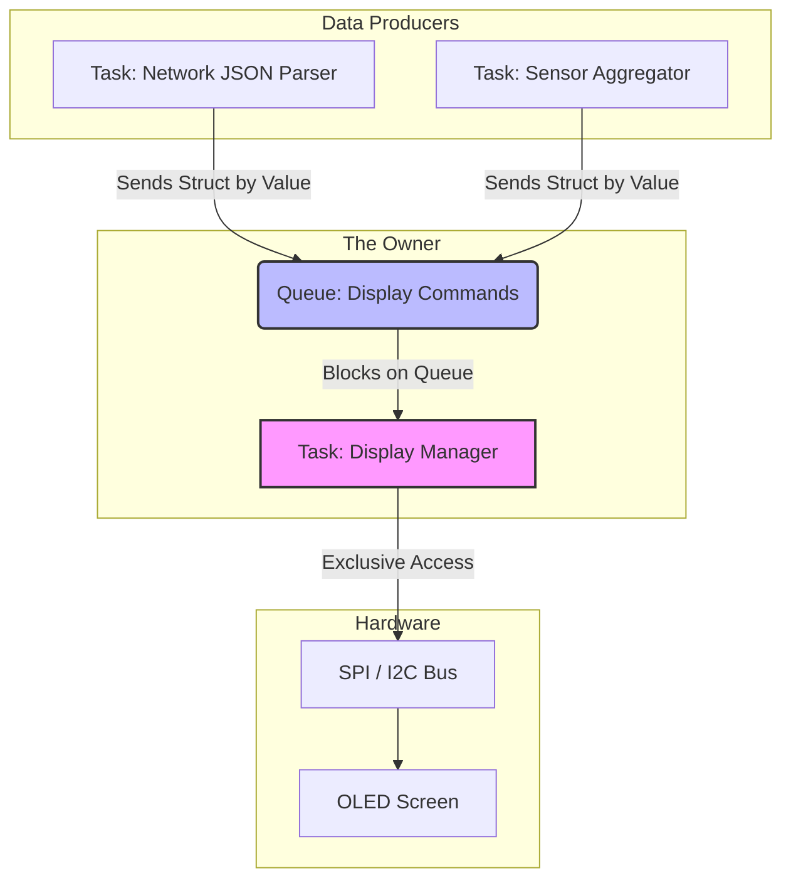

# Task Architecture and Ownership

When transitioning to an RTOS, the architecture shifts from a single monolithic flow of control to multiple independent, concurrent execution threads (Tasks). If Tasks are not strictly isolated by design, the system rapidly devolves into chaotic, non-deterministic spaghetti code. The core architectural concept in an RTOS is **Ownership**.

## 1. Deep Technical Rationale: The Private Stack

In a C program, local variables, function arguments, and return addresses are pushed onto the Stack. 
In a superloop, there is only one stack. In an RTOS, every task has its own completely isolated stack area in RAM.

### 1.1 Stack Overflow: The Silent Killer

If Task A has a 512-byte stack, and it calls a function that declares a massive array `uint8_t buffer[600];`, the stack pointer moves outside the memory allocated for Task A. It silently overwrites the RAM belonging to Task B (or even the RTOS kernel structures). 

The system will not crash immediately. It will crash milliseconds or hours later when Task B wakes up, tries to read its variables, and finds corrupted garbage.

**Silicon Solution:** Modern RTOS implementations combat this using **Stack Watermarking**. During task creation, the RTOS fills the entire stack RAM with a known byte pattern (e.g., `0xA5A5A5A5`). At runtime, a low-priority background task checks the end of the stack. If the `0xA5` pattern is overwritten, the RTOS triggers a fatal exception.

Advanced ARM processors (Cortex-M33) utilize hardware Memory Protection Units (MPUs) to trigger an immediate hardware fault the nanosecond a stack pointer exceeds its bounds, entirely preventing the corruption.

## 2. Production-Grade Task Design: Ownership

The fundamental rule of RTOS architecture is that **Tasks must own their data and their peripherals.** Global variables are the enemy of concurrency.

If two tasks need to interact with the SPI bus, they do not both call `SPI_Transmit()`. Instead, a dedicated `SPI_Manager_Task` is created. It *owns* the SPI peripheral. Other tasks send messages (via an RTOS Queue) to the Manager. The Manager executes the transactions sequentially.

### 2.1 Static Task Allocation (The Safety Standard)

In 99% of professional, long-lived embedded systems, tasks are created once at boot and never destroyed. Therefore, dynamically allocating their memory using `malloc()` (the default in many RTOS tutorials) is an architectural failure. It introduces heap fragmentation and the possibility of runtime out-of-memory errors.

We mandate **Static Allocation**. The linker reserves the memory at compile time.

```c
#include "FreeRTOS.h"
#include "task.h"

// 1. Statically allocate the Stack (Linker puts this in .bss)
// configMINIMAL_STACK_SIZE is typically 128 words (512 bytes on 32-bit ARM)
#define SENSOR_TASK_STACK_SIZE 256
static StackType_t sensor_task_stack[SENSOR_TASK_STACK_SIZE];

// 2. Statically allocate the Task Control Block (TCB)
static StaticTask_t sensor_task_tcb;

// 3. The Task Function
void vSensorTask(void *pvParameters) {
    // Task Init...
    while(1) {
        // Block indefinitely waiting for event...
        ulTaskNotifyTake(pdTRUE, portMAX_DELAY);
        read_sensor_hardware();
    }
}

void app_main(void) {
    // 4. Create the task safely. This CANNOT fail at runtime.
    xTaskCreateStatic(
        vSensorTask,             // Function pointer
        "Sensor",                // Name for debugging
        SENSOR_TASK_STACK_SIZE,  // Stack depth in words
        NULL,                    // Parameters
        tskIDLE_PRIORITY + 2,    // Priority (higher number = higher priority)
        sensor_task_stack,       // The statically allocated stack buffer
        &sensor_task_tcb         // The statically allocated TCB
    );
    
    vTaskStartScheduler();
}
```

## 3. Concrete Anti-Patterns

### Anti-Pattern 1: Passing Pointers to Local Variables via Queues

This is a classic concurrency bug. Task A creates a local variable on its stack, passes a pointer to that variable into a Queue for Task B, and then Task A's function exits or loops. 

```c
// [ANTI-PATTERN] DO NOT DO THIS
void TaskA(void *pvParams) {
    while(1) {
        // 1. Data allocated on Task A's private stack
        sensor_data_t local_data = get_sensor(); 
        
        // 2. Send the MEMORY ADDRESS of local_data to Task B
        xQueueSend(data_queue, &local_data, 0);
        
        // 3. Task A loops. local_data goes out of scope and is overwritten!
    }
}

void TaskB(void *pvParams) {
    sensor_data_t *ptr;
    xQueueReceive(data_queue, &ptr, portMAX_DELAY);
    
    // FATAL: Task B is now reading memory on Task A's stack. 
    // It is reading corrupted garbage!
    process_data(ptr->temperature); 
}
```

**The Fix:** RTOS Queues are designed to **copy by value**. You must define the queue to hold the full struct, not a pointer. If the struct is massive (e.g., a 10KB image buffer), you must allocate it statically or from a thread-safe memory pool, pass the pointer, and use a strict ownership protocol so Task A never touches it again until Task B is done.

### Anti-Pattern 2: The God Task
A single task that handles UART, Sensors, Display, and Motor Control. It contains a massive `switch` statement based on events. This defeats the purpose of the RTOS. Break it into independent, owned tasks.

## 4. Execution Visualization: The Peripheral Manager Pattern


*Notice how Task A and Task B never touch the SPI bus. They do not need Mutexes. They simply fire messages into the Display Manager's queue. The Display Manager owns the SPI bus completely, guaranteeing sequential, atomic transactions.*

## 5. Company Standard Rules: Task Architecture

1. **RULE-TSK-01**: **Static Allocation Only:** All RTOS Tasks, Queues, Semaphores, and Mutexes MUST be statically allocated at compile time. Dynamic allocation (`xTaskCreate()`, `xQueueCreate()`) is strictly prohibited to ensure deterministic memory bounds.
2. **RULE-TSK-02**: **Strict Peripheral Ownership:** A hardware peripheral (e.g., I2C bus, Display) MUST be owned by exactly one RTOS Task. Other tasks interacting with that peripheral must do so by sending messages via an RTOS Queue to the owning task.
3. **RULE-TSK-03**: **Pass-By-Value Queues:** Data passed through RTOS Queues MUST be copied by value. Passing pointers to data residing on a task's private stack is a fatal violation of memory safety and is prohibited.
4. **RULE-TSK-04**: **Stack Watermarking:** During development and integration testing, Stack Overflow checking (e.g., `configCHECK_FOR_STACK_OVERFLOW = 2`) MUST be enabled to empirically prove that task stacks are appropriately sized.
5. **RULE-TSK-05**: **Minimum Stack Sizing:** No task stack shall be configured smaller than 256 words (1024 bytes on 32-bit systems) unless mathematically proven by static call-tree analysis, to accommodate standard C library overhead (like `printf`).
