# Synchronization Primitives

When tasks cannot strictly adhere to the "Single Owner" pattern (e.g., a shared configuration struct in RAM that multiple tasks must read and write), the RTOS provides Synchronization Primitives. The most critical, and most misunderstood, are Mutexes and Semaphores.

## 1. Deep Technical Rationale: Mutex vs. Semaphore

The most common interview question for an Embedded Engineer is: "What is the difference between a Mutex and a Binary Semaphore?" 
Junior engineers say: "A Mutex is a token you take and give back. A Semaphore is for signaling."
Principal Engineers say: "**A Mutex implements Priority Inheritance. A Semaphore does not.**"

### 1.1 The Silicon Mechanics of a Mutex

At the silicon level, an RTOS Mutex uses the atomic `LDREX` / `STREX` instructions (or similar atomic test-and-set hardware) to check a memory flag. 
If Task A calls `xSemaphoreTake(mutex)`, and the Mutex is available, Task A acquires it.
If Task B (which has a lower priority) already holds the Mutex, Task A is immediately moved from the "Ready" state to the "Blocked" state. The RTOS scheduler removes Task A from the CPU. Task A will consume zero CPU cycles until Task B calls `xSemaphoreGive(mutex)`.

### 1.2 Priority Inheritance Protocol (PIP)

Why must a Mutex implement Priority Inheritance? To prevent the deadliest RTOS bug: Priority Inversion (detailed in the next chapter).

If a High-Priority Task blocks on a Mutex held by a Low-Priority Task, the RTOS automatically elevates the priority of the Low-Priority Task to match the High-Priority Task. This ensures the Low-Priority Task cannot be preempted by Medium-Priority tasks, allowing it to finish its critical section, release the Mutex, and unblock the High-Priority Task as quickly as possible.

**A Binary Semaphore does not do this.** It is a raw signaling mechanism. 

## 2. Production-Grade Usage

### 2.1 The Mutex Pattern (Protecting Shared Data)

A Mutex is used exclusively for Mutual Exclusion. **The task that takes the Mutex MUST be the task that gives it back.**

```c
#include "FreeRTOS.h"
#include "semphr.h"

// Statically allocated Mutex
static StaticSemaphore_t xMutexBuffer;
static SemaphoreHandle_t xConfigMutex;

// Shared Global Resource
typedef struct {
    uint32_t ip_address;
    uint32_t subnet;
} system_config_t;

static system_config_t g_config;

void config_init(void) {
    xConfigMutex = xSemaphoreCreateMutexStatic(&xMutexBuffer);
}

// Any task can call this safely
void update_ip_address(uint32_t new_ip) {
    // 1. Block until the Mutex is available (Wait forever)
    if (xSemaphoreTake(xConfigMutex, portMAX_DELAY) == pdTRUE) {
        
        // 2. CRITICAL SECTION: We have exclusive access to g_config
        g_config.ip_address = new_ip;
        
        // 3. Immediately release the Mutex!
        xSemaphoreGive(xConfigMutex);
    }
}
```

### 2.2 The Binary Semaphore Pattern (ISR to Task Signaling)

A Binary Semaphore is used for Synchronization, usually from an ISR to a Task. **An ISR "Gives" the Semaphore. The Task "Takes" it.** The ISR does not own it. 

```c
// Statically allocated Binary Semaphore
static StaticSemaphore_t xSemBuffer;
static SemaphoreHandle_t xDataReadySem;

void init_sensors(void) {
    xDataReadySem = xSemaphoreCreateBinaryStatic(&xSemBuffer);
}

// ---------------------------------------------
// HARDWARE ISR
// ---------------------------------------------
void EXTI0_IRQHandler(void) {
    EXTI->PR = EXTI_PR_PR0; // Clear hardware flag
    
    BaseType_t xHigherPriorityTaskWoken = pdFALSE;
    
    // Unblock the processing task.
    // Note the special "FromISR" API required by FreeRTOS!
    xSemaphoreGiveFromISR(xDataReadySem, &xHigherPriorityTaskWoken);
    
    // If giving the semaphore unblocked a task with higher priority 
    // than the currently running task, force an immediate context switch!
    portYIELD_FROM_ISR(xHigherPriorityTaskWoken);
}

// ---------------------------------------------
// RTOS TASK
// ---------------------------------------------
void SensorProcessingTask(void *pvParameters) {
    while(1) {
        // Block forever until the ISR gives the semaphore.
        // Task consumes 0% CPU while blocked.
        xSemaphoreTake(xDataReadySem, portMAX_DELAY);
        
        // Process the data...
        read_sensor_spi();
    }
}
```

## 3. Concrete Anti-Patterns

### Anti-Pattern 1: Mutex in an ISR

You **CANNOT** use a Mutex inside an ISR.
1. A Mutex requires the caller to block if it is unavailable. An ISR cannot block.
2. A Mutex uses Priority Inheritance. An ISR does not have an RTOS task priority; it operates at the hardware preemption level.

```c
// [ANTI-PATTERN] FATAL ERROR
void UART_ISR(void) {
    // If the Mutex is locked by a task, the ISR hangs forever!
    xSemaphoreTake(xConfigMutex, 0); 
    update_data();
    xSemaphoreGive(xConfigMutex);
}
```

### Anti-Pattern 2: The Infinite Lock
If a task takes a Mutex, and then enters an infinite loop or blocks on a Queue indefinitely while holding the Mutex, the entire system deadlocks.

```c
// [ANTI-PATTERN] Deadlock generator
void bad_task(void) {
    xSemaphoreTake(xI2CMutex, portMAX_DELAY);
    
    // BAD: Blocking on another resource while holding a Mutex!
    // If the network takes 5 seconds to reply, the I2C bus is locked for 5 seconds.
    wait_for_network_response(); 
    
    xSemaphoreGive(xI2CMutex);
}
```

## 4. Execution Visualization: Priority Inheritance

```mermaid
gantt
    title Mutex Priority Inheritance Protocol
    dateFormat  s
    axisFormat  %S
    
    section Tasks
    Task High (Prio 3)    :crit, th, 0.4, 0.5s
    Task Med (Prio 2)     :active, tm, 0.2, 0.5s
    Task Low (Prio 1)     :tl, 0, 0.8s
    
    section Execution
    Low Takes Mutex       :done, l1, 0, 0.2s
    Med Preempts Low      :active, m1, 0.2, 0.2s
    High Wakes Up         :crit, h1, 0.4, 0.1s
    High Blocks on Mutex  :done, h2, 0.5, 0.1s
    Low Priority Elevated :tl, 0.5, 0.2s
    Low Gives Mutex       :done, l2, 0.7, 0.1s
    High Gets Mutex       :crit, h3, 0.7, 0.2s
```


*At 0.4s, High wakes up. At 0.5s, High tries to take the Mutex, but Low has it. High blocks. The RTOS immediately elevates Low to Priority 3! Low preempts Med, finishes its critical section rapidly, and gives the Mutex. High immediately takes it. Without PIP, Med would have starved High.*

## 5. Company Standard Rules: Synchronization

1. **RULE-SYNC-01**: **Mutex vs Semaphore:** A Mutex MUST be used exclusively for protecting shared resources (Mutual Exclusion). A Binary Semaphore MUST be used exclusively for event signaling (e.g., ISR to Task synchronization). They are not interchangeable.
2. **RULE-SYNC-02**: **No Mutexes in ISRs:** A Mutex SHALL NOT be acquired or released from within an Interrupt Service Routine.
3. **RULE-SYNC-03**: **Bounded Critical Sections:** Code executing between `xSemaphoreTake(Mutex)` and `xSemaphoreGive(Mutex)` MUST be bounded and deterministic. It SHALL NOT contain blocking calls (e.g., waiting on Queues, `vTaskDelay()`, or polling external hardware timeouts).
4. **RULE-SYNC-04**: **Ownership of Lock:** The specific RTOS Task that successfully acquires a Mutex is the only entity permitted to release it.
5. **RULE-SYNC-05**: **Use Specific ISR APIs:** When interacting with RTOS primitives from within an ISR, developers MUST use the dedicated `...FromISR()` API variants (e.g., `xSemaphoreGiveFromISR()`) and MUST trigger a context switch (`portYIELD_FROM_ISR`) if a higher-priority task is unblocked.