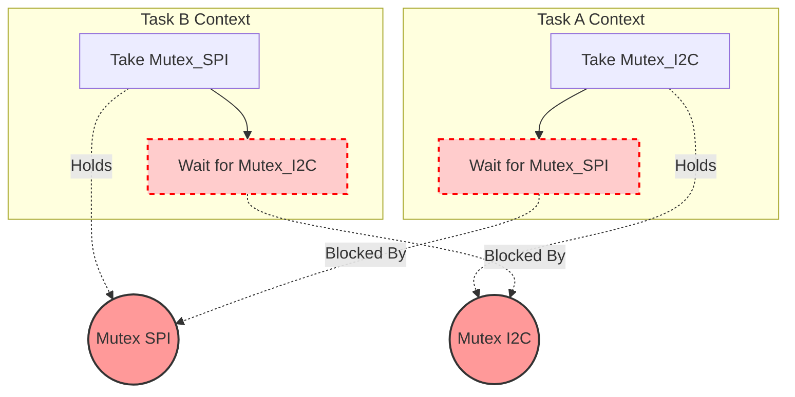

# Concurrency Hazards in RTOS

The transition from a bare-metal superloop to a preemptive RTOS trades timing jitter for a new, devastating class of bugs: Concurrency Hazards. These are systemic failures caused by the complex interactions of preemption, task priorities, and shared resources. They are notoriously difficult to reproduce because they depend on exact microsecond timing alignments.

A Principal Architect must design the system so these hazards are mathematically impossible.

## 1. Deep Technical Rationale: Priority Inversion

Priority Inversion is the most famous RTOS bug in history. In 1997, the Mars Pathfinder rover experienced continuous system resets on the surface of Mars due to this exact bug.

### 1.1 The Mechanics of Inversion

Consider three tasks: High, Medium, and Low. 
There is one shared resource: the SPI bus, protected by a Mutex (or a Semaphore lacking PIP).

1. **Low** is running. It acquires the SPI Mutex.
2. A hardware timer fires. **High** wakes up. Because High has superior priority, it preempts Low.
3. **High** attempts to acquire the SPI Mutex. It is locked by Low. High transitions to the Blocked state.
4. **Low** resumes running so it can finish its SPI transaction and release the Mutex.
5. Suddenly, **Medium** wakes up. Medium does not need the SPI bus. Medium has a higher priority than Low, so it preempts Low.
6. **Medium** runs for a long time (e.g., a massive math calculation).
7. **THE INVERSION:** The High priority task is completely blocked, waiting on Low. But Low cannot run because it is preempted by Medium. Therefore, **Medium is effectively preempting High.** The priority hierarchy is inverted.

If High was a critical motor control task with a deadline, the motor crashes.

### 1.2 The Solution: PIP and Architecture

As discussed in the previous chapter, Priority Inheritance Protocol (PIP) in true Mutexes solves this by temporarily boosting Low's priority to match High's. However, PIP is a bandage, not a cure. The architectural solution is to avoid sharing resources across vast priority gaps entirely.

## 2. Deep Technical Rationale: Deadlock

Deadlock occurs when two or more tasks are permanently blocked, each waiting for a resource held by the other. The system halts silently. No watchdogs trigger (if the watchdog is serviced by a task not involved in the deadlock).

### 2.1 The Coffman Conditions

In computer science, deadlock can *only* occur if four conditions are met simultaneously (The Coffman Conditions):
1. **Mutual Exclusion:** Resources cannot be shared; only one task can hold a resource at a time (e.g., Mutexes).
2. **Hold and Wait:** A task holds at least one resource while waiting to acquire additional resources.
3. **No Preemption:** A resource cannot be forcibly taken from a task; it must be released voluntarily.
4. **Circular Wait:** Task A waits for a resource held by Task B, which waits for a resource held by Task A.

### 2.2 Breaking the Deadlock

To prevent deadlock, the Architect must break at least one of the Coffman Conditions. We cannot break #1 or #3 in an RTOS. We must break #2 or #4.

**Breaking #4 (Circular Wait) via Lock Ordering:**
If a system has multiple Mutexes (e.g., `MutexX` and `MutexY`), you establish a strict, system-wide rule: If a task needs both, it MUST acquire `MutexX` before `MutexY`. It is mathematically impossible to create a circular wait if all tasks acquire locks in the exact same alphabetical/numerical order.

**Breaking #2 (Hold and Wait) via Timeouts:**
Never use `portMAX_DELAY` when acquiring multiple locks.

```c
// [CORRECT] Breaking Deadlock with Timeouts
void process_data(void) {
    if (xSemaphoreTake(MutexX, pdMS_TO_TICKS(100)) == pdTRUE) {
        
        // Attempt to get second lock, but don't wait forever!
        if (xSemaphoreTake(MutexY, pdMS_TO_TICKS(50)) == pdTRUE) {
            // Success! We have both.
            do_work();
            xSemaphoreGive(MutexY);
        } else {
            // FAILED to get Y. We must RELEASE X immediately to prevent deadlock!
            // (Breaking the "Hold and Wait" condition)
        }
        
        xSemaphoreGive(MutexX);
    }
}
```

## 3. Concrete Anti-Patterns

### Anti-Pattern 1: The Classic Deadlock

This code is guaranteed to freeze the system eventually.

```c
// [ANTI-PATTERN] Deadlock
void Task_A(void) {
    while(1) {
        xSemaphoreTake(Mutex_I2C, portMAX_DELAY);
        // Task A gets preempted right here by Task B!
        xSemaphoreTake(Mutex_SPI, portMAX_DELAY);
        
        transfer_data();
        
        xSemaphoreGive(Mutex_SPI);
        xSemaphoreGive(Mutex_I2C);
    }
}

void Task_B(void) {
    while(1) {
        xSemaphoreTake(Mutex_SPI, portMAX_DELAY); // Task B acquires SPI
        // Task B tries to acquire I2C, but A has it. B blocks.
        // Task A resumes, tries to acquire SPI, but B has it. A blocks.
        // DEADLOCK.
        xSemaphoreTake(Mutex_I2C, portMAX_DELAY); 
        
        transfer_data();
        
        xSemaphoreGive(Mutex_I2C);
        xSemaphoreGive(Mutex_SPI);
    }
}
```

### Anti-Pattern 2: Starvation via Same-Priority CPU Hogging

If two tasks are assigned the exact same priority in FreeRTOS, the scheduler uses "Time Slicing." It switches between them every SysTick (e.g., every 1ms). 

However, if Task 1 never blocks (it has an infinite computation loop), and Task 2 is the same priority, Task 1 will consume 50% of the CPU, and Task 2 gets 50%. But if Task 3 is lower priority, it will get **0%**. Task 3 is starved to death. 

Every task in an RTOS must eventually enter the Blocked state (via a Queue, Semaphore, or Delay) to allow lower-priority tasks to execute.

## 4. Execution Visualization: The Deadlock Trap


*The Circular Wait is visually obvious. The arrows form a closed loop. The system is dead.*

## 5. Company Standard Rules: Hazard Mitigation

1. **RULE-HAZ-01**: **Lock Ordering:** If a task must acquire multiple Mutexes simultaneously, they MUST be acquired in a globally defined, system-wide hierarchical order to mathematically prevent Circular Wait deadlocks.
2. **RULE-HAZ-02**: **No Nested Infinite Blocking:** A task holding a Mutex SHALL NOT block indefinitely (`portMAX_DELAY`) attempting to acquire a second Mutex or read from an empty Queue. It MUST use a finite timeout and release the first Mutex if the timeout expires.
3. **RULE-HAZ-03**: **Mandatory Blocking:** Every RTOS task MUST contain at least one blocking API call (Queue read, Semaphore take, or `vTaskDelay`) in its main execution loop to prevent starvation of lower-priority tasks. Infinite spin-loops without RTOS blocking are prohibited.
4. **RULE-HAZ-04**: **Priority Gap Limitation:** Shared resources (via Mutexes) SHOULD NOT be utilized between tasks with a priority difference greater than 2 levels. Data must instead be passed asynchronously via Queues to prevent severe priority inversion latency.
