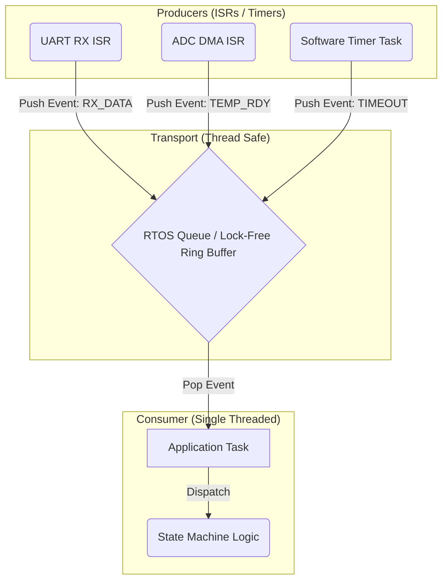

# Event-Driven Structure

Whether you are using a bare-metal superloop or a preemptive RTOS, building complex application logic out of `if/else` statements and boolean flags (`is_running`, `is_heating`, `has_error`) guarantees architectural collapse. The solution is to abandon polling and adopt an **Event-Driven Architecture** driven by Formal State Machines.

## 1. Deep Technical Rationale: Polling vs. Events

In a polling architecture, the CPU constantly asks: "Is the button pressed? Is the timer done? Is the temperature high?"
This couples the *detection* of a condition tightly to the *logic* of the application.

In an Event-Driven architecture, the system is fundamentally passive. It sleeps. When a hardware interrupt occurs, it translates that physical occurrence into an **Event**. That Event is placed into a Queue. The Application Logic (the Consumer) wakes up, pulls the Event, and reacts based on its current State.

### 1.1 The Anatomy of an Event

An Event is not just a boolean flag. It is a formal data structure containing two things:
1. **The Signal (What happened?)** - Usually an `enum`.
2. **The Payload (What data came with it?)** - A union or struct.

```c
#include <stdint.h>

// 1. The Signal Dictionary
typedef enum {
    SIG_BUTTON_PRESS,
    SIG_TIMER_EXPIRED,
    SIG_TEMP_READING,
    SIG_FAULT_DETECTED
} Signal_t;

// 2. The Payload Structures
typedef struct {
    uint8_t button_id;
    uint32_t press_duration_ms;
} ButtonPayload_t;

typedef struct {
    float temperature_celsius;
    bool  sensor_valid;
} TempPayload_t;

// 3. The Universal Event Structure
typedef struct {
    Signal_t signal;
    
    // Union to save RAM: only one payload exists at a time
    union {
        ButtonPayload_t button;
        TempPayload_t   temp;
        uint32_t        error_code;
    } payload;
} Event_t;
```

By defining Events centrally, we decouple the Producers (ISRs, Timers) from the Consumers (State Machines).

## 2. Production-Grade Event Dispatching

### 2.1 The Multiple-Producer, Single-Consumer (MPSC) Pattern

The most robust architectural pattern for embedded state machines is the MPSC Queue. 
- **Producers:** The UART ISR, the SysTick Timer, the ADC DMA Interrupt. They all generate Events and push them into the Queue.
- **Consumer:** A single State Machine (running in the main loop or an RTOS task). It pulls Events one by one and processes them sequentially.

This guarantees that the State Machine is completely **thread-safe**. Because there is only one consumer, the State Machine never preempts itself. It handles one event entirely before looking at the next. It does not need Mutexes for its internal state variables.

```c
#include "FreeRTOS.h"
#include "queue.h"

// Statically allocated Event Queue
extern QueueHandle_t xMainEventQueue;

// PRODUCER: Hardware Timer ISR
void SysTick_Handler(void) {
    static uint32_t ticks = 0;
    ticks++;
    
    if (ticks % 1000 == 0) { // Every 1 second
        Event_t ev;
        ev.signal = SIG_TIMER_EXPIRED;
        
        BaseType_t xHigherPriorityTaskWoken = pdFALSE;
        
        // Push event into the queue from ISR context
        xQueueSendFromISR(xMainEventQueue, &ev, &xHigherPriorityTaskWoken);
        portYIELD_FROM_ISR(xHigherPriorityTaskWoken);
    }
}

// CONSUMER: The Application Task
void MainAppTask(void *pvParameters) {
    Event_t current_event;
    
    while(1) {
        // Block indefinitely until an event arrives
        if (xQueueReceive(xMainEventQueue, &current_event, portMAX_DELAY) == pdTRUE) {
            
            // Dispatch the event to the State Machine
            state_machine_dispatch(&current_event);
            
        }
    }
}
```

## 3. Concrete Anti-Patterns

### Anti-Pattern 1: The Spaghetti Polling Loop

This is how unmaintainable code is written. The logic is implicitly hidden in the structure of the `if` statements.

```c
// [ANTI-PATTERN] Implicit State and Polling
void bad_superloop(void) {
    while(1) {
        if (button_pressed && !is_heating && !has_error) {
            start_heater();
            is_heating = true;
        }
        
        if (is_heating && read_temp() > 100) {
            stop_heater();
            is_heating = false;
        }
        
        if (read_temp() > 150) { // Overheat!
            has_error = true;
            stop_heater();
            sound_alarm();
        }
        
        // BUG: What if button is pressed WHILE heating?
        // BUG: What if we cool down, does has_error clear?
        // It's impossible to tell without reading every line of code.
    }
}
```

### Anti-Pattern 2: Processing Events in ISRs

If a button press requires writing to Flash memory (which takes 20 milliseconds), and you do it inside the EXTI ISR, you have destroyed the system's real-time deterministic behavior. The ISR must only generate the `SIG_BUTTON_PRESS` event and put it in the queue. The State Machine processes it later.

## 4. Execution Visualization: The MPSC Queue


*Notice the funnel effect. Multiple asynchronous, unpredictable hardware events are serialized into a perfectly ordered, synchronous stream of Events for the State Machine.*

## 5. Company Standard Rules: Event-Driven Design

1. **RULE-EVT-01**: **Explicit Event Definitions:** All system triggers (hardware interrupts, timeouts, UI interactions) MUST be translated into formal `Event_t` structures containing a definitive `Signal_t` enum and an optional payload union.
2. **RULE-EVT-02**: **No Polling Application Logic:** The core application logic SHALL NOT continuously poll hardware registers or volatile flags to determine system state. It MUST block on an Event Queue and react only when an event is dispatched.
3. **RULE-EVT-03**: **MPSC Serialization:** Asynchronous events generated by multiple producers (ISRs, other tasks) MUST be serialized through a Multiple-Producer, Single-Consumer (MPSC) queue to guarantee thread-safe, sequential processing by the State Machine.
4. **RULE-EVT-04**: **Separation of Detection and Processing:** Interrupt Service Routines MUST ONLY be responsible for detecting hardware conditions, creating an Event, and pushing it to the Queue. They SHALL NOT contain the business logic required to process that event.
