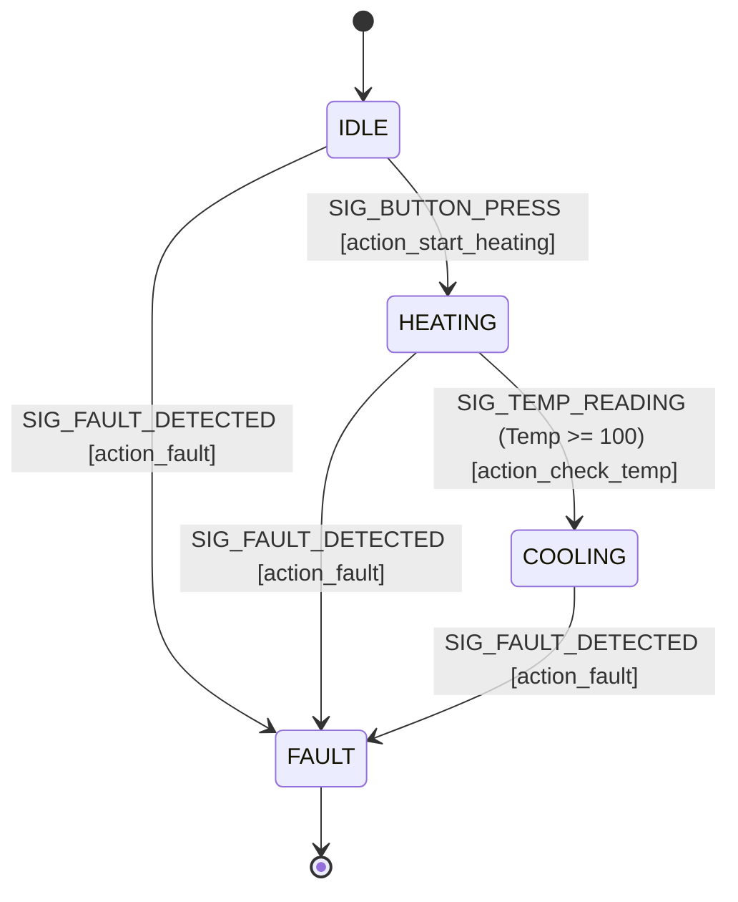

# Finite State Machines (FSMs)

Once events are serialized into a queue, we need a mathematical structure to process them predictably. A Finite State Machine (FSM) is a computational model consisting of a finite number of States, Transitions between those states, and Actions. 

If you map out an FSM on a whiteboard, and translate it correctly into C, the code will perfectly match the drawing. There is no implicit "spaghetti" logic hidden in nested `if` statements.

## 1. Deep Technical Rationale: Moore vs. Mealy

There are two primary ways to model FSMs in computer science:

1. **Moore Machine:** The outputs (Actions) depend ONLY on the current State. (e.g., "If I am in the HEATING state, the heater relay is ON. If I am in the IDLE state, the relay is OFF.")
2. **Mealy Machine:** The outputs depend on the current State AND the current Event (the Transition). (e.g., "I am in the IDLE state. I receive the BUTTON_PRESS event. I turn ON the heater relay, and transition to the HEATING state.")

In professional embedded C, we almost exclusively use a hybrid approach heavily leaning towards **Mealy mechanics with explicit Entry/Exit Actions**. 
When a state is entered, we run an Entry Action (Moore-like). When an event occurs, we run a Transition Action (Mealy-like) before changing state.

## 2. Production-Grade C Implementation: The 2D State Table

The naive way to write an FSM in C is a massive `switch(state)` containing nested `switch(event)` statements. This works for 3 states, but for 20 states, it becomes a 3,000-line unreadable monster.

The professional standard is the **Table-Driven FSM**. It separates the *topology* of the state machine (the transitions) from the *implementation* (the actions).

### 2.1 The Table-Driven Architecture

First, define the core types.

```c
#include <stdint.h>
#include "events.h" // From previous chapter

// 1. Define the States
typedef enum {
    STATE_IDLE,
    STATE_HEATING,
    STATE_COOLING,
    STATE_FAULT,
    NUM_STATES
} State_t;

// 2. Define the Action Function Pointer Signature
// It takes the Event payload and returns the NEXT state.
typedef State_t (*ActionFunc_t)(Event_t *event);
```

Next, implement the Action functions. These are small, pure, highly testable functions.

```c
// Action: Start heating when button pressed in IDLE
State_t action_start_heating(Event_t *e) {
    heater_relay_on();
    led_set_color(RED);
    return STATE_HEATING; // Transition to Heating
}

// Action: Handle temperature reading while heating
State_t action_check_temp(Event_t *e) {
    if (e->payload.temp.temperature_celsius >= 100.0f) {
        heater_relay_off();
        led_set_color(BLUE);
        return STATE_COOLING; // Target reached, cool down
    }
    return STATE_HEATING; // Stay in heating
}

// Action: Emergency fault triggered
State_t action_fault(Event_t *e) {
    heater_relay_off();
    sound_alarm();
    return STATE_FAULT;
}

// Action: Ignore event, do nothing
State_t action_ignore(Event_t *e) {
    // Return current state (requires context, usually passed in a real struct)
    // For simplicity, we just return the state we know we are in.
    return STATE_IDLE; 
}
```

Now, the magic: **The 2D Transition Table**. This table maps `[Current State][Event Signal]` to a specific Action Function. 

```c
// The FSM Topology Matrix
// Rows: States, Columns: Signals (Events)
static const ActionFunc_t fsm_table[NUM_STATES][NUM_SIGNALS] = {
    // SIG_BUTTON_PRESS       // SIG_TEMP_READING    // SIG_FAULT_DETECTED
    { action_start_heating,   action_ignore,         action_fault }, // STATE_IDLE
    { action_ignore,          action_check_temp,     action_fault }, // STATE_HEATING
    { action_ignore,          action_ignore,         action_fault }, // STATE_COOLING
    { action_ignore,          action_ignore,         action_ignore}  // STATE_FAULT
};
```

Finally, the extremely tight execution engine. This never changes, regardless of how complex the FSM gets.

```c
static State_t current_state = STATE_IDLE;

// Called by the Main Application Task when it pulls an event from the Queue
void state_machine_dispatch(Event_t *event) {
    
    // Bounds checking (Critical for safety!)
    if (current_state >= NUM_STATES || event->signal >= NUM_SIGNALS) {
        return; 
    }
    
    // 1. Lookup the action function in the 2D table
    ActionFunc_t action = fsm_table[current_state][event->signal];
    
    // 2. Execute the action, and capture the returned Next State
    State_t next_state = action(event);
    
    // 3. Update the global state
    current_state = next_state;
}
```

### 2.2 Why this is superior

1. **O(1) Dispatch Time:** Looking up the action function takes a few clock cycles via array indexing, unlike a `switch` statement which might require dozens of branch comparisons.
2. **Deterministic Memory:** The topology is stored in Flash (`const`), not RAM.
3. **Auditability:** A systems engineer can look at `fsm_table` and immediately trace every possible behavior of the system.

## 3. Concrete Anti-Patterns

### Anti-Pattern 1: The Implicit State Machine

Using a collection of boolean flags instead of an explicit `enum`.

```c
// [ANTI-PATTERN] Implicit State
bool is_idle;
bool is_heating;
bool is_cooling;
bool has_fault;

// What if is_heating AND is_cooling are somehow both true? 
// The FSM mathematically prevents this by forcing only ONE State_t value.
```

### Anti-Pattern 2: Blocking Inside Actions

If `action_start_heating` calls `delay_ms(5000)`, the entire state machine engine freezes. The RTOS Queue will fill up with incoming events until it overflows and drops data. FSM Actions MUST return immediately.

## 4. Execution Visualization: The Graph


*Notice how `SIG_FAULT_DETECTED` must be explicitly mapped in every single state. This is the primary weakness of a flat FSM (state explosion), which is solved by Hierarchical State Machines in the next chapter.*

## 5. Company Standard Rules: FSM Implementation

1. **RULE-FSM-01**: **Explicit State Variable:** The state of a system component MUST be represented by a single, explicit enumerated variable (`enum State_t`), not by combinations of boolean flags.
2. **RULE-FSM-02**: **Table-Driven Dispatch:** For state machines exceeding 5 states or 5 distinct events, a 2D Function Pointer Transition Table SHOULD be utilized to ensure O(1) deterministic dispatch time and enforce complete mapping of all Event/State combinations.
3. **RULE-FSM-03**: **Action Execution Limits:** Functions mapped to FSM Actions SHALL NOT contain blocking delays, unbounded loops, or RTOS waits (`vTaskDelay`). They must execute their logic and return the next state immediately.
4. **RULE-FSM-04**: **Const Topology:** The FSM Transition Table MUST be declared `const` to ensure the routing topology is placed in read-only Flash memory, protecting it from runtime RAM corruption.