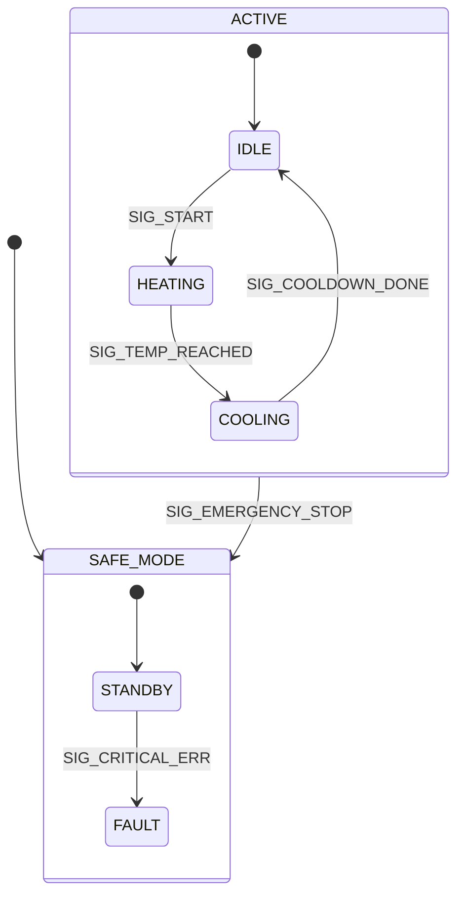

# Hierarchical State Machines (HSMs)

A flat Finite State Machine (FSM) is perfect for simple logic. However, as the system grows, FSMs suffer from a mathematical crisis known as **State Explosion**. 

If you have a 20-state machine, and you add an "Emergency Stop" button that must instantly transition the system to a `FAULT` state regardless of what it is currently doing, you must add 20 identical transitions to your code. If you forget one, you have a critical safety bug.

In 1987, David Harel invented **UML Statecharts**, introducing the concept of Hierarchical State Machines (HSMs). An HSM allows states to be nested inside other states (Superstates and Substates), solving the state explosion problem through **Behavioral Inheritance**.

## 1. Deep Technical Rationale: Behavioral Inheritance

In an HSM, a Substate inherits the transitions of its Superstate. 

### 1.1 The "Event Bubbling" Mechanism

When an Event is dispatched to the HSM:
1. The HSM passes the event to the currently active **Substate**.
2. If the Substate knows how to handle the event, it processes it, transitions, and the dispatch ends.
3. If the Substate *ignores* the event, the event "bubbles up" to the parent **Superstate**.
4. The Superstate attempts to process it. If it ignores it, it bubbles to the grandparent, all the way to the top.

### 1.2 Solving the Emergency Stop Problem

We create a Superstate called `ACTIVE`. Inside `ACTIVE`, we place the Substates `HEATING`, `COOLING`, and `IDLE`. 

We map the `SIG_EMERGENCY_STOP` event **only once**, on the `ACTIVE` Superstate.
If the system is in `HEATING` and the Emergency Stop button is pressed:
1. `HEATING` receives the event. It doesn't care. It bubbles it up.
2. `ACTIVE` (the parent) receives the event. It triggers the transition to the `FAULT` state. 

We eliminated 19 redundant transitions. 

## 2. Advanced HSM Features

### 2.1 Entry and Exit Actions

Because states are nested, transitioning between them is complex. If you transition from `HEATING` (Substate of `ACTIVE`) to `FAULT` (Substate of `SAFE_MODE`), the HSM engine automatically executes:
1. `HEATING` Exit Action (e.g., Turn off heater relay)
2. `ACTIVE` Exit Action (e.g., Turn off power to the sub-system)
3. `SAFE_MODE` Entry Action (e.g., Sound alarm)
4. `FAULT` Entry Action (e.g., Log error to Flash)

This guarantees that hardware is safely deactivated when leaving a state, regardless of *why* you are leaving it.

### 2.2 History States

A common requirement: A system is performing a complex sequence (`ACTIVE` -> `SEQUENCE_STEP_4`). A high-priority event occurs (e.g., user opens a door), forcing a transition to `PAUSED`. When the door is closed, the system needs to resume exactly where it left off (`SEQUENCE_STEP_4`), not restart the whole sequence.

A **History State** remembers the last active Substate of a Superstate. Transitioning back to the History State automatically routes you to the correct Substate.

## 3. Concrete Anti-Patterns

### Anti-Pattern 1: The Global Override Hack

When engineers using flat FSMs realize they have a State Explosion problem, they often implement a "Global Override" hack outside the State Machine.

```c
// [ANTI-PATTERN] Destroying the integrity of the State Machine
void state_machine_dispatch(Event_t *event) {
    
    // HACK: Bypass the state machine entirely!
    if (event->signal == SIG_EMERGENCY_STOP) {
        current_state = STATE_FAULT;
        return; 
    }
    
    // Normal FSM logic...
    ActionFunc_t action = fsm_table[current_state][event->signal];
    // ...
}
```

Why is this fatal? Because by bypassing the FSM, you skipped the Exit Actions! The system transitioned to `FAULT`, but the `HEATING` state never ran its Exit Action. The heater relay is still ON while the system thinks it is safely in a fault state. The device catches fire.

HSMs guarantee that all Exit/Entry actions are executed in the correct hierarchical order during every transition.

## 4. Execution Visualization: The Hierarchy


*In this diagram, if `SIG_EMERGENCY_STOP` fires, it doesn't matter if we are in `IDLE`, `HEATING`, or `COOLING`. They all belong to `ACTIVE`. The event bubbles to `ACTIVE`, and `ACTIVE` transitions the entire sub-system to `SAFE_MODE`. The heater relay is guaranteed to turn off because `HEATING`'s exit action is executed.*

## 5. Company Standard Rules: HSM Architecture

1. **RULE-HSM-01**: **Addressing State Explosion:** When a flat Finite State Machine requires identical transitions from more than 3 distinct states to handle a global event (e.g., Faults, Resets), the architecture MUST be refactored into a Hierarchical State Machine (HSM).
2. **RULE-HSM-02**: **No FSM Bypassing:** Events SHALL NOT be intercepted and processed outside of the formal state machine dispatch engine. Global overrides destroy Entry/Exit action determinism.
3. **RULE-HSM-03**: **Entry/Exit Encapsulation:** Hardware initialization (e.g., turning on a relay) and de-initialization MUST be placed exclusively in Entry and Exit actions of the corresponding state. They SHALL NOT be placed in the transition action to guarantee execution regardless of the transition path.
4. **RULE-HSM-04**: **Event Bubbling Propagation:** If a substate does not explicitly handle an event, it MUST silently pass the event to its designated parent superstate without generating an error or halting dispatch.