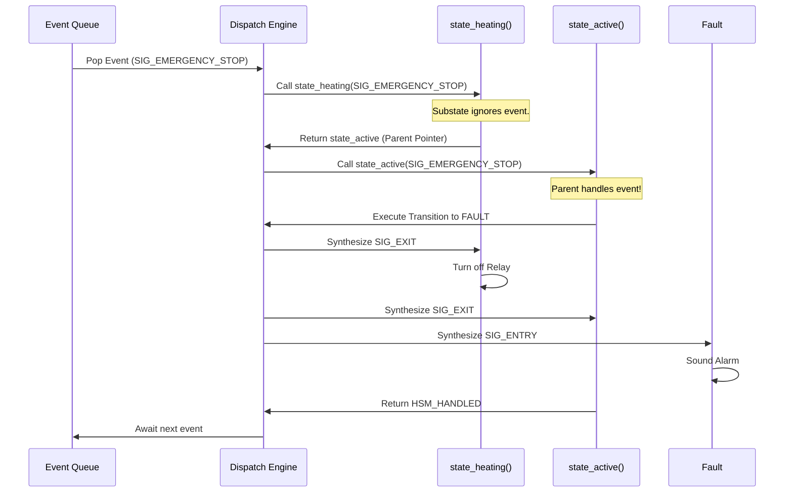

# Translating Behavior into Code

Implementing a Hierarchical State Machine in C is significantly more complex than a 2D array table. There are heavy, professional frameworks available, most notably the **Quantum Leaps (QP) Framework** by Miro Samek. For deeply embedded, safety-critical systems, QP is the industry gold standard.

However, bringing a massive framework into a 32KB microcontroller is often overkill. A Principal Architect must know how to implement a lightweight, robust HSM pattern in pure C.

## 1. Deep Technical Rationale: The Function Pointer Pattern

The most elegant way to implement an HSM in standard C is to represent every State as a function. 

Instead of an Action function returning the *Next State* (like in the flat FSM), a State function returns the **Parent State** (the Superstate). 

When the dispatch engine calls a State function with an Event:
- If the State handles the event, it returns `HANDLED`.
- If the State ignores the event, it returns a pointer to its Parent State function, telling the dispatch engine: "I didn't handle this, bubble it up to my parent."

### 1.1 The Canonical State Handler Signature

```c
#include <stdint.h>
#include <stdbool.h>

// Forward declarations
typedef struct Hsm_t Hsm_t;
typedef struct Event_t Event_t; // From Chapter 9.01

// The State Function Pointer Signature
// It takes the HSM instance and the Event, and returns the Parent State (or NULL if handled)
typedef void* (*StateHandler_t)(Hsm_t *me, Event_t *e);

// Special return values to indicate the event was handled
#define HSM_HANDLED ((void*)0)

// The HSM Instance Object
struct Hsm_t {
    StateHandler_t current_state; // Pointer to the currently active substate
};
```

## 2. Production-Grade C Implementation

Let's implement the `ACTIVE` superstate and the `HEATING` substate from the previous chapter.

### 2.1 The States as Functions

```c
// ---------------------------------------------------------
// SUPERSTATE: ACTIVE
// ---------------------------------------------------------
void* state_active(Hsm_t *me, Event_t *e) {
    switch (e->signal) {
        
        case SIG_ENTRY:
            // Action executed when entering ACTIVE
            system_power_on();
            return HSM_HANDLED;
            
        case SIG_EXIT:
            // Action executed when leaving ACTIVE
            system_power_off();
            return HSM_HANDLED;
            
        case SIG_EMERGENCY_STOP:
            // The magic global transition!
            // We use a macro (defined later) to execute exit/entry actions
            // and move to the FAULT state.
            HSM_TRAN(me, state_fault);
            return HSM_HANDLED;
    }
    
    // ACTIVE is the top level. It has no parent.
    // If we didn't handle the event, it is truly ignored.
    return NULL; 
}

// ---------------------------------------------------------
// SUBSTATE: HEATING
// ---------------------------------------------------------
void* state_heating(Hsm_t *me, Event_t *e) {
    switch (e->signal) {
        
        case SIG_ENTRY:
            heater_relay_on();
            return HSM_HANDLED;
            
        case SIG_EXIT:
            // GUARANTEED to run when transitioning out, 
            // even if caused by the parent's Emergency Stop!
            heater_relay_off(); 
            return HSM_HANDLED;
            
        case SIG_TEMP_READING:
            if (e->payload.temp.temperature_celsius > 100.0f) {
                HSM_TRAN(me, state_cooling);
            }
            return HSM_HANDLED;
    }
    
    // HEATING did not handle the event. 
    // BUBBLE UP TO PARENT: Return pointer to state_active.
    return (void*)state_active; 
}
```

### 2.2 The Dispatch Engine

The dispatch engine is a simple `while` loop that calls the state function and follows the returned pointers upwards until the event is handled or the top of the hierarchy is reached.

```c
void hsm_dispatch(Hsm_t *me, Event_t *e) {
    // Start at the current lowest-level substate
    StateHandler_t target = me->current_state;
    
    // Loop: Bubble the event up the hierarchy
    while (target != NULL) {
        // Call the state function.
        // It returns HSM_HANDLED (NULL) if it processed the event.
        // It returns a pointer to its parent if it ignored the event.
        target = (StateHandler_t)target(me, e);
    }
}
```

### 2.3 The Transition Engine (Entry/Exit Handling)

The hardest part of an HSM is `HSM_TRAN()`. When transitioning from `HEATING` to `FAULT`, the engine must automatically synthesize `SIG_EXIT` events to the current states, update `me->current_state`, and synthesize `SIG_ENTRY` events to the new states.

*(Note: A full, topology-aware transition engine that calculates Least Common Ancestors (LCA) to determine exactly which states to exit and enter is complex and forms the core of frameworks like QP. For lightweight implementations, strict adherence to a shallow hierarchy is often enforced to simplify this math).*

## 3. Concrete Anti-Patterns

### Anti-Pattern 1: Transitioning Without Dispatching

The most common failure in custom C state machines is manually updating the state pointer without invoking the engine.

```c
// [ANTI-PATTERN] Silent State Change
void some_interrupt_handler(void) {
    // FATAL: The system changed state, but Exit actions for the old state
    // and Entry actions for the new state were NEVER CALLED.
    // Hardware is now in an undefined, highly dangerous condition.
    my_hsm.current_state = state_fault; 
}
```

**The Fix:** You must *always* generate an Event and push it to the queue. Only the `hsm_dispatch` loop is allowed to execute transitions.

## 4. Execution Visualization: The Dispatch Sequence



## 5. Company Standard Rules: Code Implementation

1. **RULE-CODE-01**: **The Function Pointer Pattern:** Lightweight Hierarchical State Machines MUST implement states as independent C functions returning a pointer to their immediate parent superstate, facilitating dynamic event bubbling.
2. **RULE-CODE-02**: **No Direct State Manipulation:** Application code, including ISRs and other tasks, SHALL NOT directly modify the `current_state` pointer of an HSM instance. All state transitions MUST be exclusively triggered by dispatching an Event through the transition engine.
3. **RULE-CODE-03**: **Entry/Exit Synthesis:** The Transition Engine macro/function (`HSM_TRAN`) MUST strictly guarantee the dispatch of `SIG_EXIT` events to the outgoing state hierarchy, followed by `SIG_ENTRY` events to the incoming state hierarchy, before returning control to the main loop.
4. **RULE-CODE-04**: **Framework Adoption:** For state hierarchies exceeding a depth of 3 levels or involving Orthogonal Regions (parallel states), a formal, certified framework (e.g., Quantum Leaps QP/C) SHOULD be integrated rather than attempting to write a custom topological transition engine.