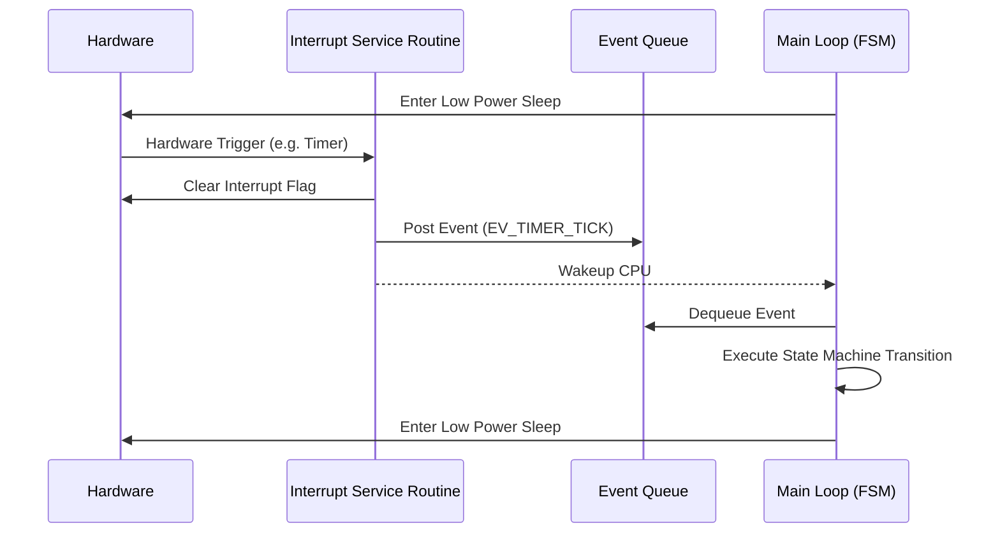

# Bare-Metal Sensor Node Architecture

When designing a bare-metal sensor node, constraints are typically extremely tight: highly limited RAM/Flash, strict low-power requirements (often sleeping 99% of the time), and no Real-Time Operating System (RTOS) to manage concurrency.

The fundamental architectural challenge here is managing asynchronous events (like a sensor data ready interrupt or a timer tick) while executing synchronous business logic without missing deadlines or creating unmaintainable "spaghetti" code.

## The Super-Loop Anti-Pattern

The naive approach to bare-metal design is the synchronous "Super-Loop."

### Anti-Pattern Example
```c
// ANTI-PATTERN: Blocking Super-Loop
void main(void) {
    hw_init();
    while(1) {
        if (button_pressed()) {
            led_on();
            delay_ms(1000); // BLOCKING: CPU does nothing, interrupts might be delayed, power is wasted
            led_off();
        }
        
        float temp = i2c_read_temp_blocking(); // BLOCKING
        uart_send_blocking(temp); // BLOCKING
    }
}
```

**Rationale:** The blocking delays and synchronous polling waste CPU cycles, drain battery, and completely ruin the system's ability to respond quickly to new events (e.g., a critical fault interrupt occurs while sitting in `delay_ms`).

## The Event-Driven State Machine Pattern

A professional bare-metal architecture separates execution into two contexts:
1. **Foreground (Interrupt Context):** ISRs execute quickly, clear hardware flags, and post *events* to a queue.
2. **Background (Main Loop Context):** The main loop sleeps the CPU until an event arrives, pops it from the queue, and processes it via a non-blocking Finite State Machine (FSM).

### Architecture Diagram



### Implementing the Event Queue

To enforce standards, create a centralized, ring-buffer-based event queue.

```c
// event_queue.h
typedef enum {
    EV_NONE = 0,
    EV_BUTTON_PRESS,
    EV_SENSOR_DATA_READY,
    EV_TIMER_TICK,
    EV_FAULT_DETECTED
} event_id_t;

typedef struct {
    event_id_t id;
    uint32_t payload; // Optional data attached to the event
} event_t;

// Thread-safe (ISR-safe) queue operations
bool event_queue_push(event_t event);
bool event_queue_pop(event_t *event);
```

### The Main Loop (Background Context)

The main loop becomes entirely reactive. It does not initiate actions; it only responds to events.

```c
// main.c
#include "event_queue.h"
#include "state_machine.h"
#include "power_manager.h"

int main(void) {
    system_init();
    
    while(1) {
        event_t evt;
        
        // Disable interrupts briefly to safely check queue
        disable_interrupts();
        if (event_queue_pop(&evt)) {
            enable_interrupts();
            // Dispatch event to the application state machine
            app_state_machine_dispatch(&evt);
        } else {
            // Queue is empty, safe to sleep. 
            // WFI (Wait For Interrupt) will re-enable interrupts implicitly or atomically
            power_manager_enter_sleep(); 
            enable_interrupts();
        }
    }
}
```

### The ISR (Foreground Context)

ISRs must be kept strictly short. No processing, no floating-point math, no loops.

```c
// isr.c
void EXTI0_IRQHandler(void) {
    // 1. Clear hardware pending bit immediately
    EXTI->PR = EXTI_PR_PR0; 
    
    // 2. Formulate event
    event_t evt = { .id = EV_BUTTON_PRESS, .payload = 0 };
    
    // 3. Push to queue (must be lock-free / ISR safe)
    event_queue_push(evt);
}
```

## Architectural Rules for Bare-Metal

1. **Rule of ISR Brevity:** An ISR shall do nothing more than clear the hardware flag, read immediate data registers (if necessary to prevent overrun), and post an event to a queue.
2. **Rule of Non-Blocking Main:** The main loop must never contain a blocking wait, `while(flag == 0)`, or delay function. All timing must be handled by hardware timers posting events.
3. **Rule of Default Sleep:** The natural state of the main loop is to be in a low-power sleep state (`WFI` / `WFE`). It only wakes to process items in the event queue.