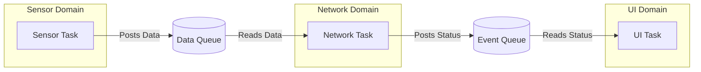

# RTOS-Connected Device Architecture

When moving to a 32-bit microcontroller (e.g., ARM Cortex-M4/M33 or ESP32) with a requirement for networking (Wi-Fi, BLE, Ethernet), a bare-metal architecture breaks down. The complexity of managing asynchronous network stacks alongside sensor reads and UI updates requires an RTOS (Real-Time Operating System) like FreeRTOS or Zephyr.

However, an RTOS is a double-edged sword. If used without strict architectural guidelines, it quickly degrades into a chaotic mess of race conditions, deadlocks, and priority inversions.

## The Global State Anti-Pattern

The most common mistake when migrating from bare-metal to RTOS is maintaining global variables and simply wrapping them in Mutexes, or worse, not protecting them at all.

### Anti-Pattern Example
```c
// ANTI-PATTERN: Shared Global State
float g_temperature = 0.0f; // Global shared state
bool g_data_ready = false;

// Task 1: Sensor Reader (Priority: High)
void SensorTask(void *pvParameters) {
    while(1) {
        g_temperature = read_i2c_sensor();
        g_data_ready = true;
        vTaskDelay(pdMS_TO_TICKS(100));
    }
}

// Task 2: Network Sender (Priority: Medium)
void NetworkTask(void *pvParameters) {
    while(1) {
        if (g_data_ready) { // Race condition: what if Task 1 preempts here?
            send_over_wifi(g_temperature);
            g_data_ready = false;
        }
        vTaskDelay(pdMS_TO_TICKS(50));
    }
}
```

**Rationale:** The above code is prone to race conditions. If `NetworkTask` reads `g_data_ready` as true, but gets preempted by `SensorTask` before setting it back to `false`, data might be sent twice or missed entirely. Even with a Mutex, shared global state tightly couples tasks, making unit testing impossible and leading to priority inversion if a low-priority task holds the mutex while a high-priority task needs it.

## The Message Passing (Actor) Pattern

A professional RTOS architecture borrows from the "Actor Model". Tasks do not share state. Instead, they own their private state and communicate exclusively by passing immutable messages through RTOS Queues.

### Architecture Diagram



### Implementing the Message Passing Architecture

First, define the structures that will be passed through the queues. These must be self-contained and passed by value (or passed by pointer if dynamically allocated from a strict memory pool, though by-value is safer for small structures).

```c
// messages.h
typedef enum {
    MSG_CMD_START_WIFI,
    MSG_DATA_TEMPERATURE,
    MSG_EVT_WIFI_CONNECTED
} msg_type_t;

typedef struct {
    msg_type_t type;
    union {
        float temperature;
        int error_code;
    } payload;
} system_msg_t;
```

### The Isolated Task

Each task is an isolated infinite loop that blocks on its specific input queue.

```c
// network_task.c
#include "messages.h"

// Task private state (NOT global)
static bool wifi_is_connected = false; 

void NetworkTask(void *pvParameters) {
    QueueHandle_t input_queue = (QueueHandle_t)pvParameters;
    system_msg_t msg;

    while(1) {
        // Block indefinitely until a message arrives
        if (xQueueReceive(input_queue, &msg, portMAX_DELAY) == pdTRUE) {
            switch(msg.type) {
                case MSG_CMD_START_WIFI:
                    wifi_is_connected = wifi_connect();
                    break;
                case MSG_DATA_TEMPERATURE:
                    if (wifi_is_connected) {
                        mqtt_publish_float("sensors/temp", msg.payload.temperature);
                    }
                    break;
                default:
                    // Log unhandled message
                    break;
            }
        }
    }
}
```

## Task Design Rules for RTOS

1. **Rule of Isolation:** Tasks shall not communicate via global variables. All inter-task communication must utilize RTOS primitives (Queues for data, Task Notifications/Event Groups for pure signaling).
2. **Rule of Blocking:** A task must spend the vast majority of its time in a "Blocked" state, waiting on a Queue, Semaphore, or Task Notification. A task that spins in a `while(1)` polling loop defeats the purpose of an RTOS scheduler.
3. **Rule of Bounded Queues:** Queue sizes must be strictly bounded and calculated based on worst-case execution time (WCET) analysis. If a queue fills up, the architecture must define a deterministic failure mode (e.g., drop newest, drop oldest, assert).
4. **Avoid Mutexes if Possible:** Mutexes introduce the risk of deadlocks and priority inversion. If you find yourself needing a Mutex, ask if the shared resource can instead be "owned" by a single dedicated task, with other tasks sending requests via a Queue to interact with it.
