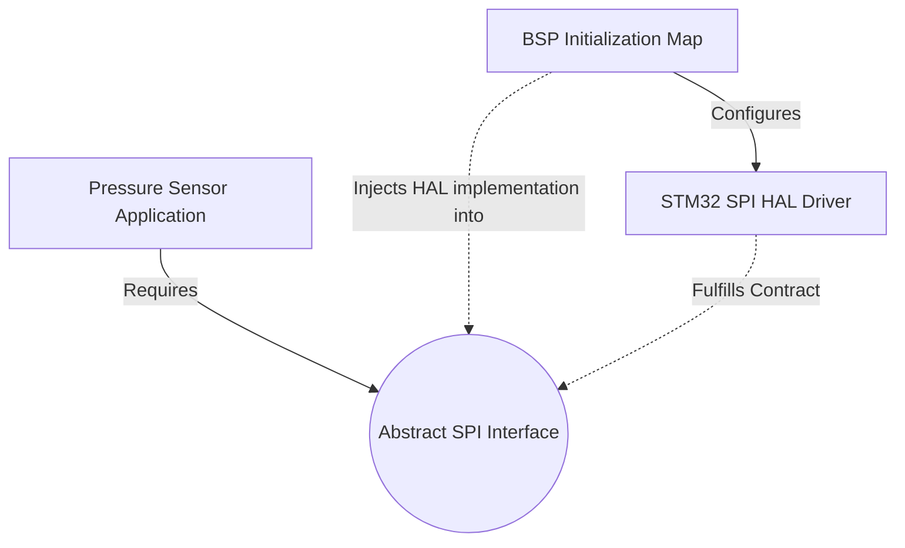

# Chapter 19.3: The Driver Stack: HAL and BSP Separation

One of the most catastrophic, insidious, and historically common architectural failures in embedded software engineering is coupling the product's business logic directly to the physical silicon. When the application layer accesses MCU registers directly, or relies intimately on specific GPIO pin states, the code immediately becomes completely untestable on a standard host PC (rendering unit testing impossible) and impossible to port when the hardware inevitably changes. 

Hardware *always* changes. Whether driven by global chip shortages, cost reduction initiatives, end-of-life silicon, or next-generation product revisions, the microcontroller will eventually be replaced. If the codebase is tightly coupled, a chip swap mandates a "Big Rewrite" of the entire application—a massive waste of engineering resources.

To permanently eradicate this technical debt, the 20-year architecture mandates a rigid, uncompromising boundary between the Application, the Hardware Abstraction Layer (HAL), and the Board Support Package (BSP).

## The Tightly Coupled Anti-Pattern

To understand the solution, we must dissect the failure.

### Anti-Pattern Example: The Native SPI Call
```c
// ANTI-PATTERN: Application code directly manipulating ST registers
// File: src/app/pressure_sensor.c
#include "stm32f4xx.h" // SILICON DEPENDENCY INJECTED INTO APP LAYER!

float sensor_read_pressure(void) {
    // Direct manipulation of STM32 SPI1 peripheral registers
    SPI1->DR = 0x8F; 
    
    // Busy-wait polling on hardware flags (Blocks RTOS tasks)
    while (!(SPI1->SR & SPI_SR_TXE));
    while (!(SPI1->SR & SPI_SR_RXNE));
    
    uint8_t raw_data = SPI1->DR;
    
    // Direct GPIO manipulation for Chip Select (CS) logic
    GPIOA->BSRR = (1 << 16); // Pull CS pin low physically
    
    return calculate_compensated_pressure(raw_data);
}
```

**The Compiler Rationale of Failure:** 
If the company switches from the STMicroelectronics STM32 to a Nordic Semiconductor NRF52, the file `pressure_sensor.c` will immediately fail to compile. The NRF compiler toolchain has no concept of `stm32f4xx.h`, `SPI1->DR`, or `GPIOA->BSRR`. 

Furthermore, simply moving the sensor from the physical SPI1 bus to the SPI2 bus on the *exact same* STM32 chip requires editing the application's core business logic. To write a unit test for `calculate_compensated_pressure`, you must execute the test on the physical PCB, because an x86 PC running GTest or Unity does not have an AHB bus or an `SPI1` register block. This code is definitionally untestable and unportable.

## The Dependency Inversion Pattern (Interfaces in C)

The architectural solution is to utilize Inversion of Control via Dependency Injection. Because C lacks native object-oriented interfaces, we construct our own using C-structs populated with function pointers.

### 1. Define the Abstract Interface (The Architectural Contract)

The application layer defines *exactly what it needs* the hardware to do, without knowing *how* the hardware actually executes the request. This interface header lives in `src/hal/include/` and is completely silicon-agnostic.

```c
// spi_interface.h
// This contract is owned by the Framework, NOT the silicon vendor.
#include <stdint.h>
#include <stdbool.h>

// Forward declaration of the interface instance
typedef struct spi_interface spi_interface_t;

// The pure, abstract interface definition
struct spi_interface {
    // The functional contract
    bool (*transmit_receive)(spi_interface_t* self, const uint8_t* tx_data, uint8_t* rx_data, uint16_t length);
    void (*set_cs)(spi_interface_t* self, bool assert_cs);
    
    // Opaque pointer holding hardware-specific instance data (e.g. SPI_TypeDef*)
    void* hw_context; 
};
```

### 2. Implement the HAL Driver (The Silicon Translation)

The hardware layer (`src/bsp/`) provides a concrete implementation of the abstract contract defined above. This file is allowed to include silicon headers, but it never includes application headers.

```c
// stm32_spi_driver.c (100% Hardware Specific)
#include "spi_interface.h"
#include "stm32f4xx.h"

// The concrete ST-specific implementation
static bool stm32_spi_txrx(spi_interface_t* self, const uint8_t* tx, uint8_t* rx, uint16_t len) {
    SPI_TypeDef* spi_instance = (SPI_TypeDef*)self->hw_context;
    
    // ST-specific SPI register logic executes here...
    for(uint16_t i=0; i<len; i++) {
        spi_instance->DR = tx[i];
        while (!(spi_instance->SR & SPI_SR_RXNE));
        rx[i] = spi_instance->DR;
    }
    return true;
}

static void stm32_spi_cs(spi_interface_t* self, bool assert) {
    // ST-specific GPIO logic executes here...
}

// Factory initialization function to bind the interface vtable
void stm32_spi_init(spi_interface_t* interface, SPI_TypeDef* instance) {
    interface->transmit_receive = stm32_spi_txrx;
    interface->set_cs = stm32_spi_cs;
    interface->hw_context = (void*)instance;
}
```

### 3. Inject the Dependency into the Application

The application is initialized during the system boot sequence by passing in the populated interface pointer.

```c
// pressure_sensor.c (Application Code - 100% Portable)
#include "pressure_sensor.h"

// The application merely stores a pointer to the contract
static spi_interface_t* sensor_spi_bus;

// Dependency Injection Constructor
void pressure_sensor_init(spi_interface_t* spi_drv) {
    sensor_spi_bus = spi_drv; 
}

float sensor_read_pressure(void) {
    uint8_t tx[2] = {0x8F, 0x00};
    uint8_t rx[2] = {0};
    
    // Abstract, decoupled hardware interaction
    sensor_spi_bus->set_cs(sensor_spi_bus, true);
    sensor_spi_bus->transmit_receive(sensor_spi_bus, tx, rx, 2); 
    sensor_spi_bus->set_cs(sensor_spi_bus, false);
    
    return calculate_compensated_pressure(rx[1]);
}
```

## HAL vs. BSP Distinction

The architecture stack is divided into three distinct strata:

- **App (Application):** The purely mathematical and logical rules of the system (`pressure_sensor.c`).
- **HAL (Hardware Abstraction Layer):** Abstracts the *internal* silicon peripherals of the specific MCU. The HAL knows how to configure the baud rate of UART2 or setup the DMA controller for an STM32G4. It provides the concrete implementation of `spi_interface_t`.
- **BSP (Board Support Package):** Abstracts the *external* physical printed circuit board (PCB) layout. The BSP maps logical functions to physical pins and initializes external chips. For example, the BSP knows that the Red Status LED is connected to `GPIOC_PIN_13`, and provides a `BSP_LED_RED_ON()` macro. It wires the specific STM32 SPI instances to the specific application drivers during `main()` bootup.



---

## Company Standard Rules

**Rule 19.3.1:** **The Hardware Header Quarantine.** No source (`.c`) or header (`.h`) file outside of the designated `src/bsp/` or `src/hal/` directories is permitted to `#include` an MCU-specific header file (e.g., `stm32f4xx.h`, `nrf52.h`) or a CMSIS core header.

**Rule 19.3.2:** **Mandatory Dependency Injection.** Peripheral drivers and application modules must not pull in their physical dependencies via hardcoded global variables or singleton macros. Dependencies (e.g., the SPI bus, a Timer instance) must be explicitly passed into the module's initialization function via interface pointers.

**Rule 19.3.3:** **Interface Mockability.** All hardware abstraction contracts (`src/hal/include/`) must be designed purely as C-structs containing function pointers to ensure they can be automatically mocked using the chosen host testing framework (e.g., CMock/FFF).

**Rule 19.3.4:** **Separation of PCB State (BSP) from Silicon State (HAL).** The HAL layer shall not contain board-specific hardcoded pin numbers, sensor addresses, or component values. The HAL provides the generic mechanism (e.g., `I2C_Write`); the BSP provides the board-specific policy (e.g., "The Temperature Sensor lives at I2C address 0x4A on I2C Bus 1").