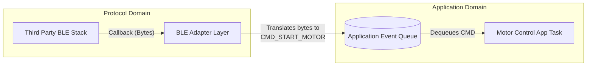

# Protocol Stack Organization

Integrating third-party or complex proprietary protocol stacks (like Bluetooth Low Energy (BLE), LwIP for TCP/IP, or a custom RS-485 Modbus implementation) is often the most chaotic part of an embedded codebase. Stacks are notoriously complex, highly stateful, and rely heavily on asynchronous callbacks.

If the protocol stack is allowed to "bleed" into the application logic, the codebase becomes incredibly fragile. A change to the networking layer will break the sensor reading logic.

## The Bleeding Callback Anti-Pattern

Third-party stacks usually alert the application to network events via callbacks. A common mistake is putting complex business logic directly inside these callbacks.

### Anti-Pattern Example
```c
// ANTI-PATTERN: Application logic inside protocol callbacks
// ble_stack_callbacks.c

void on_ble_characteristic_written(uint16_t char_id, uint8_t *data, uint16_t len) {
    if (char_id == CHAR_MOTOR_CONTROL) {
        // BLE callback directly controlling hardware!
        if (data[0] == 0x01) {
            HAL_GPIO_WritePin(GPIOA, GPIO_PIN_5, 1); // Turn on motor
            delay_ms(100); // NEVER block in a stack callback!
            start_adc_conversion();
        }
    }
}
```

**Rationale:** Protocol stacks often run in high-priority tasks or directly inside interrupt contexts. Blocking inside a callback will crash the stack. Furthermore, this tightly couples the BLE module to the Motor Control and ADC modules. If we swap BLE for Wi-Fi, we have to rewrite the motor control logic.

## The Adapter / Facade Pattern

The standard architectural approach is to isolate the protocol stack behind an **Adapter** (or Facade). The protocol stack translates network bytes into abstract application events, posts them to an RTOS Queue (or Event Manager), and immediately returns. The application logic executes in its own task context, completely unaware of *how* the event arrived.

### Architecture Diagram



### 1. The Adapter Layer

The Adapter's only job is serialization/deserialization and queue management. It strips away the protocol-specific details (like UUIDs or TCP sockets) and generates standardized system events.

```c
// ble_adapter.c
#include "app_events.h"
#include "event_queue.h"

// Callback registered with the third-party stack
void on_ble_characteristic_written(uint16_t char_id, uint8_t *data, uint16_t len) {
    app_event_t evt;
    
    if (char_id == CHAR_MOTOR_CONTROL && len >= 1) {
        evt.id = (data[0] == 0x01) ? EVT_MOTOR_START : EVT_MOTOR_STOP;
        evt.source = EVENT_SRC_NETWORK;
        
        // Push to queue and return immediately!
        // No blocking, no hardware access.
        event_queue_push_from_isr(&evt); 
    }
}
```

### 2. The Application Handler

The application task waits on the queue. It doesn't know if the `EVT_MOTOR_START` command came from a BLE packet, a physical button press, or a UART debug command.

```c
// motor_app.c
#include "app_events.h"

void MotorAppTask(void *pvParameters) {
    app_event_t evt;
    
    while(1) {
        if (event_queue_pop(&evt, portMAX_DELAY)) {
            switch(evt.id) {
                case EVT_MOTOR_START:
                    motor_driver_enable(); // Clean abstraction
                    break;
                case EVT_MOTOR_STOP:
                    motor_driver_disable();
                    break;
                // ...
            }
        }
    }
}
```

## Handling Outbound Data (The Facade)

The reverse path (Application sending data out over the protocol) must also be abstracted. The application should not call `ble_gatts_hvx()`. Instead, provide a facade interface.

```c
// network_facade.h
typedef enum {
    NET_TOPIC_TELEMETRY,
    NET_TOPIC_ALARM
} net_topic_t;

// The application calls this. It does not know about BLE vs Wi-Fi.
bool network_publish(net_topic_t topic, const uint8_t *payload, size_t len);
```

## Architectural Rules for Protocol Stacks

1. **Rule of Callback Deflection:** Protocol stack callbacks must never contain business logic, hardware interactions, or blocking delays. They must only map data to standard application events and defer execution via a queue or semaphore.
2. **Rule of Protocol Ignorance:** Application domain code must not contain `#include` directives for protocol stacks (e.g., no `#include "lwip/sockets.h"` in `sensor_app.c`).
3. **Rule of Unified Transport:** Outbound data should be routed through a generic Transport Interface or Facade, allowing the physical medium (UART, BLE, TCP) to be swapped at compile time or runtime without altering the application logic.
