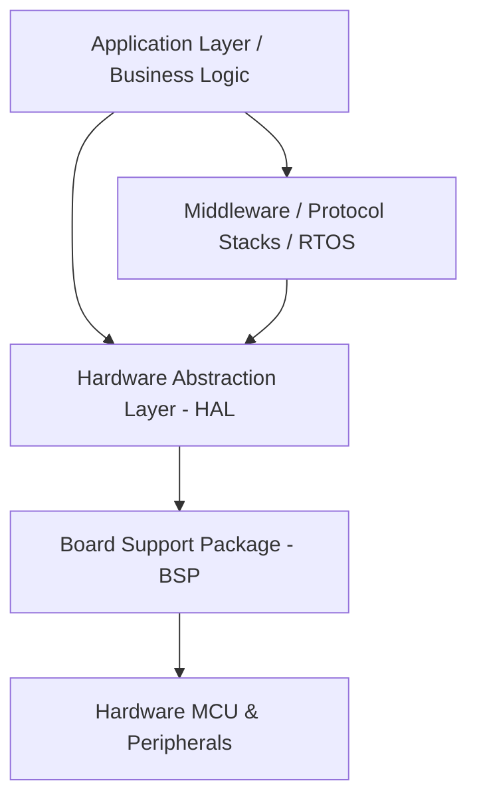

# Chapter 19 — Example Architecture Patterns
## Who This Chapter Is For

- Embedded C engineers implementing or reviewing production firmware architecture
- Technical leads and architects defining team-wide standards

## Prerequisites

- Familiarity with C syntax and embedded build/debug workflows
- Completion of prior chapter topics in this curriculum (recommended)

## Learning Objectives

- Explain the core architectural principles covered in this chapter
- Apply the chapter rules to structure module boundaries and dependencies
- Evaluate existing code for architectural risks related to this chapter

## Key Terms

- Architecture boundary
- Module contract
- Dependency direction

## Practical Checkpoint

- Review one existing module and document 2 improvements based on this chapter's guidance
- Refactor one API or dependency edge to align with the chapter standards

## What to Read Next

- Continue with the next section in this chapter, then proceed to the next chapter in `src/SUMMARY.md`.

Welcome to **Chapter 19: Architectural Archetypes Workshop**. This section provides a hands-on exploration of the foundational architectures used in modern Embedded C systems. Instead of theoretical ideals, we will focus on practical, production-ready patterns that solve real-world constraints in memory, timing, and scalability.

## Core Rationale

Embedded systems span a vast spectrum—from 8-bit microcontrollers running on coin cells to multi-core 32-bit processors managing high-speed networking and displays. A single monolithic architecture cannot service this spectrum. Attempting to force an RTOS onto an ultra-low-power, simple sensor node leads to bloat; conversely, running a complex networking stack in a bare-metal super-loop leads to spaghetti code and missed real-time deadlines.

As an embedded software architect, your job is to select the correct **Archetype** for the hardware and product requirements, and to establish **Company Standards** that dictate how that archetype should be implemented across all teams.

## Workshop Objectives

In this workshop, we will dissect four common structural domains:

1. [**Bare-Metal Sensor Nodes**](01-bare-metal-sensor-node.md): Designing highly deterministic, low-power systems without an OS.
2. [**RTOS-Connected Devices**](02-rtos-connected-device.md): Structuring concurrent, event-driven applications using an RTOS.
3. [**Driver Stack (HAL & BSP)**](03-driver-stack-hal-bsp.md): Decoupling hardware specifics from business logic.
4. [**Protocol Stack Organization**](04-protocol-stack-organization.md): Managing complex communications cleanly and asynchronously.

## Defining the Baseline Standards

Regardless of the archetype chosen, the codebase must adhere to these non-negotiable architectural rules:

- **Rule 1: Separation of Concerns.** Business logic must NEVER directly touch hardware registers. 
- **Rule 2: Inversion of Control.** High-level modules must define interfaces (abstract C structs with function pointers) that low-level modules implement, rather than high-level modules depending on concrete hardware implementations.
- **Rule 3: Deterministic Execution.** In hard real-time systems, dynamic memory allocation (`malloc`/`free`) is strictly forbidden post-initialization. All memory must be statically allocated.

## System Architecture Overview

The chapters that follow provide deep-dives into each of these layers and operational models. By internalizing these archetypes, you will be equipped to standardize your company's approach to embedded software, significantly reducing onboarding time for new developers and eliminating the "every project is a unique snowflake" anti-pattern.
