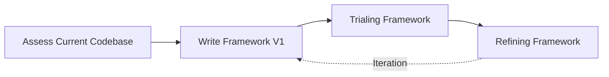

# Chapter 20 — Capstone: Drafting and Trialing a Standardization Framework
## Who This Chapter Is For

- Embedded C engineers implementing or reviewing production firmware architecture
- Technical leads and architects defining team-wide standards

## Prerequisites

- Familiarity with C syntax and embedded build/debug workflows
- Completion of prior chapter topics in this curriculum (recommended)

## Learning Objectives

- Convert an architectural assessment into a minimum viable framework plan
- Trial framework rules against a real codebase without halting delivery
- Produce reviewable rollout artifacts instead of vague framework aspirations

## Key Terms

- Strangler fig migration
- Pilot module
- Framework ratchet

## Practical Checkpoint

- Produce a dependency map, rule shortlist, and pilot-module selection for one existing codebase
- Define the first framework version, then list the evidence required before broad rollout

## What to Read Next

- Continue with the capstone sections below, then proceed into the system-boundary and delivery modules in Part VIII.

Welcome to **Chapter 20: Capstone Framework Delivery**. The previous chapters already defined the technical rules, framework scope, standard package, and rollout strategy. This chapter is intentionally different: it is a capstone workshop where you apply that earlier material to a messy, organically grown codebase and drive it toward a reusable internal framework.

## The Problem with "Organic" Codebases

Most embedded codebases start as a vendor-supplied template or an evaluation board proof-of-concept. The engineering team, under severe schedule pressure, hacks features into this template.

Two years later, the company has three products. The code was copy-pasted between them. A bug fixed in Product A is completely missed in Product B. The team is paralyzed; implementing a simple feature takes weeks because the code is a tangled mess of `#ifdef PRODUCT_A` macros and global state.

## The Capstone Objective

To scale embedded development across multiple products and teams, the company must invest in an **Internal Framework**. By the time you reach this capstone, the question is no longer whether standards matter. The question is how to assess a real codebase, define a minimum viable framework, trial it safely, and refine it based on evidence.

An internal framework is a centralized, version-controlled repository containing:
1. Standardized build systems (e.g., CMake)
2. Hardware Abstraction Layers (HAL) based on interfaces, not concrete implementations
3. Reusable middleware (event queues, state machines, software timers)
4. Core utilities (error handling, logging, assertions)

### Capstone Execution Pipeline

Building a framework is not a single sprint. It is a strategic initiative. In this capstone, we work through four execution phases:

1. [**Assessing Current Codebase**](01-assessing-current-codebase.md): You cannot fix what you do not understand. Use static analysis and dependency mapping to locate the "God Objects" and structural violations.
2. [**Writing Framework V1**](02-writing-framework-v1.md): Define the minimum viable standard. Establish the first rules for error handling, interfaces, and reusable primitives.
3. [**Trialing Framework**](03-trialing-framework.md): Use the strangler-fig pattern to introduce the new framework into the legacy codebase without halting feature development.
4. [**Refining Framework**](04-refining-framework.md): Gather team feedback, adjust the abstractions, and version the framework for broader deployment.

Treat this chapter as a deliverable-oriented exercise. Each phase should produce artifacts that another engineer can review: dependency maps, framework rules, pilot-module diffs, and versioned refinement notes.
