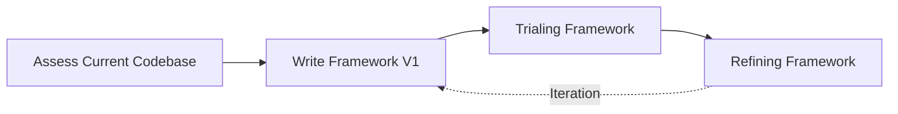

# Chapter 20: Building an Internal Framework

Welcome to **Chapter 20: Building an Internal Framework**. The previous chapters covered the theoretical and practical archetypes of embedded systems. This chapter transitions into the engineering management and execution phases: how do you take a messy, organically grown legacy codebase and systematically transition it into a clean, reusable internal framework?

## The Problem with "Organic" Codebases

Most embedded codebases start as a vendor-supplied template or an evaluation board proof-of-concept. The engineering team, under severe schedule pressure, hacks features into this template. 

Two years later, the company has three products. The code was copy-pasted between them. A bug fixed in Product A is completely missed in Product B. The team is paralyzed; implementing a simple feature takes weeks because the code is a tangled mess of `#ifdef PRODUCT_A` macros and global state.

## The Internal Framework Solution

To scale embedded development across multiple products and teams, the company must invest in an **Internal Framework**.

An internal framework is a centralized, version-controlled repository containing:
1. Standardized build systems (e.g., CMake).
2. Hardware Abstraction Layers (HAL) based on interfaces, not concrete implementations.
3. Reusable Middleware (Event Queues, State Machines, Software Timers).
4. Core Utilities (Error handling, Logging, Assertions).

### Framework Adoption Pipeline

Building a framework is not a single sprint. It is a strategic initiative. We will break this process down into four distinct phases:

1. [**Assessing Current Codebase**](01-assessing-current-codebase.md): You cannot fix what you do not understand. We will use static analysis and dependency mapping to locate the "God Objects" and architectural violations.
2. [**Writing Framework V1**](02-writing-framework-v1.md): Defining the minimum viable standard. Establishing the core rules for error handling and types.
3. [**Trialing Framework**](03-trialing-framework.md): Using the "Strangler Fig" pattern to safely introduce the new framework into the legacy codebase without halting feature development.
4. [**Refining Framework**](04-refining-framework.md): Gathering team feedback, adjusting the abstractions, and versioning the framework for enterprise deployment.

Let's begin the transformation process.